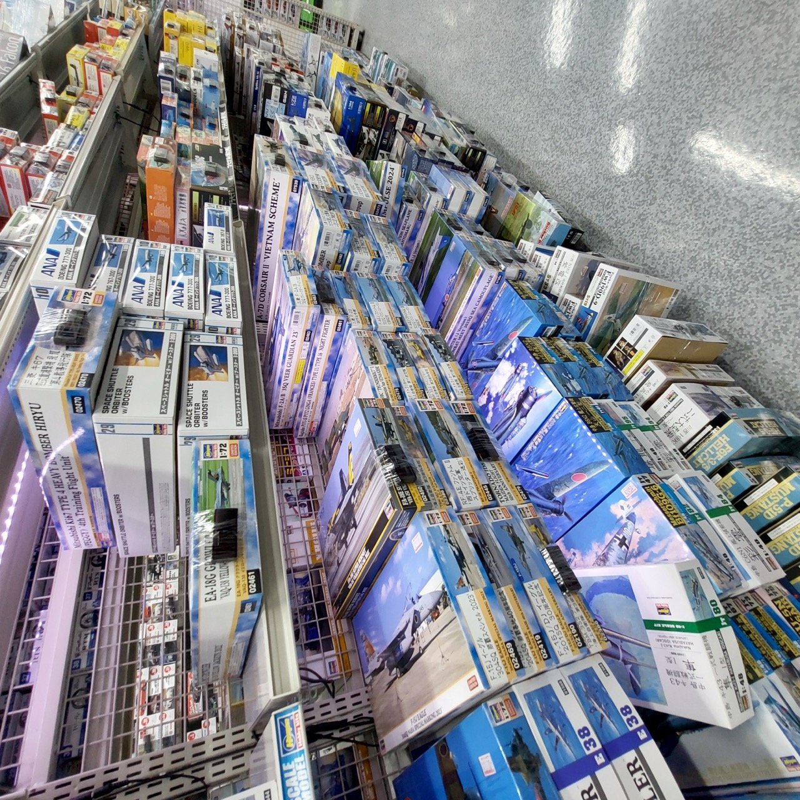
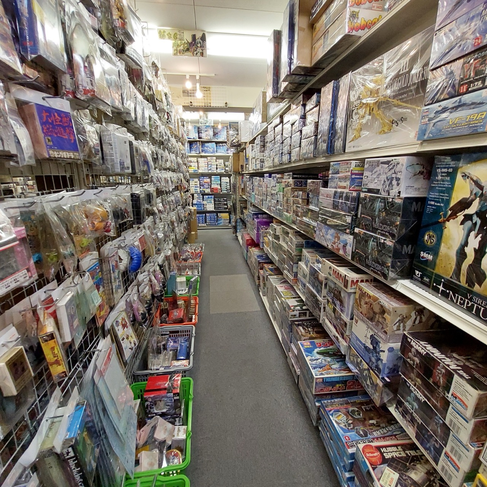
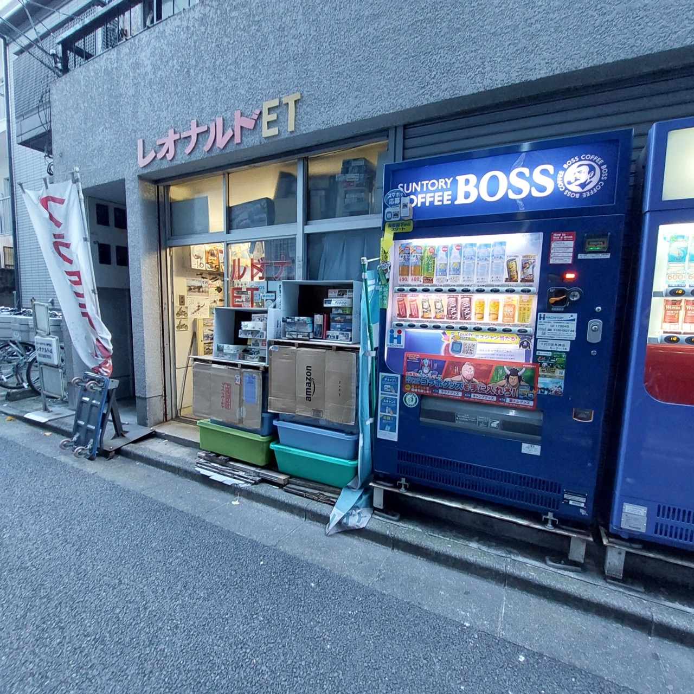
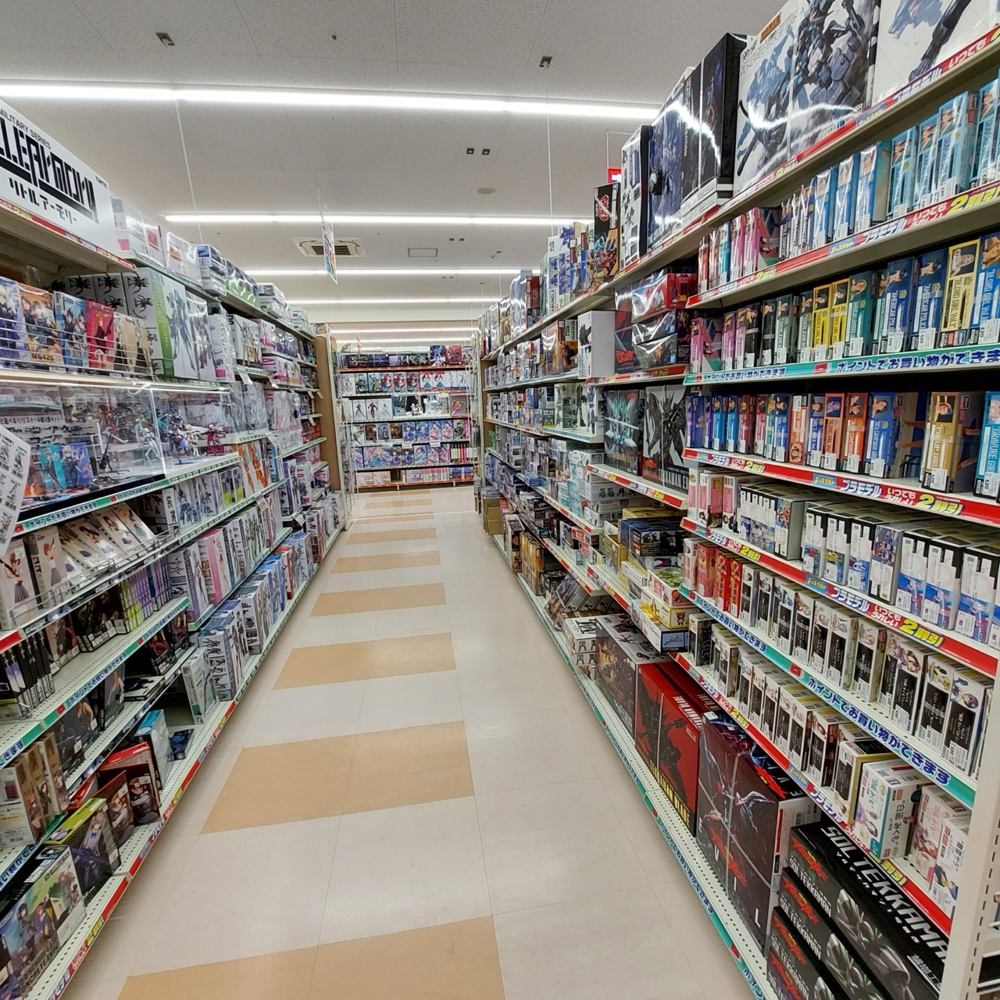

# #136 Tokyo Model Stores

Reviewing the best model stores in Tokyo.

## Notes

These are my notes from model stores I've visited in Tokyo.
I've restricted my reviews and comments to historical plastic models and tools,
although of course these stores usually also have a significant gunpla and model train offerings.

I'll keep this page updated as I get to visit again.
Stores covered so far:

* Joshin ōji
* Leonardo レオナルド LG
* Leonardo レオナルド LG 2
* Leonardo レオナルド ET
* Surugaya Akihabara Plastic model Hall (駿河屋 秋葉原プラモデル館)
* Tamiya Plamodel Factory Shimbashi
* TamTam Hobby Shop Akihabara (ホビーショップ タムタム 秋葉原店)
* YAMADA Denki LABI Shibuya (ヤマダデンキ LABI 渋谷店)
* YAMADA Denki LABI Shinjuku Nishiguchi (ヤマダデンキ LABI新宿西口館)
* YFS (ミニチュア人形のYFS)
* Yodobashi Akiba (ヨドバシカメラ マルチメディアAKIBA)
* Yodobashi Camera Shinjuku Nishiguchi Game and Hobby (ヨドバシカメラ 新宿西口本店 ゲーム館)

Others I can recommend but haven't got pics or written up here yet include:

* [Hobby Base Yellow Submarine (イエローサブマリン秋葉原本店★ミント)](https://maps.app.goo.gl/FaotHUwSqdSYQCEe9)

### Yodobashi Akiba (ヨドバシカメラ マルチメディアAKIBA)

* Last visited: Dec 2024
* Tax free? Yes

I'll start with probably the most well-known: [Yodobashi Akiba](https://maps.app.goo.gl/335kKbCGzQBC63eX7) ... famous for also selling all manner of electronics ... and luggage, just in case😆

In the past I've always found it to have very good pricing, but this time (Dec 2024) the prices are all over the shop. Some great deals, especially on smaller kits (e.g ¥680 ex tax for the Tamiya IJN Auxiliary Vessels 31519 1:700) but many were as expensive as anywhere else and not really bargains compared to online sellers. So, basically pays to know the price point of kits when shopping here and don't just assume everything is a bargain.

As to selection: good range of current kits, lots of tools. The plastic model section of the store would put most around the world to shame, but it's just a small corner of a huge electronics/gaming wonderland (and didn't even get mentioned in their 80+ page toys & games catalog that I picked up at the entrance!)

### Yodobashi Camera Shinjuku Nishiguchi Game and Hobby (ヨドバシカメラ 新宿西口本店 ゲーム館)

* Last visited: Dec 2022
* Tax free? Yes

If you are in the Shinjuku area, then [Yodobashi Camera](https://maps.app.goo.gl/oz2NcquKUbjavBxn9) is well worth a visit.
Yodobashi is spread out over many buildings in Shinjuku, so ust fist find the correct one - the Game and Hobby outlet.
Inside their plastic model and tools are spread over two levels.

Not quite the range as the Yodobashi Akiba, but the same good pricing, and I've often found books and kits here that
I was unable to find at  Yodobashi Akiba.

### The "Golden Triangle of the Golden Age of Modelling"

To the north end of Akihabara, around Suehirochō Station, is what I think of as the "Golden Triangle of the Golden Age of Modelling" - 3 stores within a few minutes of each other that deal in second-hand, old stock, and rare kits: Leonardo (レオナルド) LG, LG2, and ET. If you are looking for an old release from Hasegawa, Fujimi, Tamiya, or others (especially Japanese, but some foreign manufacturers), then together these stores offer a good chance of finding it.

#### Leonardo LG 2

* Last visited: Dec 2024
* Tax free? No

I usually start at [Leonardo レオナルド LG 2](https://maps.app.goo.gl/epCyUSCJ6Rq5QRVQ6) after alighting at Suehirochō Station.

It is good for 1:144 planes, more recent afv, ship, and plane kits. I didn't buy anything here this time but there was lots that tempted me. Prices tend to be sim to original RRP or a little higher, so this is mainly a good place to pickup recent but out of production kits that you really need.

#### Leonardo LG

* Last visited: Dec 2024
* Tax free? No

Next is usually a short walk over to [Leonardo レオナルド LG](https://maps.app.goo.gl/doggiAeGHoNbsRdWA) (they are related)

This one has a larger stock, but generally the older/rarer releases. Don't expect decals to be in good order, and prices again will be sim to original RRP or a little higher, but if its an old kit you really want, then I've often found it here.

#### Leonardo ET

* Last visited: Dec 2024
* Tax free? No

Finally a walk back via [Leonardo レオナルド ET](https://maps.app.goo.gl/zno9LJZfB6srvGj2A) (I think actually not related any longer, was a split some time back iirc)

This one specializes more in the higher end rare items, e.g.old ship kits with the detail options. Will be a bit more pricey. Didn't buy anything here this time (but did get stuck in one of the aisles)

### TamTam Hobby Shop Akihabara (ホビーショップ タムタム 秋葉原店)

* Last visited: Dec 2024
* Tax free? Yes

[TamTam Hobby Shop](https://maps.app.goo.gl/p4TN4LKgZkPQawz38) is on the corner between Suehirochō Station and Leonardo レオナルド LG 2,
so I often pop in just to see what might be in stock. Their prices are generally not the best, but they do tend to carry the latest releases in their relatively small range of plastic kits.

### Volks Akihabara Hobby Paradise 2

* Last visited: Dec 2022
* Tax free? Yes

After visiting the Leonardo stores, I'll walk down Chuo-dori Ave towards Yodobashi Akiba. [Volks Akihabara](https://maps.app.goo.gl/J2nAG5kitN1tRSQY6) is about half way there.
Although mainly figure related, it has a great tools and materials section.

### Tamiya Plamodel Factory Shimbashi

* Last visited: Dec 2024
* Tax free? (I don't think so - need to check again)

Shimbashi is a great place to stay in Tokyo, and just so happens this is where the
[Tamiya Plamodel Factory](https://maps.app.goo.gl/fcrvZnkwigfwXry69)
is located. This store is the main Tamiya showroom in Tokyo, newly renovated in 2023 and now includes a cafe and features all products on one floor. Highly worth a visit if only to pick up some merch. Kit prices are all RRP, but here they are almost guaranteed to be in stock if in the current catalogue.

Special Christmas releases on display:

The new cafe..

### Joshin ōji

* Last visited: Dec 2024
* Tax free? Yes

[Joshin ōji](https://maps.app.goo.gl/qTrUFNYhpzNzjVFQ7) is well worth the short train trip out of central Tokyo.
It's a modelling mega mart! Truly huge range of products, with most prices being some of the best around.
Mainly Japanese manufacturers represented, with some imports.

### YAMADA Denki LABI

Yamada Denki LABI is similar to Yodobashi - a large electronics and entertainment retail complex, but also with a plastic models department. Key point with LABI is that their range is relatively small and just covers current product ranges, but if they have it, it will likely be at the cheapest price of all retailers.

#### YAMADA Denki LABI Shibuya (ヤマダデンキ LABI 渋谷店)

* Last visited: Dec 2024
* Tax free? Yes

Their [Shibuya store](https://maps.app.goo.gl/b3csASYb5dTawWFy9) has a mid-size plastic model section.
Not as large as their Shinjuku store, but worth a look if you are staying nearby.

### YAMADA Denki LABI Shinjuku Nishiguchi (ヤマダデンキ LABI新宿西口館)

* Last visited: Dec 2022
* Tax free? Yes

Their [Shinjuku store](https://maps.app.goo.gl/oKXEpBUt9x1sKuNq8) has a larger plastic model section
than their Shibuya store. Worth a look when visiting Shinjuku.

### YFS (ミニチュア人形のYFS)

* Last visited: Dec 2022
* Tax free? No

[YFS](https://maps.app.goo.gl/domj4GE8NKSXL8UR7) is a specialty figure shop, mainly dedicated to train enthusiasts,
though there are some scales that would interest plastic scale modellers. They also produce some of their own, with a special focus on Japanese subjects.

### Surugaya Akihabara Plastic Model Hall (駿河屋 秋葉原プラモデル館)

* Last visited: Dec 2022
* Tax free? (I think so - need to check again)

Another store along Chuo-dori Ave worth a look is [Surugaya Akihabara](https://maps.app.goo.gl/nk46VQiiE7XfvcVf7).
Although mainly figure and gunpla focused, it does have a reasonable plastic model section and of course tools.

## Credits and References

* [Hobby Base Yellow Submarine (イエローサブマリン秋葉原本店★ミント)](https://maps.app.goo.gl/FaotHUwSqdSYQCEe9)
* [Joshin ōji](https://maps.app.goo.gl/qTrUFNYhpzNzjVFQ7)
* [Leonardo レオナルド LG](https://maps.app.goo.gl/doggiAeGHoNbsRdWA)
* [Leonardo レオナルド LG 2](https://maps.app.goo.gl/epCyUSCJ6Rq5QRVQ6)
* [Leonardo レオナルド ET](https://maps.app.goo.gl/zno9LJZfB6srvGj2A)
* [Surugaya Akihabara Plastic model Hall (駿河屋 秋葉原プラモデル館)](https://maps.app.goo.gl/nk46VQiiE7XfvcVf7)
* [Tamiya Plamodel Factory Shimbashi](https://maps.app.goo.gl/fcrvZnkwigfwXry69)
* [TamTam Hobby Shop Akihabara (ホビーショップ タムタム 秋葉原店)](https://maps.app.goo.gl/p4TN4LKgZkPQawz38)
* [YAMADA Denki LABI Shibuya (ヤマダデンキ LABI 渋谷店)](https://maps.app.goo.gl/b3csASYb5dTawWFy9)
* [YAMADA Denki LABI Shinjuku Nishiguchi (ヤマダデンキ LABI新宿西口館)](https://maps.app.goo.gl/oKXEpBUt9x1sKuNq8)
* [YFS (ミニチュア人形のYFS)](https://maps.app.goo.gl/domj4GE8NKSXL8UR7)
* [Yodobashi Akiba (ヨドバシカメラ マルチメディアAKIBA)](https://maps.app.goo.gl/335kKbCGzQBC63eX7)
* [Yodobashi Camera Shinjuku Nishiguchi Game and Hobby (ヨドバシカメラ 新宿西口本店 ゲーム館)](https://maps.app.goo.gl/oz2NcquKUbjavBxn9)
* [TOP 10 Model Kits Shops in Tokyo Revealed!](https://www.youtube.com/watch?v=cftTLjXlUGk)
