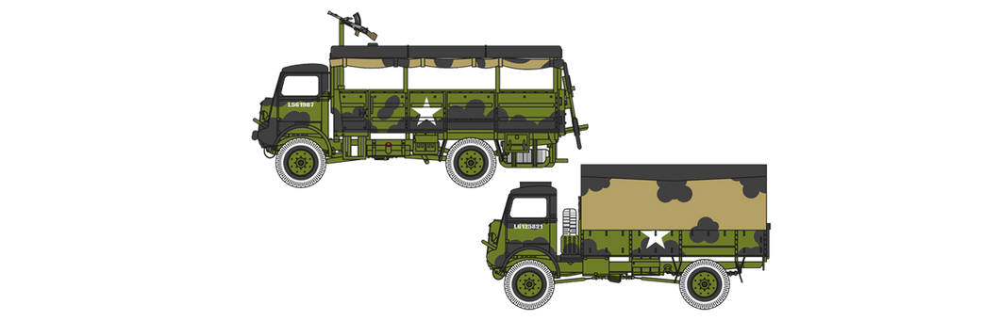

# #xxx Bedford QLT and QLD Trucks

Building the Airfix 1:76 Bedford QLT and QLD Trucks, kit A03306. Just the vehicles themselves right now - they'll likely end up in a diorama one day.

## Notes

The [Bedford QL](https://en.wikipedia.org/wiki/Bedford_QL) was a series of trucks manufactured by Bedford for use by the British Armed Forces in the Second World War.

* QLD: General service cargo truck and was the most numerous version in the series
* QLT: Troop carrier
    * From August 1941 and until the end of WW II more than 3,300 QLTs were produced.

With over 52,000 vehicles built between 1941 and 1945, the Bedford QL 3-ton truck was one of the most numerous British vehicles during the Second World War. Designed as either a general duties truck or troop transport, the QL was powered by a 3.5 litre, 6-cylinder petrol engine producing 72bhp, giving a governed top speed of 38mph.

Thanks to its high ground clearance, cross-country tyres and a 2-speed, 4-wheel-drive transfer box located in the centre of the chassis (giving 8 forward gear ratios), the QL had excellent cross country mobility. A large number are still in use by enthusiasts.

### The Kit

The Airfix kit No. A03306 is a 2010 tooling. It includes two vehicles (QLD, QLT) in 1:76 scale.
The most recent boxing is the 2025 release A03306A, now named "WWII 3-Ton G.S. And Troop Trucks".

See [instructions](./assets/A03306-instructions.pdf)

### A - QLT Troop Carrier and QLD General Purpose Cargo Truck, British Army, Northern Europe, 1944-1945

| Feature               | Color                | Recommended | Paint Used |
|-----------------------|----------------------|-------------|------------|
| camo, covers          | Matt Black           | No 33       | H12        |
| canvas panels         | Ochre                | No 83       | H79 + H71 tint |
| seats                 | Ochre                | No 83       | H79        |
| body, interior        | Khaki Drab           | No 159      | H80        |
| exhaust pipes         | Red Brick            | No 70       |         |
| headlight cover       | Gloss Yellow         | No 69       |         |
| instruments           | Gloss Black          | No 21       |         |

### Build Log

Just the vehicles themselves right now. I haven't found suitable figures for the vehicles yet.
Hopefully these will end up in a diorama one day.

## Final Gallery

## Credits and References

* [this project on scalemates](https://www.scalemates.com/profiles/mate.php?id=74137&p=projects&project=218020)
* Bedford QLT And Bedford QLD Trucks Airfix No. A03306 1:76
    * [on scalemates](https://www.scalemates.com/kits/airfix-a03306-bedford-qlt-and-bedford-qld-trucks--109371)
    * [on airfix](https://uk.airfix.com/products/bedford-qldqlt-trucks-a03306)
    * [instructions](./assets/A03306-instructions.pdf)

### Research References

* <https://en.wikipedia.org/wiki/Bedford_QL>
* [Modelling British World War II Armoured Vehicles by Tom Cole](https://www.goodreads.com/book/show/44315034-modelling-british-world-war-ii-armoured-vehicles)
* [Bedford QLT i QLD na etacie II Korpusu Polskiego](https://warhammster.blogspot.com/2013/02/bedford-qlt-i-qld-na-etacie-ii-korpusu.html)

#### Bedford QL Normandy 70th Anniversary by rockola59

### Build References

#### Part By Part Build, Airfix 1/76 Bedford QLT by Luca Sprues

Some fun stop-motion!

#### Airfix Bedford QLD & Bedford QLT Scale 1/76 by Gavin Marshall

