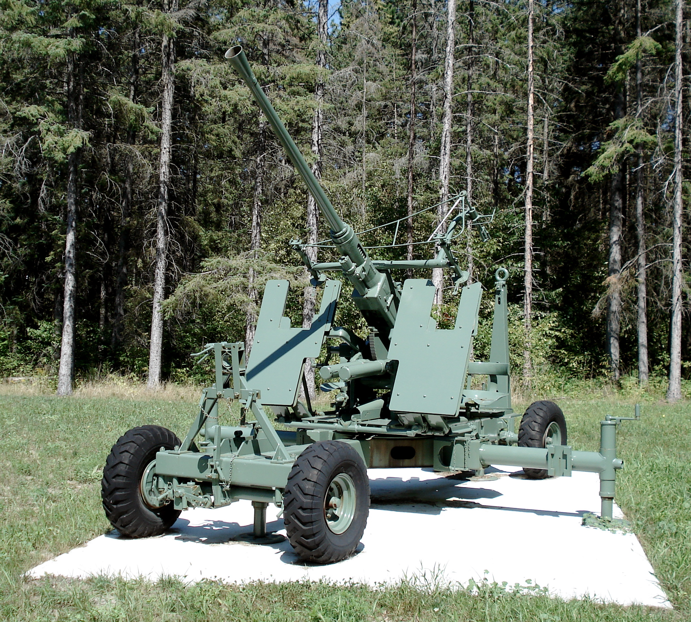
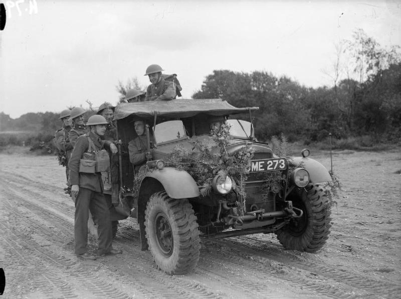

# #173 Bofors 40mm and Tractor

Bofors 40mm and Morris CS8 with crew deployed with the British 8th Army in North Africa 1942. Depicted with the Airfix 1:76 kit and figures.

## Notes

Designed in 1930 by the Swedish Bofors Company, the
[Bofors 40 mm L/60 gun](https://en.wikipedia.org/wiki/Bofors_40_mm_L/60_gun)
was adopted by some 18 countries and became the standard light anti aircraft weapon with the British forces.

The
[Morris CS8](https://en.wikipedia.org/wiki/Morris_CS8)
15-cwt 4x2 General Service Trucks were made in large numbers and they became the backbone of the British Army.

### The Kit

[A02314V - Bofors Gun & Tractor (A)](https://www.scalemates.com/kits/airfix-a02314-bofors-40mm-gun-and-tractor--109346) is the 2008 boxing of the 1976 tooling.
Purchased from Hobby Bounties for SG$23.90 (Sep-2021).

### Paint Scheme

| Feature               | Color                | Recommended | Paint Used |
|-----------------------|----------------------|-------------|------------|
|                       | Gloss Black          | Humbrol 21  |            |
| tires                 | Matt Black           | Humbrol 33  |            |
| shells                | Metallic Brass       | Humbrol 54  |            |
| interior              | Matt Khaki Drill     | Humbrol 72  | H81        |
| vehicle body          | Desert Yellow        | Humbrol 93  | H79        |
| soft covers           | Matt Pale Stone      | Humbrol 121 | H27        |

Figures - Gun Crew, 8th Army

| Feature               | Color                | Recommended | Paint Used                    |
|-----------------------|----------------------|-------------|-------------------------------|
| boots                 | Matt Black           | Humbrol 33  | 70.862                        |
| skin                  | Matt Flesh           | Humbrol 61  | various AMMO flash tones      |
| uniform, helmet       | Matt Khaki Drill     | Humbrol 72  | H27 over H81, various Vallejo |

### Initial Construction

### Planning the diorama and preparing the ground work

### Painting and Weathering the Morris CS8

### Painting and Weathering the Bofors 40mm

### Figures

### Final Diorama Assembly

### Final Gallery

### Final Gallery - Diorama Details

## Credits and References

* [this project on scalemates](https://www.scalemates.com/profiles/mate.php?id=74137&p=projects&project=139005)
* Bofors 40mm Gun & Tractor Airfix No. A02314 1:76
    * [on scalemates](https://www.scalemates.com/kits/airfix-a02314-bofors-40mm-gun-and-tractor--109346)
    * [on airfix.com](https://uk.airfix.com/products/bofors-40mm-gun-tractor-a02314v)
    * [instructions](./assets/A02314-instructions.pdf)
    * Purchased for SG$23.90 from Hobby Bounties Sep-2021
* WWII British 8th Army Vintage Classics Airfix No. A00709V 1:76
    * [on scalemates](https://www.scalemates.com/kits/airfix-a00709v-wwii-british-8th-army--1190125)
    * Purchased for £4.99 from airfix.com Jan-2024

### Research References

* [Bofors 40 mm L/60 gun](https://en.wikipedia.org/wiki/Bofors_40_mm_L/60_gun)
* [Morris CS8](https://en.wikipedia.org/wiki/Morris_CS8)
* <https://history-making.com/product/british-tank-crew-uniform-north-africa-1940-1941/>
* <https://www.fategate.com/en/archiv/i/4321-ww2-british-forces-charles-black-8th-army-infantryman-north-africa-1942>

#### The Bofors 40mm AA gun

YouTube by Lessons from the front

### Build References

#### Airfix 1:76 Bofors 40mm Gun & Tractor Full Build and Review

YouTube by Scale Stuff

