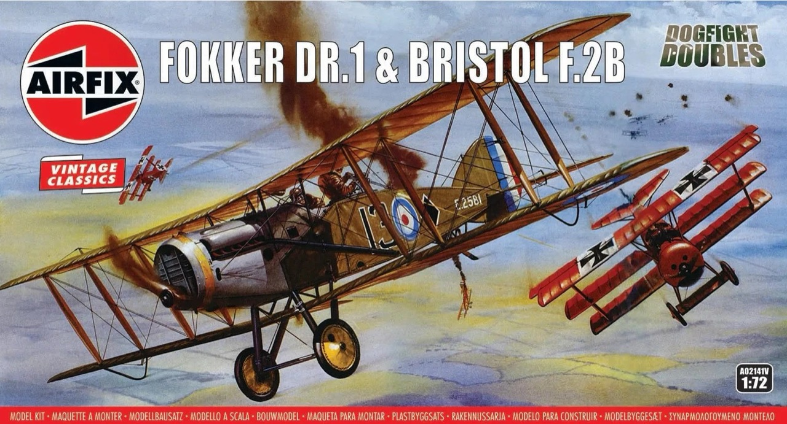

# #132 Fokker Dr.I

Building the Fokker Dr.I (intended for another diorama). This is the venerable Airfix Vintage Classic from 1957!

## Notes

The Fokker Dr.I, also known as the Fokker Triplane, was a German World War I fighter aircraft famed for its unique three-wing design. Built by the Fokker-Flugzeugwerke and introduced in 1917, it gained widespread recognition as the aircraft flown by the famous ace Manfred von Richthofen, the "Red Baron." Renowned for its agility and ability to make tight turns, the Fokker Dr.I was a formidable opponent in dogfights despite its relatively slow speed and short operational lifespan. Its iconic silhouette and association with the Red Baron have made it one of the most recognizable aircraft of the First World War.

### The Kit

The pace of aviation development during the First World War was nothing short of astonishing, with aeroplanes transforming from flimsy, unarmed observation platforms to deadly dominators of the sky in less than a twelve month period of fighting.

The year 1917 would prove to be a significant one for the air war over the trenches of the Western Front, as the British introduced their capable Bristol F.2B Fighter, a true multi-role aircraft and the Germans their Fokker DR.1, an aircraft which would be made famous by the feared Manfred von Richthofen.

The scene was set for a period of unrelenting aerial combat, as both sides struggled for supremacy of the skies.

The [Fokker DR.1 & Bristol F.2B Dogfight Doubles](https://www.scalemates.com/kits/airfix-a02141v-fokker-dr1-and-bristol-f2b--1460227)
kit from Airfix (No. A02141V in 1:72) is a Vintage Classics boxing of toolings that date from as early as 1957.

### Paint Schemes

#### A02141V - Fokker DR.1 Dreidecker, Aircraft flown by Manfred von Richthofen, Kommandeur Geschwader 1, March 1918. (B)

| Feature                | Color                  | Recommended | Paint Used |
|------------------------|------------------------|-------------|------------|
|                        | Black - Matt           | No 33       | |
|                        | Gunmetal - Metallic    | No 53       | H18 |
|                        | Brass Metallic         | No 54       | |
|                        | Light Grey - Matt      | No 64       | |
|                        | Cream - Matt           | No 103      | |
| Interior, prop, struts | Natural Wood - Matt    | No 110      | H37 |
|                        | Matt Olive Drab - Matt | No 155      | |
| fuselage               | Signal Red - Satin     | No 174      | H13 |

### Build Log

It's a simple kit that goes together in a jiffy..

Not a great likeness, and just a quick slap-dash paint job.

Parts coming together..

I've added copper wire for eventual in-flight mounting (for another display that I am working on).

Not bad for a 1957 kit.. didn't try to do anything special with it.

## Credits and References

* [this project on scalemates](https://www.scalemates.com/profiles/mate.php?id=74137&p=projects&project=160838)
* Fokker DR.1 & Bristol F.2B Dogfight Doubles Vintage Classics Airfix No. A02141V 1:72
    * [on scalemates](https://www.scalemates.com/kits/airfix-a02141v-fokker-dr1-and-bristol-f2b--1460227)
    * [on Airfix site](https://uk.airfix.com/products/fokker-dr1-triplane-bristol-fighter-dogfight-double-a02141v?_br_psugg_q=a02141v)
    * [instructions](./assets/A02141V-instructions.pdf)

### Research References

* [Fokker Dr.I](https://en.wikipedia.org/wiki/Fokker_Dr.I) - wikipedia
