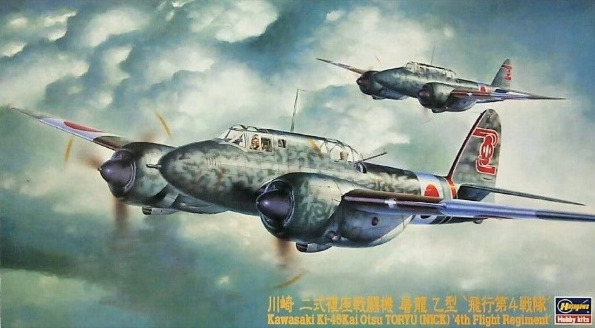

# #139 Kawasaki Ki-45 Kai Otsu

Building the Kawasaki Ki-45 Kai Otsu Toryu (Nick) as used by the IJA 4th Flight Regiment, based on the Hasegawa 1:72 kit.

## Notes

The [Kawasaki Ki-45](https://en.wikipedia.org/wiki/Kawasaki_Ki-45) Toryu (屠龍, "Dragonslayer") is a two-seat, twin-engine heavy fighter used by the Imperial Japanese Army in World War II. The army gave it the designation "Type 2 Two-Seat Fighter" (二式複座戦闘機, Ni-shiki fukuza sentōki); the Allied reporting name was "Nick". Originally serving as a long-range escort-fighter, the design — as with most heavy fighters of the period — fell prey to smaller, lighter, more agile single-engine fighters. As such, the Ki-45 instead served as a day and nighttime interceptor and strike fighter.

### Rejected By Japan For The Dumbest Reason: Kawasaki Ki-96

The Kawasaki Ki-96, a Japanese single-seat heavy fighter/interceptor/ground attacker from World War II that was intended to serve as a replacement for the Kawasaki Ki-45 Toryu. We first talk about the short era of the heavy fighter, how the era came about and why it quickly faded after WW2. We then talk about Japan venturing into the realm with the Ki-45, a pretty solid plane that served well as a bomber destroyer. We talk about the variants of the Ki-45 that were to serve in various roles.

## The Kit

I found a 1998 boxing of the
[Kawasaki Ki-45Kai Otsu Toryu (Nick) 4th Flight Regiment Hasegawa No. 51270 1:72](https://www.scalemates.com/kits/hasegawa-51270-kawasaki-ki-45kai-otsu-toryu-nick-4th-flight-regiment--177786)
kit at Hobby Mate ホビーメイト in Osaka.

The tooling comes from 1995, and Hasegawa have been re-releasing every few years (the last in 2019).

### Schemes

1. 飛行第4戦隊 第2攻擊隊 木村定光准尉乘機 昭和18年11月 山口県 小月基地 2nd Company 4th Flight Regiment Flown by WO. Sadamitsu Kimura Nov. 1943 Ozuki AB. Yamaguchi
2. 飛行第4戦隊 第2攻撃隊 昭和18年11月 山口県 小月基地 2nd Company 4th Flight Regiment Nov. 1943 Ozuki AB. Yamaguchi

### Paint Scheme

| Feature               | Color                    | Recommended | Paint Used |
|-----------------------|--------------------------|-------------|------------|
| pitot tube            | Silver                   | C8, H8      | H8         |
| guns, engine          | Steel                    | C28, H18    | H18        |
|                       | Flat Black               | C33, H12    | H12        |
| propeller             | Red Brown                | C41, H47    | H47        |
| port wing light       | Clear Red                | C47, H90    | H90        |
| starboard wing light  | Clear Blue               | C50, H93    | H93        |
|                       | Khaki Green              | C54, H80    | |
| exhaust pipes         | Burnt Iron               | C61, H76    | H76        |
| cockpit interior      | Cockpit Color (Nakajima) | C127        | C127       |
| fuselage base color   | Gray Green               | C128        | H336 + drop of H62 |
| camouflage            | Dark Green (Kawasaki)    | C130        | H330       |
| insignia bands        | Flat White               |             | H11        |
| hinomaru              | Flat Red                 |             | H13        |
| leading edge trim     | Orange Yellow            |             | H24 + H104 |

### Crew

To crew the aircraft, I've used two 3d resin printed figures from
[1/72 Scale Model Japanese Cockpit Pilot Figures - Frontline Collection Store](https://www.aliexpress.com/item/1005006220262721.html)

| Feature               | Paint Used      |
|-----------------------|-----------------|
| uniform               | 70.923 + 70.921 |
| boots and headgear    | Ammo F-552      |

### Build Log

### Final Gallery

The Kawasaki Ki-45 Toryu (屠龍) two-seat, twin-engine heavy fighter was introduced by the IJA in 1941.
A classic 1995 tooling from Hasegawa that still nicely captures the beautiful lines of this lesser-known aircraft.

It's now added to my wall of flight..

## Credits and References

* [this project on scalemates](https://www.scalemates.com/profiles/mate.php?id=74137&p=projects&project=167751)
* [Kawasaki Ki-45Kai Otsu Toryu (Nick) 4th Flight Regiment Hasegawa No. 51270 1:72](https://www.scalemates.com/kits/hasegawa-51270-kawasaki-ki-45kai-otsu-toryu-nick-4th-flight-regiment--177786)
* [for Hasegawa Ki-45 KAI Ko/Hei Toryu Canopy Mask DEAD Design Models No. VM72004 1:72](https://www.scalemates.com/kits/dead-design-models-vm72004-ki-45-kai-ko-hei-toryu-canopy-mask--1173407)
* [1/72 Scale Model Japanese Cockpit Pilot Figures - Frontline Collection Store](https://www.aliexpress.com/item/1005006220262721.html)
* [Kawasaki Ki-45](https://en.wikipedia.org/wiki/Kawasaki_Ki-45)
