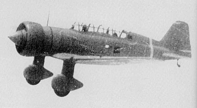

# #145 Mitsubishi Ki-15-II

Building the ARII 1:72 kit of the Mitsubishi Ki-15-II in IJA service.

## Notes

The [Mitsubishi Ki-15](https://en.wikipedia.org/wiki/Mitsubishi_Ki-15)
(雁金, Karigane, English: Wild Goose)
Army Type 97 Command Reconnaissance aircraft
(九七式司令部偵察機, Kyunana-shiki sireibu teisatsuki)
was a Japanese reconnaissance aircraft and a light attack bomber of the Second Sino-Japanese War and Pacific War.
It began as a fast civilian mail-plane.
It served with both the Imperial Japanese Army and Navy (as the C5M)
and was code-named "Babs" by the Allies.

### The Kit

I picked up the
[ARII No. 53011 1:72](https://www.scalemates.com/kits/arii-53011-mitsubishi-ki-15-ii-type-97-mk2-babs--172607)
kit at Yodobashi Akihabara in 2023 for ¥792.

It has decal options for two versions:

* Mitsubishi Ki-15-II Army Type 97 (IJA)
* Mitsubishi C5M1 (IJN)

### Paint Scheme

For inspiration, I'm borrowing the boxart from the [Fine Molds kit](https://www.scalemates.com/kits/fine-molds-fb25-ija-mitsubishi-ki-15-ii-babs--1162339)
and some builds I've [seen on ebay](https://www.ebay.com.sg/itm/394617105964).
I haven't found any actual references yet.

| Feature                    | Color                 | Recommended | Paint Used |
|----------------------------|-----------------------|-------------|------------|
| seats                      | Interior Green        | H58         |            |
| cockpit floor and interior | Interior Green        | H58         |            |
| engine                     | Steel                 | H18         |            |
| exhaust                    | Burnt Iron            | H76         |            |
| prop (C5M)                 | Silver                | H8          | n/a        |
| prop, spinner (Ki15)       | Red Brown             | H47         |            |
| main camo (C5M)            | IJA Gray              | H61         | n/a        |
| main camo (Ki15)           | IJN Gray              | H62         |            |
| fuselage base color        | Gray Green            |             | C128       |
| camouflage                 | Dark Green (Kawasaki) |             | C130? H330 |
|                            |                       |             |            |

### Aircrew Figures

The kit has 2 aircrew figures - which is great!
Bad news is that they are not great molds, but probably good enough once hidden under the canopy.

| Feature               | Color                | Recommended | Paint Used |
|-----------------------|----------------------|-------------|------------|
| cap, gloves, boots    | Mahogany             | H84         |            |
| straps                | Khaki Green          | H80         |            |
| face                  | Pale Brown           | H44         |            |
| overalls (Ki15)       | Khaki                | H81         | 70.921 English Uniform |
| overalls (C5M)        | Red Brown            | H47         | n/a        |
|                       |                      |             |            |

### Build Log

Figures aren't great, and I've just done a basic interior, as it is not very visible..

Quick background painting...

### Final Build Gallery

## Credits and References

* [this project on scalemates](https://www.scalemates.com/profiles/mate.php?id=74137&p=projects&project=195208)
* Mitsubishi Ki-15-II Type 97 Mk2 Babs C5M1 ARII No. 53011 1:72
    * [on scalemates](https://www.scalemates.com/kits/arii-53011-mitsubishi-ki-15-ii-type-97-mk2-babs--172607)

### Research References

* [Mitsubishi Ki-15](https://en.wikipedia.org/wiki/Mitsubishi_Ki-15) - wikipedia
* <http://www.aviationofjapan.com/2010/10/jaaf-mitsubishi-ki-15-ii-babs-in.html>
