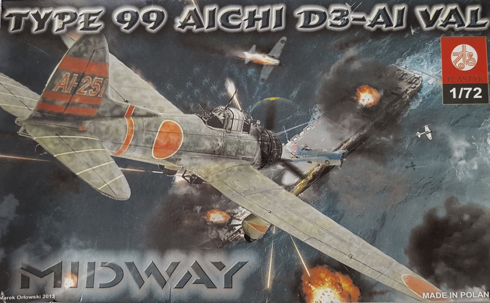
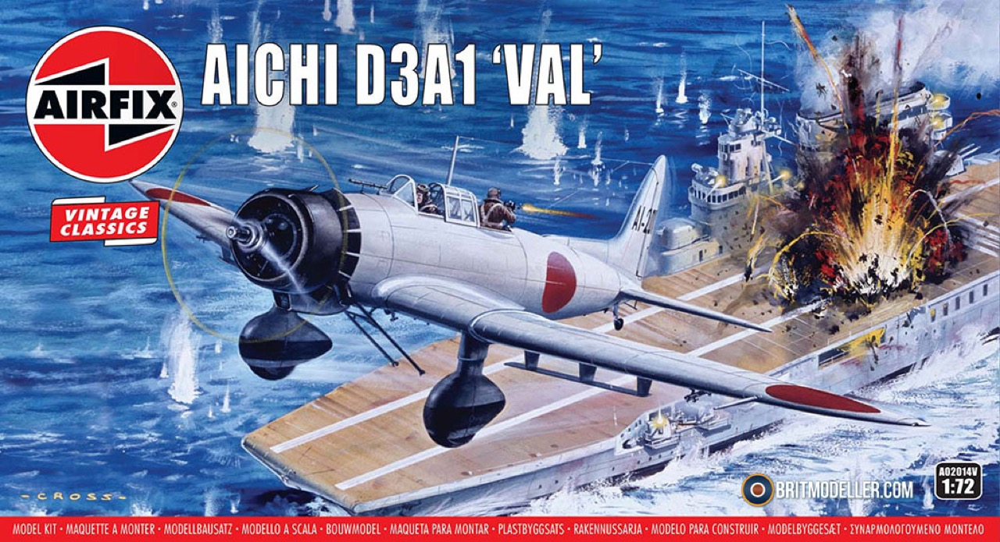
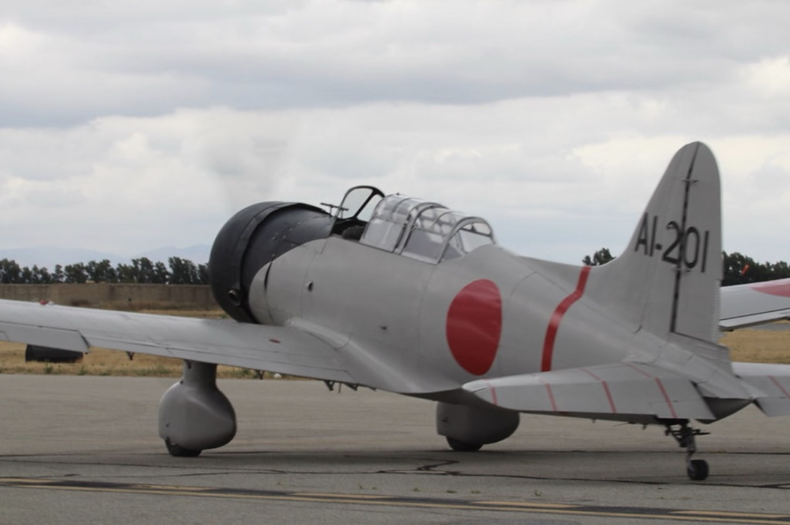

# #137 Aichi D3A1 from Akagi

An Aichi D3A1 Val dive bomber attack launched from the Akagi. Featuring kits from Airfix and ZTS Plastyk in 1:72.

## Notes

The [Aichi D3A](https://en.wikipedia.org/wiki/Aichi_D3A) Navy designation "Type 99 Carrier Bomber"; Allied reporting name "Val" is a World War II carrier-borne dive bomber. It was the primary dive bomber of the Imperial Japanese Navy (IJN) and was involved in almost all IJN actions, including the attack on Pearl Harbor.

The Aichi D3A  "Val" dive bomber was one of the most significant Japanese planes of the early war.
Surprisingly though, there are scant good options in 1:72 scale.
Wingsy Kits is working on a new 1:48 kit due in 2025, but I'm not aware of anything yet in 1:72.

I've long wanted to build the Aichi D3A in 1:72, and I got my hands on two contenders:

* [ZTS Plastyk No. S055](https://www.scalemates.com/kits/zts-plastyk-s055-type-99-aichi-d3-a1-val--1073616) - 2005 tooling
* [Airfix No. A02014V](https://www.scalemates.com/kits/airfix-a02014v-aichi-d3a1-val--1325491) - 1965 tooling

It didn't take me long to realise that neither of these kits are great. There are accuracy, detail and scaling issues with each. Fit and clear parts are also disappointing. As a result, I didn't stress too much about the build, and focused more on the presentation: both posed in a joint attack.

## Kits

### Aichi D3A1 in 1:72 by ZTS Plastyk No. S055

["Midway" Type 99 Aichi D3-A1 Val ZTS Plastyk No. S055 1:72](https://www.scalemates.com/kits/zts-plastyk-s055-type-99-aichi-d3-a1-val--1073616)

#### S055 Paint Scheme

| Feature               | Color                | Recommended |
|-----------------------|----------------------|-------------|
| walkway, bomb         | Matt Black           | Humbrol 33  |
| nose, prop rear       | Coal Black           | Humbrol 85  |
| upper fuselage        | Matt Bronze Green    | Humbrol 75  |
| lower fuselage        | Matt Beige Green     | Humbrol 90  |
| prop front            | Aluminium            | Humbrol 191 |
| cockpit interior      | Matt Forrest Green   | Humbrol 150 |

### Aichi D3A1 in 1:72 by Airfix No. A02014V

[Aichi D3A1 'Val' Vintage Classics Airfix No. A02014V 1:72](https://www.scalemates.com/kits/airfix-a02014v-aichi-d3a1-val--1325491)

#### A02014V Paint Scheme

(used for both models)

| Feature                | Color                | Recommended | Paint Used |
|------------------------|----------------------|-------------|------------|
| pitot tube, prop front | Silver               | Humbrol 11  | SM208      |
| bomb rack              | Silver               | Humbrol 11  | SM208      |
| nose, bomb             | Satin Coal Black     | Humbrol 85  | H12        |
| prop rear              | Satin Coal Black     | Humbrol 85  | H47        |
| Fuselage               | Satin Hemp           | Humbrol 168 | H336       |
| cockpit floor, tire    |                      | Humbrol 33  |            |
| cockpit interior       |                      | Humbrol 89  | H73        |
| bomb                   | Light Grey           | Humbrol 64  | H12        |
| engine, exhaust pipes  | Gunmetal             | Humbrol 53  | H76        |

Pilot. The recommendations from Airfix don't seem very reliable.

| Feature                | Color                | Recommended | Paint Used |
|------------------------|----------------------|-------------|------------|
| flight suit and cap    | Matt Chocolate       | Humbrol 98  |            |
| face and hands         | Matt Flesh           | Humbrol 61  |            |
| goggles                | Satin Coal Black     | Humbrol 85  |            |
| life preserver         | Matt Trainer Yellow  | Humbrol 24  |            |
| seat                   | Metallic Silver      | Humbrol 11  |            |

### Build Log

The ZTS Plastyk kit under construction:

The Airfix kit under construction:

Some crew:

Coming together:

Starting a background painting:

Ready to mount:

### Final Gallery

Akagi Attacks! A flight of Aichi D3A1 Val dive bombers unleashing destruction.

These are old kits from Airfix and ZTS Plastyk. For such a significant aircraft, I am surprised we don't have better options in 1:72.
Perhaps Wingsy Kits' new 1:48 tooling in 2025 will shake things up a bit!

### Joining the wall of flight

## Credits and References

* [this project on scalemates](https://www.scalemates.com/profiles/mate.php?id=74137&p=projects&project=176847)
* "Midway" Type 99 Aichi D3-A1 Val ZTS Plastyk No. S055 1:72
    * [on scalemates](https://www.scalemates.com/kits/zts-plastyk-s055-type-99-aichi-d3-a1-val--1073616)
* Aichi D3A1 'Val' Vintage Classics Airfix No. A02014V 1:72
    * [on scalemates](https://www.scalemates.com/kits/airfix-a02014v-aichi-d3a1-val--1325491)

### Research References

* [Aichi D3A](https://en.wikipedia.org/wiki/Aichi_D3A)
* [#33 - PEARL HARBOR raid - Akagi's dive bombers](https://japanese-aviation.forumotion.com/t29-33-pearl-harbor-raid-akagi-s-dive-bombers)

#### Aichi D3A "Val" "Dive Bomber" - "Replica" AI-201

