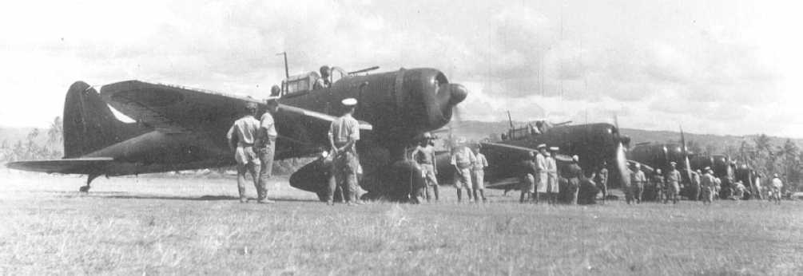
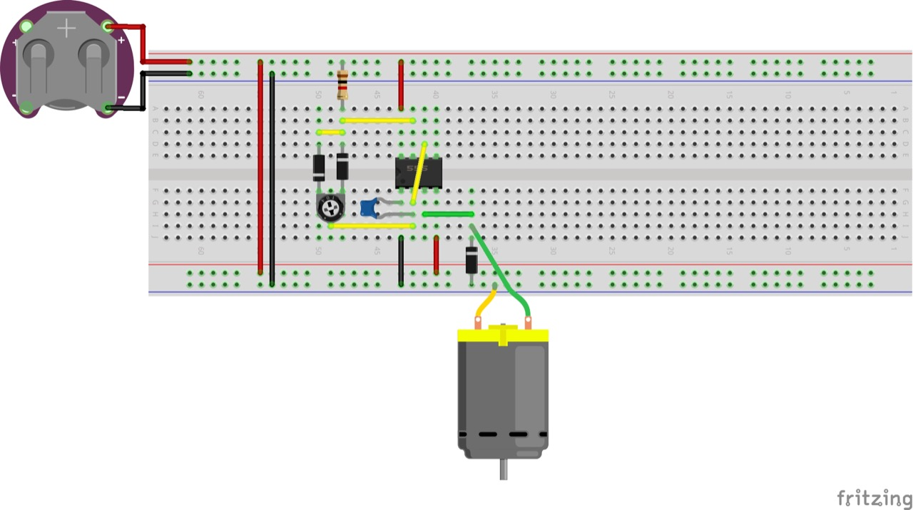
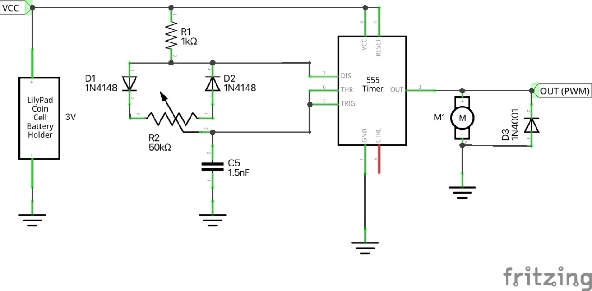

# #169 Aichi D3A2 from Zuikaku

Building and motorising the Aichi D3A2 Type 99 Carrier Bomber as flown from Zuikaku in 1943, using the 2020 release of the Fujimi 1:72 kit.

Here's a quick demo..

## Notes

The [Aichi D3A](https://en.wikipedia.org/wiki/Aichi_D3A)
(Navy full designation "Type 99 Carrier Bomber"; Allied reporting name "Val")
is a World War II carrier-borne dive bomber.
It was the primary dive bomber of the Imperial Japanese Navy (IJN) and was involved in almost all IJN actions,
including the attack on Pearl Harbor.

The Aichi D3A was the first Japanese aircraft to bomb American targets in the war,
commencing with Pearl Harbor and U.S. bases in the Philippines, such as Clark Air Force Base.
The type sank more Allied warships than any other Axis aircraft.

### AI-I-221

The marking "AI-I-221" follows Imperial Japanese Navy carrier-air-group tail code conventions:

* AI = aircraft assigned to the carrier Japanese aircraft carrier Zuikaku
* I = the dive bomber unit (D3A "Val" section)
* 221 = individual aircraft number within the air group

### D3A2 Variant

By 1943, the aircraft carrying the marking "AI-I-221" would have been an Aichi D3A Model 22 (D3A2), the later-war version with:

* more powerful Mitsubishi Kinsei engine
* increased fuel capacity
* improved canopy and streamlining
* dark green upper camouflage introduced during 1942–43

### Operations of AI-I-221 During 1943

There are no known surviving operational records specifically tracing the individual Aichi D3A aircraft from Zuikaku. Likely operations include:

#### Operation I-gō / Reinforcement of Rabaul (early 1943)

[Operation I-Go / い号作戦](https://en.wikipedia.org/wiki/Operation_I-Go)
was an aerial counter-offensive launched by Imperial Japanese forces against Allied forces during the Solomon Islands and New Guinea campaigns in the Pacific Theater of World War II.

The Japanese concentrated aircraft around Rabaul from the land-based aircraft of the 11th Air Fleet along with aircraft from the Third Fleet's four aircraft carriers, Zuikaku, Zuiho, Junyo and Hiyo.

1 April 1943:
ZUIKAKU and ZUIHO ordered by cinC Yamamoto to perform "Operation I-GO" the reinforcement of Rabaul, by delivering aircraft to reinforce the 11th Air Fleet at Rabaul.

2 April:
ZUIKAKU's Fighter and dive-bomber squadrons are detached to Rabaul and Buin, while the torpedo-bomber squadron is detached to Kavieng and Rabaul.

#### Operation RO-gō / Rabaul Deployment (late 1943)

[Operation RO-gō / ろ 号作戦](https://ja.wikipedia.org/wiki/%E3%82%8D%E5%8F%B7%E4%BD%9C%E6%88%A6)
was an air operation carried out by the Imperial Japanese Navy in November 1943.

The operation was ordered during the fighting that began with the Allied landing on Mono Island.
The Japanese forces, using their base air units and the First Carrier Division based on aircraft carriers, attacked the Allied landing convoy and supporting fleet that had arrived around Bougainville Island.

#### November 11 - Rabaul Strike and Japanese Counter-strike

The two pivotal and concluding battles of Operation Ro-Go occurred on November 11, when a follow-on USN Rabaul carrier strike was returned by a Japanese counterstrike.

TG50.3, termed "The Essex Group," comprised three carriers: two Essex-class USS Essex and USS Bunker Hill, and light carrier USS Independence, accompanied by a screen of nine destroyers, Chauncy, Kidd, Bullard, McKee, Murray, Edwards, Sterrett, Wilson, and Stack.

Japanese attack force comprised 23 Vals (seven Zuikaku and 16 Shokaku), and 14 Kates (five each from Zuikaku and Shokaku, with four more from Zuiho). A separate fighter force comprised 69 Zeros.

The main Japanese attack against the carriers occurring from 1358hrs to 1442hrs. The Vals approached first and scored near-misses against all three carriers.
At 1408hrs, a complete chutai of nine Vals tried to bomb USS Bunker Hill.

At 1442hrs, the final run was made by a substantive group of Kates. When it was over there had been negligible damage to the USN ships.

### The Kit

The [Aichi Type 99 Carrier Dive Bomber Model 11/22 Fujimi No. 72333 1:72](https://www.scalemates.com/kits/fujimi-72333-aichi-type-99-carrier-dive-bomber-model-11-22--1280997)
is the 2020 re-boxing of the classic 1985 tooling.
I purchased it for ¥2,610 from Yodobashi Shinjuku in Mar-2026.

See [instructions](./assets/72333-instructions.pdf)

### Paint Scheme

Scheme "F": 航空⺟艦「瑞鶴」⾶⾏機隊昭和18年 Carrier "Zuikaku" aircraft corps 1939:
1 Koku Sentai AI-I-221 1943 - Zuikaku

| Feature                         | Color                                   | Recommended | Paint Used |
|---------------------------------|-----------------------------------------|-------------|------------|
| bombs                           | Gloss Black                             | C2          | H2         |
| port wing light                 | Gloss Red                               | C3          | H90        |
| pitot tube, engine, joystick    | Metallic Silver                         | C8          | H8         |
| spinner, cowling, upper camo    | Semi Gloss IJN Green (Nakajima)         | C15         | H59        |
| exhaust pipes, sight, bomb rack | Metallic Steel                          | C28         | H76        |
| prop rear, joystick handle      | Flat Black                              | C33         | H12        |
| starboard wing light            | Gloss SKY BLUE                          | C34         | H93        |
| lower camo, bomb release        | Semi Gloss IJN Gray (Mitsubishi)        | C35         | H61        |
|                                 | Flat Red Brown                          | C41         |            |
| leading edge                    | Semi Gloss Orange Yellow                | C58         | H24        |
| prop front                      | Semi Gloss Propeller Color/Red Brown II | C131        | H47        |
| wheels                          | Flat Tire Black                         | C137        |            |
| cockpit interior                | Flat Russian Green "4BO" 1947-          | C512        | H511       |
|                                 |                                         |             |            |

### Build Log

Adding the aircrew using figures from [Japanese Navy Airmen Set Hasegawa No. X72-16 1:72](https://www.scalemates.com/kits/hasegawa-x72-16-japanese-navy-airmen-set--1123725).

### Motor Control

I'm using a simple variable PWM motor controller based on a 555 timer.
It works fine with a 3V coin cell to drive the particular motor I am using.

PWM gives a much more realistic, slower speed drive than just direct drive from a coin cell.

Circuit designed with Fritzing, see [ZuikakuD3A2.fzz](./ZuikakuD3A2.fzz).

### Mounting Frame

A quick watercolor for the background..

### Aircraft Finishing

### Mounting and Test

### Final Gallery

Aichi D3A2 Type 99 Carrier Bomber as flown from Zuikaku in 1943.
This is the Fujimi 1:72 kit, motorised and mounted #PlanesInFrames!

And a quick demo of the in-flight display..

## Credits and References

* [this project on scalemates](https://www.scalemates.com/profiles/mate.php?id=74137&p=projects&project=237467)
* Aichi Type 99 Carrier Dive Bomber Model 11/22 Fujimi No. 72333 1:72
    * [on scalemates](https://www.scalemates.com/kits/fujimi-72333-aichi-type-99-carrier-dive-bomber-model-11-22--1280997)
    * [instructions](./assets/72333-instructions.pdf)
* Japanese Navy Airmen Set Hasegawa No. X72-16 1:72
    * [on scalemates](https://www.scalemates.com/kits/hasegawa-x72-16-japanese-navy-airmen-set--1123725)

### Research References

* <https://en.wikipedia.org/wiki/Aichi_D3A>
* [IJN Zuikaku: Tabular Record of Movement](https://www.combinedfleet.com/Zuikak.htm)
* Operation I-Go / い号作戦
    * [ja.wikipedia](https://ja.wikipedia.org/wiki/%E3%81%84%E5%8F%B7%E4%BD%9C%E6%88%A6)
    * [en.wikipedia](https://en.wikipedia.org/wiki/Operation_I-Go)
* Operation Ro ろ 号作戦
    * [ja.wikipedia](https://ja.wikipedia.org/wiki/%E3%82%8D%E5%8F%B7%E4%BD%9C%E6%88%A6)
* ["Operation Ro-Go 1943: Japanese air power tackles the Bougainville landings"](https://www.goodreads.com/book/show/156750711-operation-ro-go-1943) by Michael Claringbould. Published November 23, 2023
* ["Pacific Profiles Volume 13: IJN Bombers, Transports, Flying Boats & Miscellaneous Types South Pacific 1942-1944"](https://www.goodreads.com/book/show/205582589-pacific-profiles-volume-13) by Michael Claringbould. Published May 31, 2024.
* [USS Bunker Hill (CV-17)](https://en.wikipedia.org/wiki/USS_Bunker_Hill_%28CV-17%29)
* [Bougainville Landings 1 November 1943](https://www.history.navy.mil/browse-by-topic/wars-conflicts-and-operations/world-war-ii/1943/beyond-guadalcanal/bougainville-imagery.html)
* [Air Strikes on Rabaul 2–11 November 1943](https://www.history.navy.mil/browse-by-topic/wars-conflicts-and-operations/world-war-ii/1943/beyond-guadalcanal/rabaul-strikes.html)

#### The Aichi D3A: The Deadly Japanese Dive Bomber

YouTube by Megaprojects

#### Overview of Dauntless vs. Val vs. Stuka

YouTube by Marc Liebman

#### Aichi D3A Type 99 'Val' in action

YouTube by Aviation videos archives part2 1935-1950

### Build References

#### Fujimi - D3A1 "Val" dive bomber

YouTube by PlasticoForEvah

