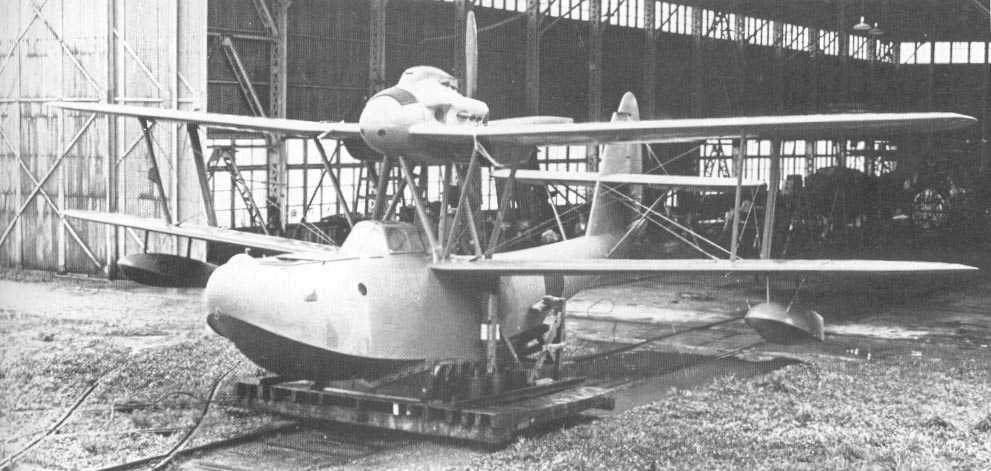
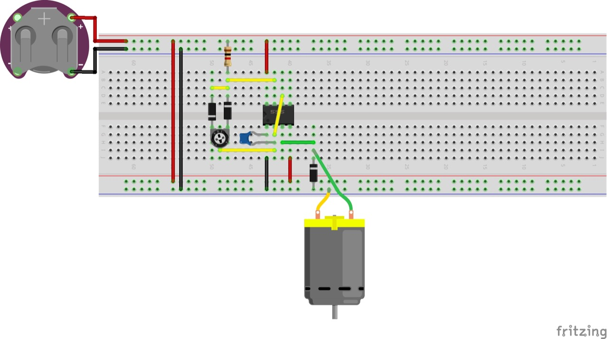
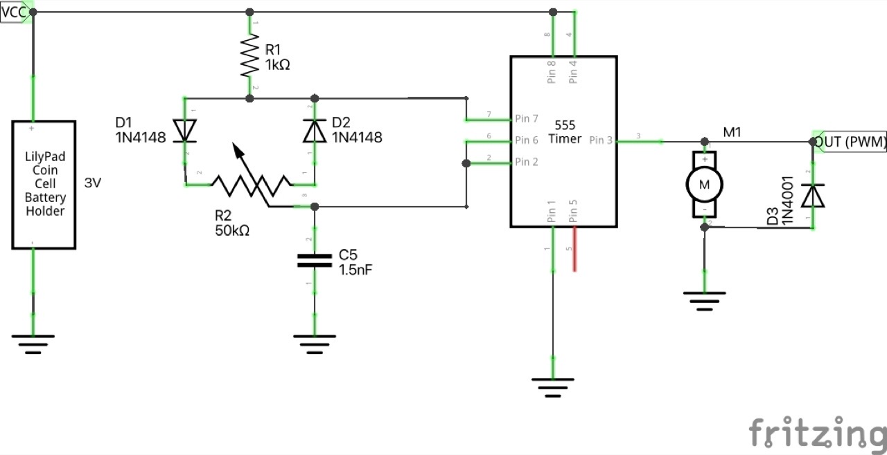
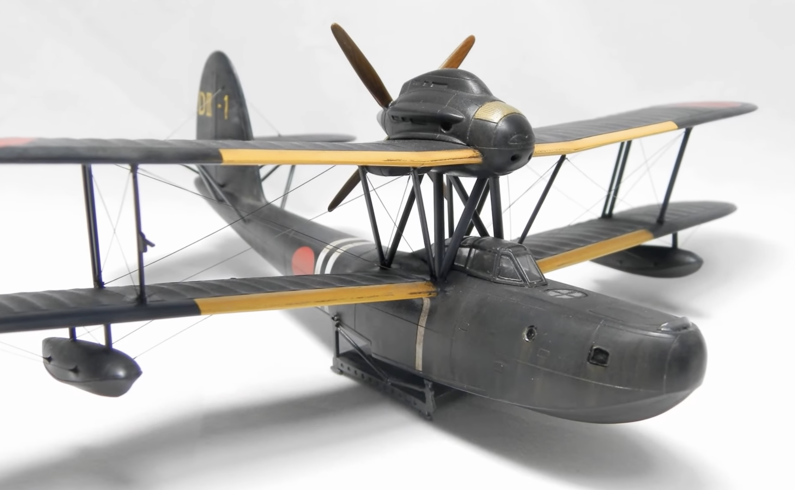

# #159 Aichi E11A

Building and motorising the Aichi E11A Type 98 Reconnaissance Seaplane, using the 2020 release of the Fujimi 1:72 kit.

## Notes

The [Aichi E11A](https://en.wikipedia.org/wiki/Aichi_E11A) Type 98 Reconnaissance Seaplane (九八夜偵, Kyū-hachi Yatei) was an Imperial Japanese Navy flying boat used during the first year of World War II for maritime patrol duties. The Allied reporting name for this type was "Laura".

The Type 98 was quite similar to the earlier E10A Type 96 ("Hank"). Type 98s  were rare - only 17 were built. It was designed to be launched from cruisers or battleships in order to spot their shellfire at night, but the Type 98s were soon diverted to communications and transport duties.
The Type 98s were displaced by newer craft such as the Aichi E13A "Jake" and Mitsubishi F1M "Pete".

The Imperial Japanese Navy originally expected it might be important to use seaplanes for night shellfire spotting, but this soon faded for several intertwined reasons:

* Inherent difficulty of night observation
* Rapid improvement in shipborne fire-control systems
* Operational vulnerability and complexity
* Shift in naval doctrine from gun duels to torpedo attacks
* Better uses for limited aircraft

### The Kit

This is the 2020 release from a 1998 tooling of the Fujimi Type 98 Aichi E11A in 1:72.

I bought the kit on Plaza Japan for ¥1,890 in Jun-2025.

See [instructions](./assets/72331-instructions.pdf)

### Paint Scheme

| Feature                   | Color                                   | Recommended | Paint Used |
|---------------------------|-----------------------------------------|-------------|------------|
|                           | Gloss Black                             | C2/H2       |            |
| port nav light            | Gloss Red                               | C3/H3       | H90 on H11 |
| pitot, spinner            | Metallic Silver                         | C8/H8       | H8         |
| upper fuselage (scheme 1) | Semi Gloss IJN GREEN (NAKAJIMA)         | C15/H59     | H59        |
| trolley                   | Metallic Steel                          | C28/H18     | H18        |
|                           | Flat Black                              | C33/H12     |            |
| starboard nav light       | Gloss SKY BLUE                          | C34/H25     | H93 on H11 |
| lower fuselage (scheme 1) | Semi Gloss IJN GRAY (MITSUBISHI)        | C35/H61     | H61        |
| props stern face          | Semi Gloss Wood Brown                   | C43/H37     | H37        |
| cockpit interior          | Semi Gloss Cockpit Green IJN            | C127        |            |
| props forward face        | Semi Gloss Propeller Color/Red Brown II | C131/H47    | H47        |
| fuselage (scheme 2)       |                                         | C2:C33 (3:1)|            |
|                           |                                         |             |            |

### Build Log

It's a very nice molding...

Installing a motor (works well with 3V PWM). Tested to make sure I get the rotation correct.
I've added a 1N4001 flyback diode across the motor to shunt inductive voltage spikes.

I've added 1 figure (of the 3-man crew) as I don't think others will be easily seen.
This is a seated pilot from the IJN Pilots and Ground Crew WWII Red Box No. RB72053 1:72 set.

Fujimi included a neat alignment jig for the upper wing on the clear sprue.

### Motor Control

I'm using a simple variable PWM motor controller based on a 555 timer.
It works fine with a 3V coin cell to drive the particular motor I am using.

PWM gives a much more realistic, slower speed drive than just direct drive from a coin cell.

Circuit designed with Fritzing, see [E11A.fzz](./E11A.fzz).

Testing the motor again before I start painting.

### Painting and Finishing

I had to pull out all the big guns to try and get these decals to settle before I can work on the finish!

### Frame and Mounting

A quick watercolor of a dramatic sea and sky in a frame from Daiso...

### Motor Control Board

I transferred the electronics to a small SO-16 DIP adapter with mainly surface-mount components

### Rigging and Final Finishing

I decided to do the full rigging, and I think I've finally got a process that works well for me.
CA is really variable in my climate without accelerator, but this made my process so much more reliable.

I have some Green Stuff World CA activator in a spray bottle, but I also read the warning on the bottle that basically said "don't do that if you want to live"!

I tried using a brush to apply the accelerator instead .. so much better! Controlled application, no waste, and hope I won't die so soon. Works with pre-application - dab to model, rigging dip in CA, then touch to model. Or reverse - CA to model, insert rigging, then touch with the brush.

I used some oils and AK weathering pencils to bring a bit more visual interest to the finish.

### Mounting and Motor Test

### Final Gallery

The Aichi E11A Type 98 on reconnaissance. Motorised Fujimi 1:72 kit.

## Credits and References

* [this project on scalemates](https://www.scalemates.com/profiles/mate.php?id=74137&p=projects&project=215541)
* Aichi Type 98 Reconnaissance Seaplane (Yatei) Fujimi No. 72331 1:72
    * [on scalemates](https://www.scalemates.com/kits/fujimi-72331-aichi-type-98-reconnaissance-seaplane-yatei--1282823)
    * [instructions](./assets/72331-instructions.pdf)
* IJN Pilots and Ground Crew WWII Red Box No. RB72053 1:72
    * [on scalemates](https://www.scalemates.com/kits/red-box-rb72053-ijn-pilots-and-ground-crew--952630)

### Research References

* <https://en.wikipedia.org/wiki/Aichi_E11A>
* <https://j-aircraft.com/faq/E11A.htm>
* <https://inchhighguy.wordpress.com/2025/10/08/aichi-e11a-type-98-reconnaissance-seaplane-laura/>

#### JAPAN WW2 Seaplane Aichi E11A Image HD - JAPAN WW2 Seaplane Aichi E11A Bild HD

YouTube by Armas Historicas - Guns Historical

### Build References

* <https://adamrehorn.wordpress.com/fujimi-1-72-aichi-e11a-laura-oob/>

#### Aircraft model - Type 98 Reconnaissance Seaplane (Night Recon) 1/72

YouTube by Amegraphy.

A different boxing of the kit, but a wonderful example.

#### 愛知 九八式水上偵察機　フジミ1/72

YouTube by terua47.

A good example of rigging too:

