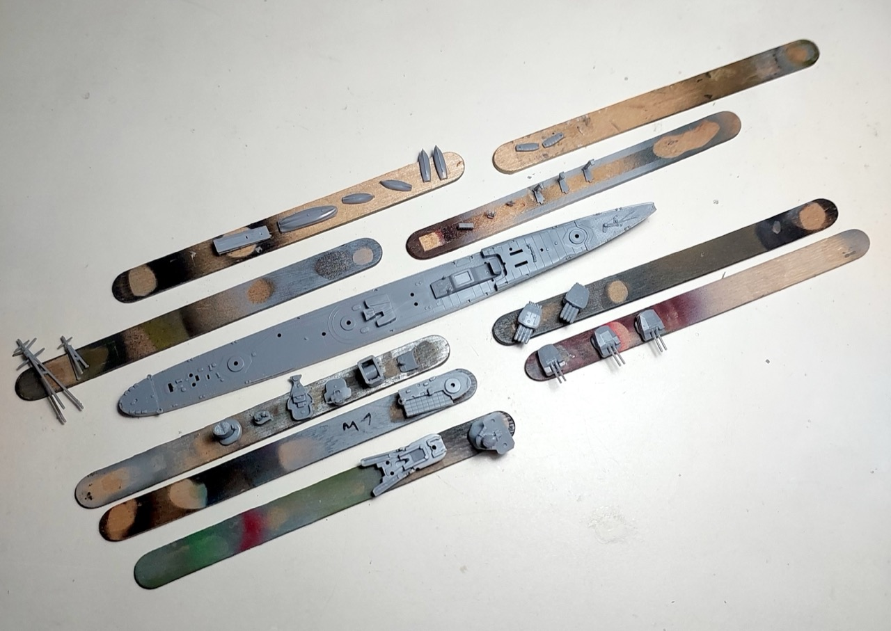
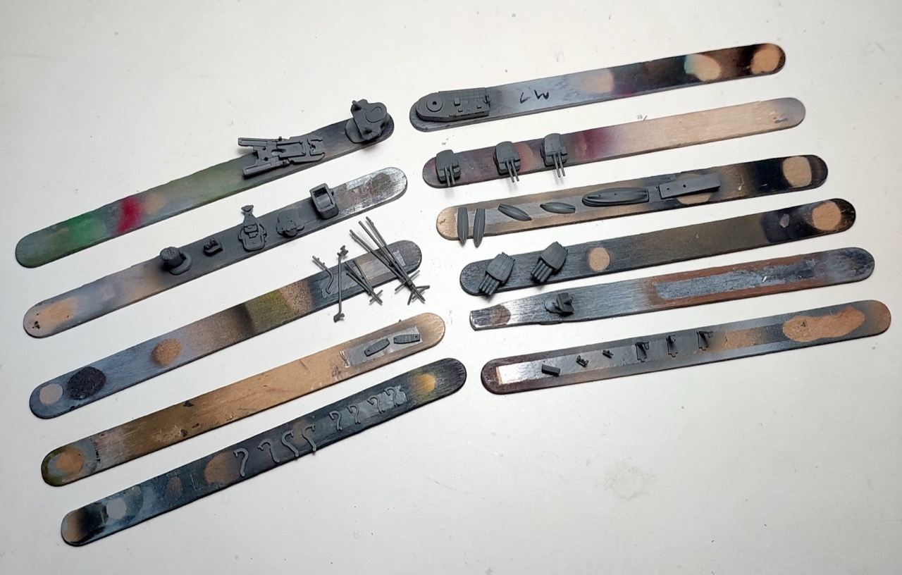
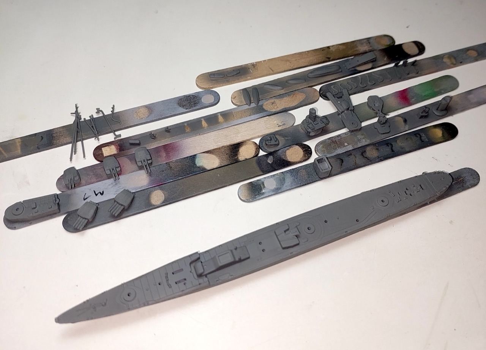
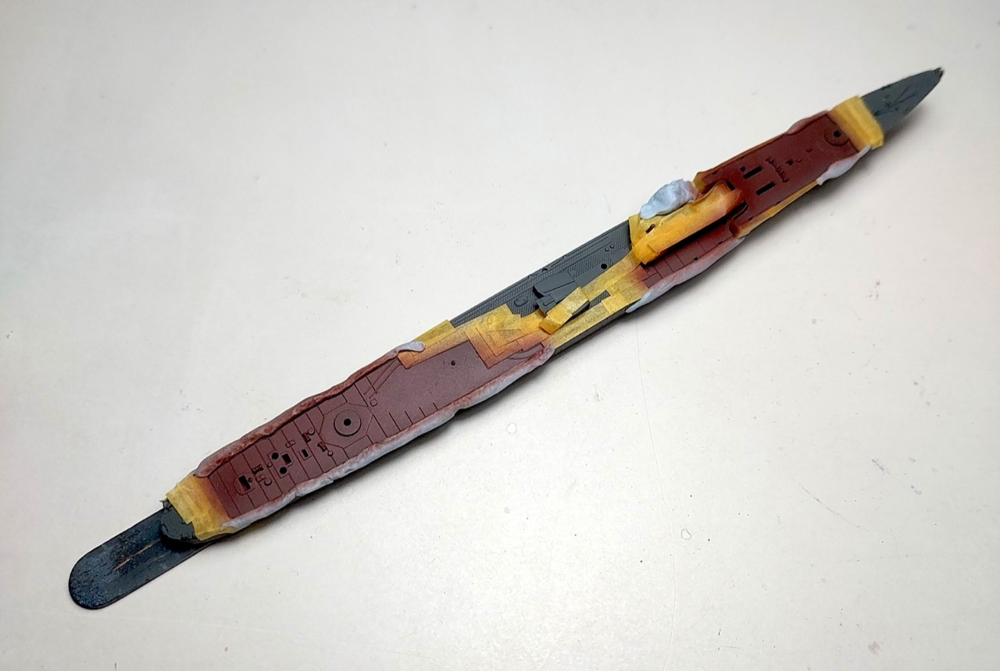
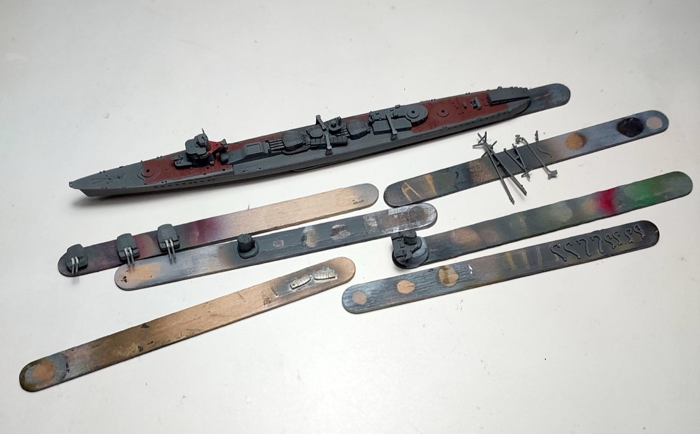
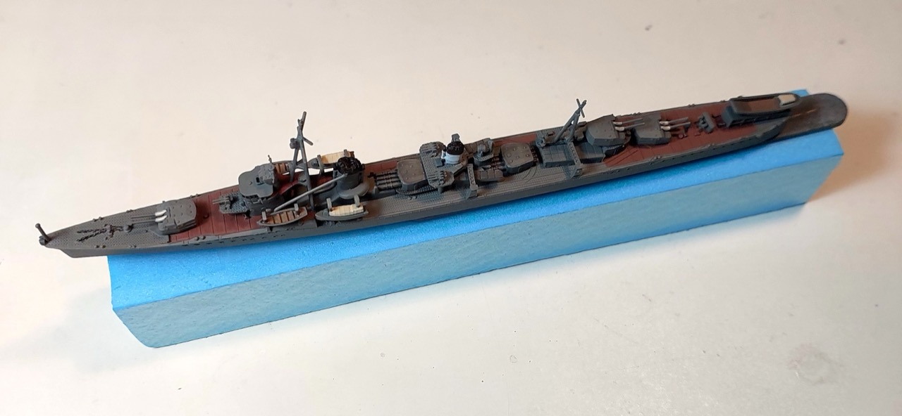

# #xxx IJN Destroyer Asagumo

Building the Hasegawa 1:700 representation of the IJN Destroyer Asagumo 朝雲. Just a basic out of the box build without PE or rigging for now.

## Notes

The Asagumo (朝雲, Morning Cloud, モグサア) was the fifth of ten
[Asashio-class](https://en.wikipedia.org/wiki/Asashio-class_destroyer) destroyers
built for the Imperial Japanese Navy in the mid-1930s under the Circle Two Supplementary Naval Expansion Program (Maru Ni Keikaku).

The success of the Asashio-class lead to the [Kagerō-class](https://en.wikipedia.org/wiki/Kager%C5%8D-class_destroyer), similar in design, but was slightly larger and incorporated a number of improvements which had been gained through operational experience.
The [Yūgumo-class](https://en.wikipedia.org/wiki/Y%C5%ABgumo-class_destroyer) was a repeat of the preceding Kagerō class with minor improvements that increased their anti-aircraft capabilities.

)

Key events from the [record of movement](http://www.combinedfleet.com/asagum_t.htm):

* 27-28 February 1942: Battle of the Java Sea
* 4-6 June 1942: Battle of Midway
* 26 October 1942: Battle of Santa Cruz
* 12-13 November 1942: First Naval Battle of Guadalcanal
* 14-15 November 1942: Second Naval Battle of Guadalcanal
* 1-4 March 1943: Battle of the Bismarck Sea
* 19-20 June 1943: Battle of the Philippine Sea
* 7-17 July 1943: Initial troop evacuation run to Kiska, aborted due to weather.
* 22 July-1 August 1943: Second troop evacuation run to Kiska, successful on 29 July. With ABUKUMA, KISO, and five other destroyers, assigned to transport unit. Removed 476 evacuees.
* 22-25 October 1944: Battle of Leyte Gulf
* 25 October 1944: Sunk in Battle of Surigao Strait.

### The Kit

I've used the Asagumo model from
[Japanese Navy Destroyer Yugumo, Kazagumo & Asagumo "Withdrawal strategy from Kiska Island" Hasegawa No. 30062 1:700](https://www.scalemates.com/kits/hasegawa-30062-yugumo-kazagumo-and-asagumo--1225647)
purchased from Hobby Point for SG$79.20 in Jun-2022.

See [instructions](./assets/30062-instructions.pdf).

The Asagumo appears to be an updated (or at least significantly refurbished) mold of the Asashio from 2017:
[Japanese Navy Destroyer Asashio Hasegawa No. 463 1:700](https://www.scalemates.com/kits/hasegawa-463-japanese-navy-destroyer-asashio--1097976).

### Paint Scheme

| Feature                                                      | Color                | Recommended   | Paint Used |
|--------------------------------------------------------------|----------------------|---------------|------------|
| navigation light port                                        | Red                  | C3/H3         | H3         |
|                                                              | Yellow               | C4/H4         |            |
| navigation light starboard                                   | Green                | C6/H6         | H6         |
|                                                              | Silver               | C8/H8         |            |
| underwater hull                                              | Cocoa Brown          | C29/H17       |            |
| hull, superstructure, cutter/launch/landing craft hull       | Dark Grey (2)        | C32/H83       | H83        |
| funnel tops, bridge windows                                  | Flat Black           | C33/H12       | H12        |
| launch/landing craft decking                                 | Wood Brown           | C43/H37       | H37        |
| cutter slats/interior                                        | Tan                  | C44/H27       | H37        |
| gun baffles                                                  | Sail Color           | C62-97%+C4-3% | H85        |
|                                                              | Sail Color           | C45/H85       |            |
| launch/landing craft canopy, funnel band                     | Flat White           | C62/H11       |            |
| deck (lighter, less red than C29)                            | Linoleum Deck Color  | C606          | H37+H17(5%)+flat base |
|                                                              |                      |               |            |

### Build Log

### Final Gallery

The IJN Destroyer Asagumo 朝雲.
Just a basic out of the box build without PE or rigging, and
no sea base for now as I have plans for this to end up in a diorama.

## Credits and References

* [this project on scalemates](https://www.scalemates.com/profiles/mate.php?id=74137&p=projects&project=240283)
* Japanese Navy Destroyer Yugumo, Kazagumo & Asagumo "Withdrawal strategy from Kiska Island" Hasegawa No. 30062 1:700
    * [on scalemates](https://www.scalemates.com/kits/hasegawa-30062-yugumo-kazagumo-and-asagumo--1225647)
    * [instructions](./assets/30062-instructions.pdf)
* Japanese Navy Destroyer Asashio Hasegawa No. 463 1:700
    * [on scalemates](https://www.scalemates.com/kits/hasegawa-463-japanese-navy-destroyer-asashio--1097976)

### Research References

* <https://en.wikipedia.org/wiki/Japanese_destroyer_Asagumo_(1937)>
* <https://ja.wikipedia.org/wiki/%E6%9C%9D%E9%9B%B2_(%E9%A7%86%E9%80%90%E8%89%A6)>
* <https://japanese-warship.com/destroyer/asagumo/>
* [IJN Asagumo: Tabular Record of Movement](http://www.combinedfleet.com/asagum_t.htm)
* <http://www.niehorster.org/014_japan/navy-commanders/dd.html>

#### Developing Asashio, Kagero, & Yugumo

YouTube by CentralCrossing

### Build References

#### 【ウォーターラインシリーズ】ハセガワ 1/700 日本海軍 駆逐艦 朝潮 を作ろう －Hasegawa 1/700 IJN Destroyer Asashio

YouTube by うどん師団

#### 1:700プラモデル「日本駆逐艦 朝潮」

YouTube by  プラモデルメーカー ハセガワ

