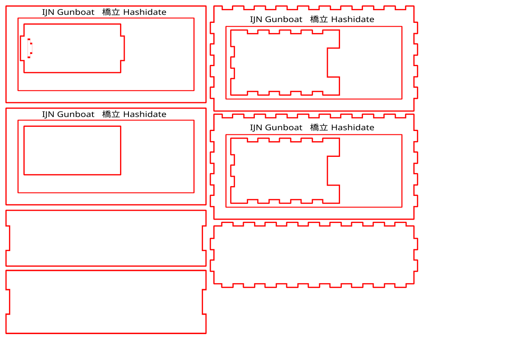

# #083 IJN Gunboat Hashidate

Building the Tamiya 1:700 kit of the IJN Gunboat 橋立 Hashidate, presented in a laser cut case with figures from ION Model.

## Notes

Hashidate (橋立, Standing Bridge) was the lead vessel in the Hashidate-class gunboats in the Imperial Japanese Navy.

She was intended initially for support of combat operations by the Imperial Japanese Army in the Second Sino-Japanese War off the coast of China. At the time of the attack on Pearl Harbor, Hashidate was assigned to the China Area Fleet as part of the 2nd China Expeditionary Fleet's 15th Escort Group. With the start of the Pacific War, she was assigned to ”Operation C” – the invasion of Hong Kong. She remained based at Hong Kong for most of the war. At some point in 1943, five additional Type 96 25 mm AT/AA Guns were added, along with depth charges in 1944.

On May 22, 1944, she was torpedoed by USS Picuda (SS-382) in the South China Sea off Pratas Island while towing the crippled merchant passenger/cargo ship Tsukuba Maru

### The Kit

[Water Line Series No. 553 IJN Gunboat Hashidate Aoshima No. 003657 1:700](https://www.scalemates.com/kits/aoshima-003657-ijn-gunboat-hashidate--306123)
is an interesting 2012 tooling, featuring the
IJN Gunboat Hashidate
and also a couple of Type 95 light tanks.

### Paint Scheme

| Feature                 | Color                   | Recommended | Paint Used |
|-------------------------|-------------------------|-------------|------------|
| nav light port          | Red                     | H3          |            |
|                         | Flat White              | H11         | H11        |
| funnel, mast, guns      | Flat Black              | H12         | H12        |
| nav light starboard     | Sky Blue                | H25         |            |
| boats, main deck        | Tan                     | H27         | H27        |
| upper deck              | Wood Brown              | H37         | H37        |
| hull and superstructure | Dark Gray (2)           | H83         | H83        |

### Paint Scheme - Type 95 Light Tank

| Feature               | Color                   | Recommended     | Paint Used |
|-----------------------|-------------------------|-----------------|------------|
|                       | Flat Yellow             | H4 + H40 4:1    |            |
|                       | Flat Black              | H12             |            |
|                       | Steel                   | H18             |            |
|                       | Wood Brown              | H37             |            |
|                       | Red Brown               | H47             |            |
|                       | IJA Green               | H60             |            |
|                       | Middle Stone            | H71             |            |
|                       | Burnt Iron              | H76             |            |

### Build Log

Just the basic kit with the addition of some PE railings:

No crew or sea base for this build yet. Let's work on that later...

### Presentation Case

I'm experimenting with some new ideas to present and store ship models.
For the Hayasui, I'm going to try a laser cut case:

* closed inner frame
    * open on both sides for either viewing or posing with a backdrop on one side
    * LED strip installed in the top
* box top that fits over the frame for dust-free storage

Inner sea base height: 10mm

#### Case Design

I used [MakerCase](https://en.makercase.com/) to generate a simple parametric designs:

* Inner frame:
    * material thickness: 3mm
    * inside dimensions:
        * width: 160mm
        * height: 80mm
        * depth: 40mm
    * closed box
    * edge joints: flat
    * panel labels: enabled (to be excluded from cutting)
    * cut line width: 1mm
    * kerf: 0.2mm
    * panel layout: separate, single file
    * exported as [inner-template.svg](./case/inner-template.svg)
* Outer cover:
    * material thickness: 3mm
    * inside dimensions:
        * width: 166mm (160mm internal width + 2 x 3mm material)
        * height: 84mm (80mm internal height + 3mm material + 1mm tolerance)
        * depth: 47.7mm (40mm internal depth + 2 x 3mm material + 1.7mm tolerance)
    * open box
    * edge joints: finger 9mm
    * panel labels: enabled (to be excluded from cutting)
    * cut line width: 1mm
    * kerf: 0.2mm
    * panel layout: separate, single file
    * exported as [cover-template.svg](./case/cover-template.svg)

Refined in Affinity Designer as [box.afdesign](./case/box.afdesign)

* exported for cutting as [box.svg](./case/box.svg)
* finalised in xTool Studio as [box.xs](./case/box.xs)

#### Building the Case

I cut the box with an [xTool S1 Laser Cutter at the library](https://leap.tardate.com/equipment/nlb/xtools1/).

Case design:

Completed with some veneer decals from ProperPlane:

### Sea Base

I used a foil base on mod podge and tissue. Sea colour built up with the standard technique of multiple layers of mod podge and acrylic colours.

#### Paint Scheme - Sea Base

| Feature                 | Color                   | Recommended | Paint Used      |
|-------------------------|-------------------------|-------------|-----------------|
| layer finish            | clear                   |             | Gloss Mod Podge |
| water layers            | Dark Seagreen           |             | 70.868          |
| water layers            | Intermediate Green      |             | 70.891          |
| water layers            | Dark Prussian Blue      |             | 70.899          |

### Crewing the Ship

Steaming along without any crew is a bit disconcerting ... so I've added a few figures for colour, from
the set: [Imperial Japanese Navy - Chilling on Deck (92 figures) ION Model No. J700-001 1:700](https://www.scalemates.com/kits/ion-model-j700-001-imperial-japanese-navy-chilling-on-deck--1352342)

#### Paint Scheme - Figures

| Feature                 | Color                   | Recommended | Paint Used |
|-------------------------|-------------------------|-------------|------------|
| crew uniform            | Flat White              |             | 70.951     |
| officer uniform, caps   | Flat Black Grey         |             | 70.862     |
| skin                    | Burnt Sand              |             | AMMO F-551 |

#### Case Background

Inspiration:

* [Postcard Hong Kong from the Harbour, 1930s](https://www.flickr.com/photos/charlesinshanghai/31730507968)
* [1930s Harbour Central](https://gwulo.com/media/26474)
* [Hong Kong Skyline over the years](https://laurathelaowai.wordpress.com/2015/09/25/hong-kong-skyline-over-the-years/)
* [Early 20th-century postcards of Hong Kong](https://gwulo.com/node/39139)

### Final Gallery

## Credits and References

* [this project on scalemates](https://www.scalemates.com/profiles/mate.php?id=74137&p=projects&project=145734)
* Water Line Series No. 553 IJN Gunboat Hashidate Aoshima No. 003657 1:700
    * [on scalemates](https://www.scalemates.com/kits/aoshima-003657-ijn-gunboat-hashidate--306123)
    * [instructions](./assets/003657-instructions.pdf)
    * Purchased from Hobby Point for SG$32.40 (Mar-2023).
* Imperial Japanese Navy - Chilling on Deck (92 figures) ION Model No. J700-001 1:700
    * [on scalemates](https://www.scalemates.com/kits/ion-model-j700-001-imperial-japanese-navy-chilling-on-deck--1352342)
    * Purchased from Super Hobby for SG$18.96 (Jan-2023)

### Research References

* [Hashidate-class gunboat](https://en.wikipedia.org/wiki/Hashidate-class_gunboat)
* [IJN Gunboat HASHIDATE: Tabular Record of Movement](http://www.combinedfleet.com/HashidateG_t.htm)
