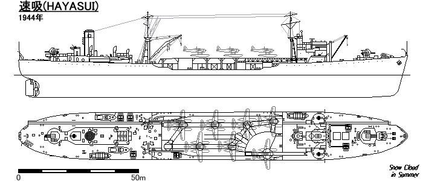

# #170 IJN Oil Supply Ship Hayasui

Building the Aoshima 1:700 representation of the IJN Oil Supply Ship Hayasui 速吸, enhanced with additional PE and rigging.

## Notes

The Hayasui (速吸, "Quick Absorption") was a Japanese fleet oiler (hybrid tanker/carrier) of the Imperial Japanese Navy (IJN), serving during World War II.

Hayasui was completed as one of the Kazahaya class fleet oilers. After lack of reconnaissance planes was identified as a contributing factor to defeat of the IJN at the Battle of Midway, aviation facilities were added to Hayasui for accompanying the carrier task force. The IJN added the function of food supply ship to Hayasui to improve carrier task force endurance following experience at the Battle of the Santa Cruz Islands.

### From [IJN HAYASUI: Tabular Record of Movement](http://www.combinedfleet.com/Hayasui_t.htm)

* 25 December 1943:
    * Launched and named HAYASUI.
* ...
* 24 April 1944:
    * Completed and registered in the IJN. HAYASUI is designed to carry six (plus one spare) E16As and one catapult. Captain Sugiura Keizaburo is the Commanding Officer.
* ...
* 16 June 1944:
    * At about 1000, HAYUSUI and the 1st Supply Force's tankers NICHIEI, KOKUYO and SEIYO MARUs rendezvous at 11-00N, 130-00E with Vice Admiral Ugaki Matome's (former CO of HYUGA) aborted Operation "Kon" Task Force's Bat Div 1's YAMATO, and MUSASHI, Cru Div 5's HAGURO and MYOKO, DesRon 2's light cruiser NOSHIRO and Des Div 4's OKINAMI, SHIMAKAZE, ASAGUMO, MAIKAZE and MICHISHIO and DesRon 10's YAMAGUMO and NOWAKI.
    * Ugaki's force is refueled promptly, then his force and the 1st Supply Force head north to join Vice Admiral Ozawa Jisaburo's (former CO of HARUNA) First Mobile Fleet's Main Body.
    * At 1650, Ugaki's force and the 1st Supply Force rendezvous with Ozawa. The 1st Supply Force begins to refuel the Mobile Fleet.
* 17 June 1944:
    * At 2000, the refueling is completed. At this time, the First Mobile Fleet is at 12-15N, 132-45E. The 1st Supply Force stands by to rendezvous with the 2nd Supply Force's oilers GENYO and AZUSA MARUs enroute from Guimaras, Philippines. Later, all six oilers depart the area for the designated standby point at 14-40N, 134-20E.
* 20 June 1944:
    * The Battle of the Philippine Sea:
    * The Supply Forces are attacked by LtCdr J. D. Blitch's seven Grumman "Avenger" TBF torpedo-bombers, 12 Curtiss "Helldiver" SB2C dive-bombers and 16 "Hellcat" F-6F strafers from Task Force 58's USS WASP (CV-18).
    * HAYASUI is hit by one bomb and set afire. She also takes two near-misses.
    * SEIYO MARU is hit by bombs and later scuttled that evening.
    * The 2nd Supply Force's oiler GENYO MARU is damaged by bombs and later scuttled by destroyer UZUKI.
    * HAYASUI's damage control party extinguishes the fire and she clears the area. Her damage is considered minor.
    * HAYASUI later makes port at Balikpapan, Borneo where she loads fuel oil then departs for Manila escort by second-class destroyer TSUGA.
* 10 July 1944:
    * Departs Manila via Takao, Formosa for Kure escorted by destroyer HIBIKI.
* ...
* 19 August 1944:
    * The convoy splits into at least two distinct groups. Just past midnight, Munson's RASHER closes on an eastbound group of three large ships with one escort. At 0030 and 0033, Munson torpedoes and hits armed merchant cruiser NOSHIRO MARU and transport AWA MARU. NOSHIRO MARU is beached near Port Curimao. AWA MARU is able to continue on to Manila.
    * 80 miles NW of Cape Bolinaro, Luzon. REDFISH is joined in the attack by LtCdr Charles M. Henderson's BLUEFISH (SS-222).
    * At 0325, HAYASUI is probably hit by two or three of four torpedoes fired by BLUEFISH in a night surface radar attack. HAYASUI goes dead in the water and is down by the stern. She begins to drift.
    * At 0818, Henderson fires three more torpedoes at HAYASUI. All three hit; one under the bridge, one amidships and one under the stack.
    * HAYASUI bursts into flames and sinks stern first at [17°34'N 119°23'E](https://www.google.com/maps/place/17%C2%B034'00.0%22N+119%C2%B023'00.0%22E/@17.6727641,118.2920076,6.7z/data=!4m4!3m3!8m2!3d17.5666667!4d119.3833333?entry=ttu&g_ep=EgoyMDI2MDYxNi4wIKXMDSoASAFQAw%3D%3D).
    * Captain Sugiura is KIA. He is promoted Rear Admiral, posthumously. The number of survivors is unknown.

### The Kit

[Water Line Series Super Detail IJN Oil Supply Ship Hayasui SD w/Photo-etched Parts Aoshima No. 012109 1:700](https://www.scalemates.com/kits/aoshima-012109-ijn-oil-supply-ship-hayasui-sd--991964).
Purchased from Hobby Mate ホビーメイト Osaka for ¥3,060 (Jan-2024).

The kit includes 8 aircraft to be carried aboard:

* 2x [Aichi E13A1 Type 0 "Jake"](https://en.wikipedia.org/wiki/Aichi_E13A) reconnaissance seaplane
* 6x [Aichi B7A Ryūsei "Grace"](https://en.wikipedia.org/wiki/Aichi_B7A_Ry%C5%ABsei) carrier-borne torpedo-dive bomber

See [instructions](./assets/012109-instructions.pdf).

From the kit notes:

> Originally planned as a Hayakaze-class oiler to accompany the fleet, the ship was reconsidered after the loss of aircraft carriers in the Battle of Midway and transformed into an oiler capable of launching the then-under-development Ryūsei bomber from a catapult.
>
> Construction began in February 1943 and it was completed in April 1944. It had an unusual appearance with an aircraft deck installed in the center of the hull, equipped with transport rails and a turntable.
>
> In May of the same year, it departed for the Philippines and in June conducted replenishment activities in preparation for the Battle of the Mariana Islands. However, it was damaged by an air raid by US carrier-based aircraft. In July, it returned to Kure. In August, it rejoined the Combined Fleet and departed for the Philippines with Convoy Hi-71. On August 19, it was severely damaged by an attack by the US submarines "Rusher," "Bluefish," and "Spadefish." At that time, the photograph of the sinking Hayasui captured through a periscope became the only known photograph of the "Hayasui" ship.

### Paint Scheme

| Feature                                                      | Color                                   | Recommended   | Paint Used    |
|--------------------------------------------------------------|-----------------------------------------|---------------|---------------|
| aircraft prop warning bands                                  | Red                                     | C3/H3         | decals        |
| aircraft leading edges                                       | Yellow                                  | C4/H4         | RCM004        |
| aircraft canopy                                              | Silver                                  | C8/H8         | acrylic blend |
| funnel band                                                  | Flat White                              | C62/H11       | H11           |
| boat awnings                                                 | Sail Color                              | C62/H11       | H85           |
| funnel top, Ryūsei tires and spinner                         | Flat Black                              | C33/H12       | RCM033        |
| aircraft deck                                                | Tan                                     | C44/H27       | H27           |
| boat decks                                                   | Wood Brown                              | C43/H37       | H37           |
| Type 0 upper camo                                            | IJN Green                               | C124/H59      | H59           |
| Ryūsei upper camo                                            | Semi Gloss RLM71 Dark Green             | H64           | H64           |
| aircraft lower camo                                          | IJN Grey                                | C35/H61       | H61           |
| hull and superstructure                                      | Dark Grey (2)                           | C32/H83       | H83           |
| metallic highlights                                          | Burnt Iron                              |               | H76           |
| cables                                                       | Steel                                   |               | H18           |
| gun baffles                                                  | Off White                               |               | H21           |
| air intakes                                                  | Russet                                  |               | H33           |
| aircraft propellers                                          | Semi Gloss Propeller Color/Red Brown II |               | H47           |

### Build Log

I've used two Aichi E13A1 Type 0 Jake planes from [Sky Wave Series Equipment For Japanese Navy Ships-WW2 (Set 7) Pit-Road No. E12 1:700](https://www.scalemates.com/kits/pit-road-e12-equipment-japanese-navy-ships-ww2-set-7--1245027), instead of parts from sprue W included in the Hayasui kit.

Competed out-of-the-box. That was my original intention, but the more I look at it,
the more I feel the lack of detail...

Planning some additional railings and rigging:

First, I've selected some rails and replacement ladders
from [Master Tools Handrails & Ladders for 1/700 model ship Trumpeter No. 06634 1:700](https://www.scalemates.com/kits/trumpeter-06634-handrails-and-ladders-1-700-model-ship--700008)
set.

Painting up the air wing...

### Enhanced Build Completed

### Enhanced Build Gallery

## Credits and References

* [this project on scalemates](https://www.scalemates.com/profiles/mate.php?id=74137&p=projects&project=209509)
* Water Line Series Super Detail IJN Oil Supply Ship Hayasui SD w/Photo-etched Parts Aoshima No. 012109 1:700
    * [on scalemates](https://www.scalemates.com/kits/aoshima-012109-ijn-oil-supply-ship-hayasui-sd--991964)
    * [instructions](./assets/012109-instructions.pdf)
* Sky Wave Series Equipment For Japanese Navy Ships-WW2 (Set 7) Pit-Road No. E12 1:700
    * [on scalemates](https://www.scalemates.com/kits/pit-road-e12-equipment-japanese-navy-ships-ww2-set-7--1245027)
    * used for: replacement Aichi E13A1 Type 0 Jake planes
* Master Tools Handrails & Ladders for 1/700 model ship Trumpeter No. 06634 1:700
    * [on scalemates](https://www.scalemates.com/kits/trumpeter-06634-handrails-and-ladders-1-700-model-ship--700008)
    * used for: rails and replacement ladders
* Upgrades Series Pullies for Signal Flag Strings Ocean Spirit No. H049 1:700
    * [on scalemates](https://www.scalemates.com/kits/ocean-spirit-h049-pullies-signal-flag-strings--967910)
    * used for: signal flag lines

### Research References

* [Japanese fleet oiler Hayasui](https://en.wikipedia.org/wiki/Japanese_fleet_oiler_Hayasui)
* [IJN Hayasui Class Oiler](http://www.combinedfleet.com/Hayasui_c.htm)
* [IJN HAYASUI: Tabular Record of Movement](http://www.combinedfleet.com/Hayasui_t.htm)
* [Aichi E13A1 Type 0 "Jake"](https://en.wikipedia.org/wiki/Aichi_E13A)
* [Aichi B7A Ryūsei "Grace"](https://en.wikipedia.org/wiki/Aichi_B7A_Ry%C5%ABsei)

### Build References

* [速吸 Hayasui](http://ww6.enjoy.ne.jp/~iwashige/hayasui.htm) build by Iwashige Tashiro 岩重多四郎
* [Model Art Vessel Model Special No.49 Autumn 2013](https://www.modelart-shop.jp/?pid=62186142)
    * Imperial Japanese Navy Chitose-class Seaplane Tenders
    * Includes modeling guides on additional IJN seaplane tenders including Akitsushima, Hayasui, and Kimikawamaru

#### 「青島文化教材社(AOSHIMA)」WaterLine 1/700　給油艦(I.J.N. Oiler)「速吸(HAYASUI)」作ってみる

YouTube by サクラ縮尺兵器工廠

Part #01:

Part #02:

Part #03:

Part #04:

Complete:

#### [Ship Model-Diorama] Painted with Acrysion - IJN Fleet oiler Hayasui 1:700 [Model Building#36]

YouTube by Amegraphy

