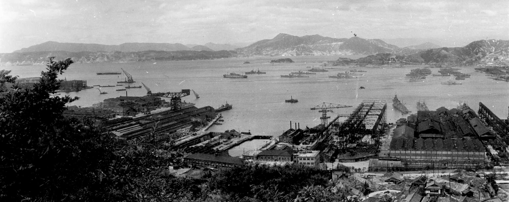
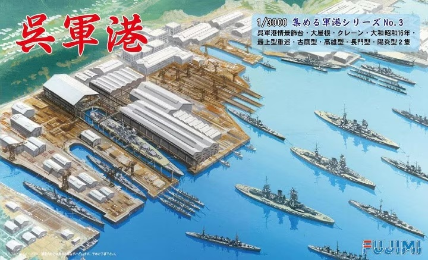

# #142 Kure Naval Arsenal

Building the Fujimi 1:3000 diorama depicting Kure Naval Arsenal.

## Notes

The Kure Naval District was established at Kure, Hiroshima in 1889, as the second of the naval districts responsible for the defense of the Japanese home islands. Along with the establishment of the navy base, a ship repair facility was also constructed.  The "Kure Shipyards" were officially renamed the
["Kure Naval Arsenal"](https://en.wikipedia.org/wiki/Kure_Naval_Arsenal)
in 1903. Kure developed into one of the largest shipbuilding facilities in the Empire of Japan, capable of working with the largest vessels. The Arsenal included a major steel works.

Notable projects:

* the cruiser [Miyako](https://en.wikipedia.org/wiki/Japanese_cruiser_Miyako) was the first warship constructed at Kure, launched in 1897.
* Battleships
    * [Yamato](https://en.wikipedia.org/wiki/Japanese_battleship_Yamato), Yamato-class battleship 1941
    * [Nagato](https://en.wikipedia.org/wiki/Japanese_battleship_Nagato), Nagato-class battleship 1920
    * Settsu, Kawachi-class battleship 1912
* Battlecruiser/Armoured Cruiser
    * Akagi, Amagi-class battlecruiser/Akagi-class aircraft carrier 1925
    * Ibuki, Ibuki-class battlecruiser 1909
    * Tsukuba, Tsukuba-class battlecruiser 1907
* Aircraft Carriers
    * Katsuragi, Unryū-class aircraft carrier 1945
    * Fleet Carrier Sōryū, 1937
    * Un'yō, Taiyō-class escort carrier 1942
* Cruisers
    * 1 of 4 [Takao-class heavy cruisers](https://en.wikipedia.org/wiki/Takao-class_cruiser): Atago (1932)
    * 1 of 4 Myōkō-class heavy cruisers: Nachi (1928)
    * light cruiser Ōyodo (1943)
* Destroyers
    * Ariake, Fubuki, Arare, Harusame-class Destroyers 1905
* Submarines
    * I-400-class submarine
    * I-201-class submarine
* Seaplane Tenders
    * Chitose, Chitose-class seaplane tender 1936
    * Chiyoda, Chitose-class seaplane tender 1937

### The Kit

This is one of the series of 1:3000 scale port dioramas that Fujimi have produced.

Photo-etch detail sets are available from Fujimi for the
[gantries](https://www.scalemates.com/kits/fujimi-11503-ijn-kure-naval-port-gantry-crane-photo-etched-parts--1028650)
and
[cranes](https://www.scalemates.com/kits/fujimi-11496-ijn-naval-port-collection-common-photo-etched-parts--1019727).
I expect these would really improve the finesse of the final product, but I'm just going to build mine out of the box and try to represent the detail with paint effects.

The kit features 7 ship models:

* [Battleship Yamato ⼤和](https://en.wikipedia.org/wiki/Japanese_battleship_Yamato)
* [Nagato-class Battleship 長門型戦艦](https://en.wikipedia.org/wiki/Nagato-class_battleship)
* [Mogami-class Heavy Cruiser 最上型重巡](https://en.wikipedia.org/wiki/Mogami-class_cruiser)
* [Furutaka-class Heavy Cruiser 古鷹型](https://en.wikipedia.org/wiki/Furutaka-class_cruiser)
* [Takao-class Heavy Cruiser ⾼雄型](https://en.wikipedia.org/wiki/Takao-class_cruiser)
* 2 x [Kagerō-class destroyers 陽炎型駆逐艦](https://en.wikipedia.org/wiki/Kager%C5%8D-class_destroyer)

### Paint Scheme

| Feature                      | Color                | Recommended | Paint Used |
|------------------------------|----------------------|-------------|------------|
| ship gun barrel boots        | Flat White           | H11         |            |
| ship funnel tops             | Flat Black           | H12         |            |
| ship deck (Yamato, Nagato)   | Tan                  | H27         | H27        |
| ship deck (all others)       | Wood Brown           | H37         | H37        |
| ship hull and superstructure | Dark Gray 2          | H83         | H83        |
| cranes                       | Russet               | H33         | H7         |
| road                         | Gray                 | H22         |            |
| gantry crane shed roof       | Brown                | H7          | H21        |
| gantry crane rails           | Brown                | H7          | H7         |
| gantry crane shed wall       | Gray                 | H22         | H22        |
| warehouse roof               | Gray                 | H22         | H22        |
| warehouse wall               | Dark Gray 2          | H83         | H83        |
| forested hills               | Green                | H6          | H73        |
| dock                         | Sail Color           | H85         | H85        |
| water                        | Cobalt Blue          | H35         | H35, H5    |

### Build Log: the base

A quick dry fit:

### Build Log: the ships

### Build Log: gantries

### Final Build Gallery

## Credits and References

* [this project on scalemates](https://www.scalemates.com/profiles/mate.php?id=74137&p=projects&project=191837)
* [Kure Naval Port Fujimi No. 40131 1:3000](https://www.scalemates.com/kits/fujimi-40131-kure-naval-port--993916)
* Upgrade/detail sets (not used in the build):
    * [Detail Up Parts Series IJN Kure Naval Port/Gantry Crane Photo-Etched Parts Fujimi No. 11503 1:3000](https://www.scalemates.com/kits/fujimi-11503-ijn-kure-naval-port-gantry-crane-photo-etched-parts--1028650)
    * [Grade Up Parts Series IJN Naval Port Collection Common Photo-Etched Parts Fujimi No. 11496 1:3000](https://www.scalemates.com/kits/fujimi-11496-ijn-naval-port-collection-common-photo-etched-parts--1019727)
* [Kure Naval Arsenal](https://en.wikipedia.org/wiki/Kure_Naval_Arsenal)
