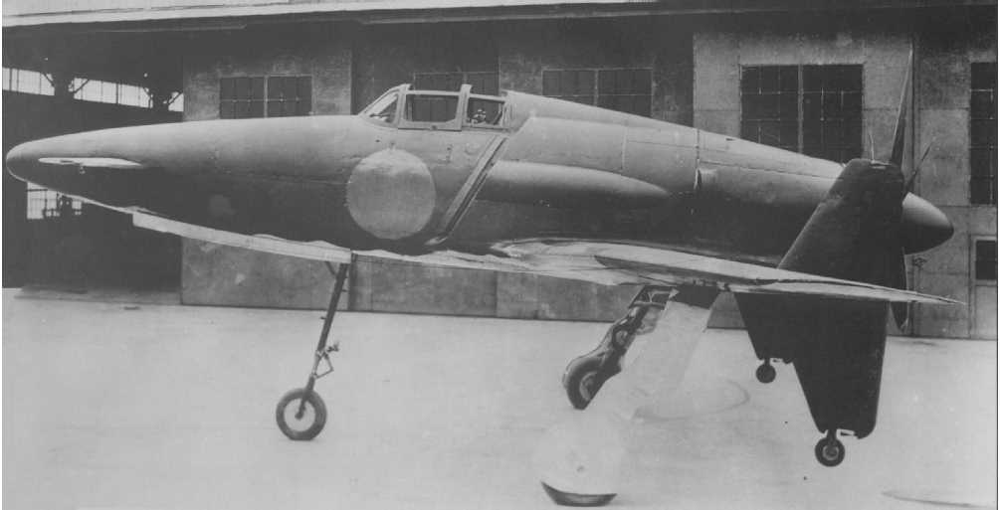

# #129 Kyushu J7W1

Building the Kyūshū J7W Shinden 震電, as used by Kōichi Shikishima in Godzilla Minus One to deliver the final fatal blow.

## Notes

The Kyūshū J7W Shinden (震電, "Magnificent Lightning") was a radical, canard-winged fighter developed by Japan during the final stages of World War II. The Shinden ("Magnificent Lightning") was intended to counter U.S. B-29 bomber raids and was unique in its design, with a forward-mounted wing configuration and pusher propeller, intended to maximize maneuverability and speed.

The development of the Shinden began in response to a 1943 Imperial Japanese Navy request for a high-speed, heavily armed interceptor. Its canard layout, an unusual design for the time, allowed for more powerful armament and helped improve its agility, theoretically making it an ideal interceptor for high-altitude bombers. Equipped with a 30 mm cannon, it held the potential to disrupt Allied air superiority.

The prototype first flew in August 1945, just days before Japan’s surrender. While promising, the Shinden was never fully developed or deployed in combat due to the end of the war. Today, it remains a notable example of Japan’s innovative engineering efforts during WWII and a fascinating "what-if" of aviation history, with one surviving prototype housed at the Smithsonian’s Udvar-Hazy Center.

The plane was featured in [Godzilla Minus One](https://en.wikipedia.org/wiki/Godzilla_Minus_One)

### Research and References

#### Kyūshū J7W1 Shinden – B-29 Superfortress Interceptor of the Imperial Japanese Navy (August, ’45)

#### B29を迎撃せよ 幻の戦闘機・震電 | Intercept the B-29 ・Phantom Fighter Shinden (J7W Interview) (EN Subtitles)

#### 九州 J7W1 十八試 局戦 震電 - HASEGAWA 1/72 KYUSHU J7W1 SHINDEN

### The Kit

[Hasegawa No. 00450 1:72](https://www.scalemates.com/kits/hasegawa-00450-kyushu-j7w1-18-shi-intercepter-fighter-shinden--1227192) is the 2000 re-boxing of the 1995 tool.

It is quite a simple kit, but engineered extremely well and the moulding is still top quality, with no flash or defects.

I got the kit for ¥950 from [Plaza Japan](https://www.plazajapan.com/4967834014503/).

### Paint Scheme

| Feature                 | Color                | Recommended | Paint Used |
|-------------------------|----------------------|-------------|------------|
| fire extinguisher       | Red                  | C3, H3      | 70.909     |
| cockpit fittings        | Silver               | C8, H8      | Molotow Liquid Chrome |
| seat                    | IJN Green (Nakajima) | C15, H36    | H36        |
| cockpit interior        | Interior Green       | C27, H58    | H58        |
|                         | Steel                | C28, H18    | H18        |
| oxygen tanks, dashboard | Flat Black           | C33, H12    | H12        |
| lower camo              | IJN Grey (Mitsubishi)| C35, H61    | H61        |
|                         | Clear Red            | C47, H90    | 70.909     |
|                         | Clear Blue           | C50, H93    | 70.963     |
|                         | Orange Yellow        | C58, H24    |            |
| Propeller               | Propeller Color      | C131        | H47        |
|                         | Tire Black           | C137, H77   |            |

### Build Log

### Final Gallery

The Kyūshū J7W Shinden 震電, as used by Kōichi Shikishima in Godzilla Minus One to deliver the final, fatal blow!

This is the Hasegawa 1:72 kit, boxed in 2000 from a 1995 mold. Still an astonishingly well engineered kit, and simple enough to throw together in a few days to sneak it in near the end of the #risingsungb

## Credits and References

* [this project on scalemates](https://www.scalemates.com/profiles/mate.php?id=74137&p=projects&project=180498)
* [Kyushu J7W1 18-shi Intercepter Fighter Shinden (Japanese Navy Intercepter Fighter) Hasegawa No. 00450 1:72](https://www.scalemates.com/kits/hasegawa-00450-kyushu-j7w1-18-shi-intercepter-fighter-shinden--1227192)
* [Kyushu J7W Shinden](https://en.wikipedia.org/wiki/Kyushu_J7W_Shinden) - wikipedia
