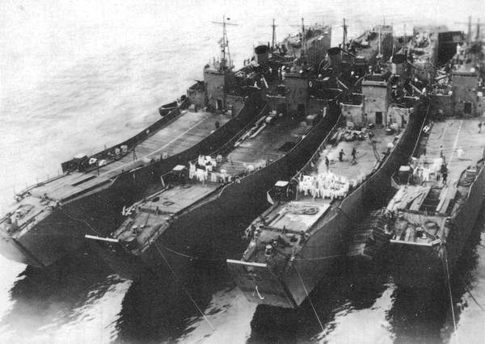

# #094 IJN Military Transports

Building the No.1 and No.101 landing ships 輸送艦 from the Tamiya Military Transport set. No electronics or base for this - saving for a future diorama.

## Notes

In June 1943, after its defeat in the Guadalcanal Campaign, the IJN realized it needed high-speed military transport vessels, and designed two classes of ship in response.
Prior to this, they had lost too many destroyers employed as transporters.
These high-speed transport vessels were actually developed by the IJN and IJA in cooperation(!).

[No.1-class landing ship](https://en.wikipedia.org/wiki/No.1-class_landing_ship)  (第一号型輸送艦,, Dai 1 Gō-gata Yusōkan)

* a 1500 ton mothership of the Daihatsu-class landing craft and Kō-hyōteki-class submarines
* Their primary role was that of a transporter, however since their armaments were strong they were useful as multi-purpose ships at the front, functioning as transporters, as minelayers and as escort ships.
* Most of these vessels were sent to the Battle of Leyte and transportation duty of the Bonin Islands.

[No.101-class landing ship](https://en.wikipedia.org/wiki/No.101-class_landing_ship)  (第百一号型輸送艦,, Dai 101 Gō-gata Yusōkan)

* a 900-ton amphibious assault ship
* Most of the Navy vessels took part in the Battle of Leyte, where 18 of them were lost. Most, however, succeeded in landing their tanks and troops.
* a detailed record of the vessels in the Army service is not known to exist.
* Some example tabular records of movement:
    * [IJN LST T.101](http://www.combinedfleet.com/T.101_t.htm)
    * [IJN LST T.127](http://www.combinedfleet.com/T.127_t.htm)
    * [IJN LST T.128](http://www.combinedfleet.com/T.128_t.htm)
    * [IJN LST T.149](http://www.combinedfleet.com/T.149_t.htm)
        * many visits to Singapore's Seletar naval port
        * including 101st Naval Repair Facility at Singapore.
    * [IJN LST T.150](http://www.combinedfleet.com/T.150_t.htm)
        * convoy to Palau in 1944, sunk 27 July 1944

### The Kit

[Japanese Military Transport Set Waterline Series Tamiya No. 31501 1:700](https://www.scalemates.com/kits/tamiya-31501-japanese-military-transport-set--171118)
was tooled way back in 1979 but is still widely available and is very finely molded.

It includes the two main vessels:

* [No.1-class landing ship](https://en.wikipedia.org/wiki/No.1-class_landing_ship)
* [No.101-class landing ship](https://en.wikipedia.org/wiki/No.101-class_landing_ship)

And a range of transported equipment:

* 2 x [Type A Ko-hyoteki (甲標的甲型)](https://en.wikipedia.org/wiki/Type_A_K%C5%8D-hy%C5%8Dteki-class_submarine) midget submarine
* 1 x [Shohatsu 10-m-class](https://en.wikipedia.org/wiki/Shohatsu-class_landing_craft) landing craft
* 1 x [Chuhatsu 13-m-class](https://en.wikipedia.org/wiki/Chuhatsu-class_landing_craft) landing craft
* 4 x [Daihatsu 14-m-class](https://en.wikipedia.org/wiki/Daihatsu-class_landing_craft) landing craft
* 3 x [Special Type 3 Launch Ka-Chi (特三式内火艇 カチ)](https://en.wikipedia.org/wiki/Type_3_Ka-Chi) amphibious medium tank
* 2 x [Type 97 Chi-Ha (九七式中戦車 チハ)](https://en.wikipedia.org/wiki/Type_97_Chi-Ha_medium_tank) medium tank

### Paint Scheme

| Feature               | Color                | Recommended       | Paint Used                  |
|-----------------------|----------------------|-------------------|-----------------------------|
| superstructure        |                      | XF-53(2):XF-63(1) | H83                         |
| Lower hull            | hull red             | XF-9              | 70.985 Hull Red             |
| tank                  | khaki                | XF-49             | H65 + misc Vallejo for camo |

### Build Log

No crew or base right now - I'm reserving these for a future diorama.

## Credits and References

* [this project on scalemates](https://www.scalemates.com/profiles/mate.php?id=74137&p=projects&project=155655)
* [Japanese Military Transport Set Waterline Series Tamiya No. 31501 1:700](https://www.scalemates.com/kits/tamiya-31501-japanese-military-transport-set--171118)
* [No.1-class landing ship](https://en.wikipedia.org/wiki/No.1-class_landing_ship)
* [No.101-class landing ship](https://en.wikipedia.org/wiki/No.101-class_landing_ship)
* [Tokusetsu-Yusokan IJN T.101 Class Landing Ship Tank  IJN LST T.149: Tabular Record of Movement](http://www.combinedfleet.com/T.149_t.htm)
* [Type A Ko-hyoteki (甲標的甲型)](https://en.wikipedia.org/wiki/Type_A_K%C5%8D-hy%C5%8Dteki-class_submarine) midget submarine
* [Shohatsu 10-m-class](https://en.wikipedia.org/wiki/Shohatsu-class_landing_craft) landing craft
* [Chuhatsu 13-m-class](https://en.wikipedia.org/wiki/Chuhatsu-class_landing_craft) landing craft
* [Daihatsu 14-m-class](https://en.wikipedia.org/wiki/Daihatsu-class_landing_craft) landing craft
* [Special Type 3 Launch Ka-Chi (特三式内火艇 カチ)](https://en.wikipedia.org/wiki/Type_3_Ka-Chi) amphibious medium tank
* [Type 97 Chi-Ha (九七式中戦車 チハ)](https://en.wikipedia.org/wiki/Type_97_Chi-Ha_medium_tank) medium tank
