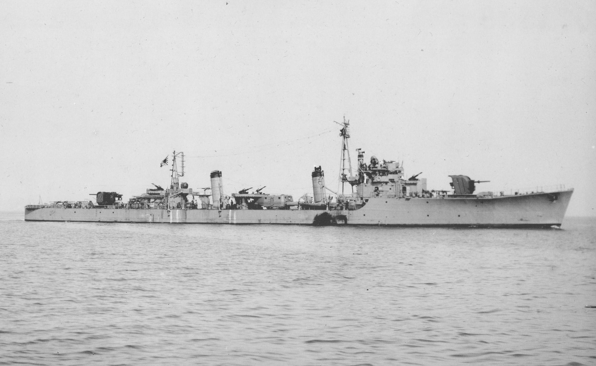
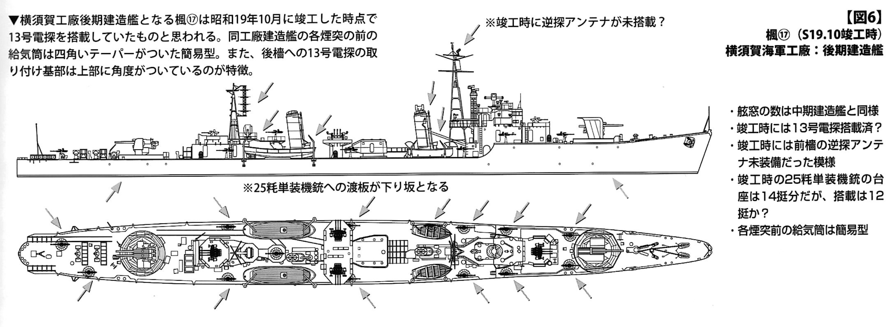

# #154 IJN Matsu-class Destroyer Sakura

Building the Matsu-class Destroyer Sakura from Fujimi in 1:700 scale with a few upgrades (replaced some of the equipment with better moldings, fixed the stern profile).

## Notes

I feel like doing a quick build out of the box.

### About the Ship

Sakura (桜 or 櫻, "cherry blossom") was one of 18 Matsu-class destroyers built for the Imperial Japanese Navy (IJN) during the final stages of World War II. Completed in late 1944, the ship was assigned to convoy escort duties in February 1945. She was slightly damaged when she struck a mine in May. Sakura sank after striking another mine near Osaka on 11 July with heavy loss of life.

Sister ship [Momi](https://en.wikipedia.org/wiki/Japanese_destroyer_Momi_(1944)):

)

Details of sister ship [Kaede](https://en.wikipedia.org/wiki/Japanese_destroyer_Kaede_(1944)),
also built at Yokosuka Naval Arsenal in 1944:

### Key Dates

From [IJN Sakura: Tabular Record of Movement](http://www.combinedfleet.com/sakura_t.htm)

25 November 1944:
Completed at Yokosuka; assigned same date to Desron 11, Combined Fleet, for training. Ship's captain: Lieutenant Commander Shimobe Shoji

12-18 February 1945:
Departed Moji, escorting Convoy MOTA-36 towards Keelung; then escorted KASHIMA to Shanghai and remained in the area, tasked with patrol and escort duties.

11 July:
Sunk: struck mine in Osaka Harbor (34-36 N, 135-28 E); aft magazine exploded, severing stern. 130 killed, including Lieutenant Commander Shimobe.

### The Kit

This kit was originally tooled by Fujimi in 1972. I picked up a 1994 boxing at the 2024 Kits for Kids charity event. Decals and instructions are a little yellowed.

See [instructions](./assets/40045-instructions.pdf)

The Tamiya kit of the [Sakura No. 31429 1:700](https://www.scalemates.com/kits/tamiya-31429-sakura--140987) is slightly more detailed. It is a good reference for
single 25 mm (1 in) AA gun placement for example.

### Armament and Equipment

| Item                                                                               | Kit Parts            | Upgrade Part?                           |
|------------------------------------------------------------------------------------|----------------------|-----------------------------------------|
| 1 × twin Type 89 12.7cm [DP gun](https://en.wikipedia.org/wiki/Dual-purpose_gun)   | 6+21                 | √ W35+W30                               |
| 1 × single Type 89 12.7cm [DP gun](https://en.wikipedia.org/wiki/Dual-purpose_gun) | 4+22                 | √ replace gun barrel from spares box    |
| 4 × triple Type 96 25mm AA guns                                                    | 24 x 4               | √ W40                                   |
| 13 × single Type 96 25mm AA guns                                                   | not included         | E12: 39+40 x 13                         |
| 1 × quadruple Type 92 61cm torpedo launcher for Type 93 torpedoes                  | 10                   | √ X24                                   |
| 2 × rails, 2 × Type 94 throwers for 36 depth charges                               | molded into the hull |                                         |
| Type 22-GO Radar                                                                   | 20                   | √ X9                                    |
| Type 13-GO Radar                                                                   | mounted on 28        | √ X15                                     |
| 2x 6m cutter                                                                       | 2                    | √ X13 (7m cutter, but looks close enough) |
| 2x 10m motor launch                                                                | 1                    | √ X12                                     |
| 110cm search light                                                                 | 14                   | √ W14                                     |

Upgrade item sources:

* Wxx parts: from Waterline detail set sprue W (included in various waterline ship kits from Tamiya, Fujimi, Hasegawa, Aoshima)
* Xxx parts: from Waterline detail set sprue X (included in various waterline ship kits from Tamiya, Fujimi, Hasegawa, Aoshima)
* E12 parts: from Sky Wave Series Equipment For Japanese Navy Ships-WW2 (Set 7) Pit-Road No. E12 1:700

Additional modifications:

* stern should be rounded according to all sources, not squared off as in this kit. Modify with some plastic card.

I decided **not** to add PE details and rigging. Let's see how it looks largely out of the box.

### Paint Scheme

| Feature                         | Color                | Recommended | Paint Used |
|---------------------------------|----------------------|-------------|------------|
| hull sides                      | dark gray            |             | H83        |
| lower hull                      | dark red             |             | H47        |
| deck                            | light gray           |             | H61        |
| launch & cutter hull            | light gray           |             |            |
| launch & cutter interior        | matt white           |             |            |
| funnel top, searchlight, anchor | matt black           |             |            |
| gun barrel baffles              | matt white           |             |            |
| gun turrets                     | dark gray            |             | H83        |
|                                 |                      |             |            |

### Build Log

Although I planned a palette-cleansing, out-of-the-box build, the more I looked at the stern, the more it bothered me!
The stern should be rounded according to all sources, not squared off as in this kit. I modified with some plastic card.

Primed..

First covered with light gray (H61), then dark gray (H83) detail.

Masking off the plimsoll line to apply the lower hull colour (H47).

Assembling all the sub-structures.

Applying flag and bridge window decals

### Base

This time I'm going to try the air-dry clay base approach..

The initial application shrunk from the edges and cracked a bit, so I went over to fill and pad out a second time.

Sea scheme:

* main colour: H35 Cobalt Blue, H36 Dark Green mix

Initially spraying wake effects with heavily thinned H11 Flat White.

Wake built up with a paste made from Deluxe Materials Scenic Snowflakes and AK Transparent Water Gel.

### Label

Quickly made up a label with Affinity Designer, see [label.afdesign](./assets/label.afdesign):

### Final Gallery

## Credits and References

* [this project on scalemates](https://www.scalemates.com/profiles/mate.php?id=74137&p=projects&project=186564)
* Sea Way Model Series Japan Navy Destroyer Sakura Fujimi No. 40045 1:700
    * [on scalemates](https://www.scalemates.com/kits/fujimi-40045-japan-navy-destroyer-sakura--323543)
    * [instructions](./assets/40045-instructions.pdf)
* Sky Wave Series Equipment For Japanese Navy Ships-WW2 (Set 7) Pit-Road No. E12 1:700
    * [scalemates](https://www.scalemates.com/kits/pit-road-e12-equipment-japanese-navy-ships-ww2-set-7--1245027)

### Research References

* [松型駆逐艦 - Matsu-class destroyer](https://ja.wikipedia.org/wiki/%E6%9D%BE%E5%9E%8B%E9%A7%86%E9%80%90%E8%89%A6) - ja.wikipedia
* [桜 (松型駆逐艦) - Sakura (Matsu-class destroyer)](https://ja.wikipedia.org/wiki/%E6%A1%9C_(%E6%9D%BE%E5%9E%8B%E9%A7%86%E9%80%90%E8%89%A6)) - ja.wikipedia
* [Japanese destroyer Sakura (1944)](https://en.wikipedia.org/wiki/Japanese_destroyer_Sakura_(1944))
* [IJN Sakura: Tabular Record of Movement](http://www.combinedfleet.com/sakura_t.htm)
* [Japanese destroyer Momi (1944)](https://en.wikipedia.org/wiki/Japanese_destroyer_Momi_(1944))
* [Japanese destroyer Kaede (1944)](https://en.wikipedia.org/wiki/Japanese_destroyer_Kaede_(1944))

#### Matsu Class

YouTube by navyreviewer

### Build References

#### Fujimi 1:700 Sakura Destroyer HMAC Kraken Build

YouTube by Harry Houdini Models

#### TAMIYA IJN DESTROYER SAKURA 1/700

YouTube by BD Scale Models

#### IJN Destroyer Sakura 桜 1/700 Tamiya

YouTube by Bilal Jamri

