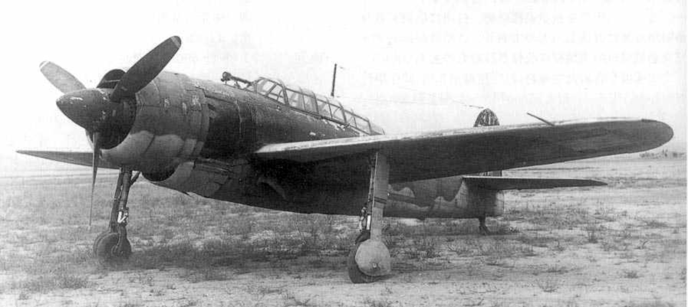
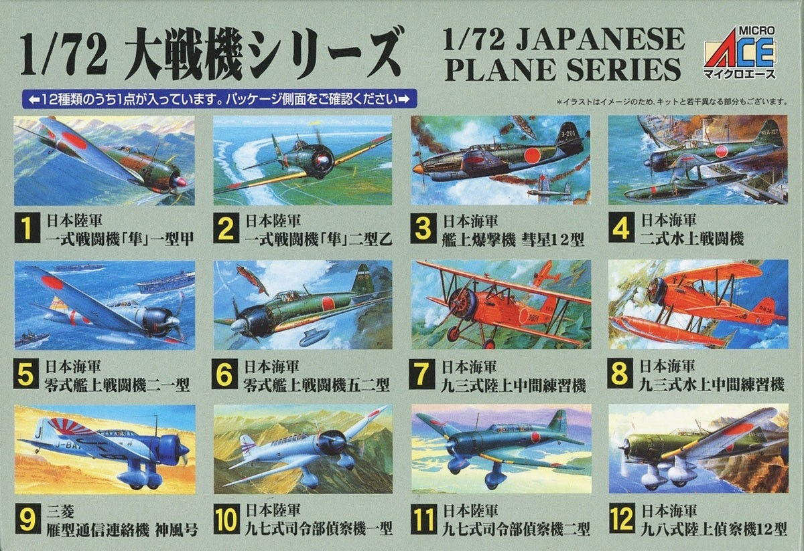

# #xxx Yokosuka D4Y2 Suisei

Building the Micro Ace 1:72 boxing of the Yokosuka D4Y2 Suisei

## Notes

The Yokosuka D4Y Suisei (彗星, Suisei; "Comet"; Allied reporting name "Judy") is a two-seat carrier-based dive bomber developed by the Yokosuka Naval Air Technical Arsenal and operated by the Imperial Japanese Navy from 1942 to 1945 during World War II. Development of the aircraft began in 1938. The first D4Y1 was complete in November 1940 and made its maiden flight at Yokosuka the following month.

### The Kit

The Micro Ace No. 53003-800 kit is a 2018 boxing of the 1961 LS tooling.
It is a 1:72 model of the D4Y2 Suisei Model 12 (彗星一二型, Suisei 12-Gata).

See also: [kit instructions](./assets/53003-800-instructions.pdf).

### Paint Scheme

Two schemes are detailed in the kit:

* 橫須賀海軍航空隊 - Yokosuka Naval Air Corps
* 第523海軍航空隊「鷹部隊』- 523rd Naval Air Squadron "Eagle Force" (selected option)

| Feature                           | Color                       | Recommended | Paint Used |
|-----------------------------------|-----------------------------|-------------|------------|
| primer                            |                             |             | Aqueous Surfacer 500 (gray)  |
| rear nav light                    | ホワイト White               | H1/C1    |   |
| Yokosuka Naval Air Corps: spinner | シルバー Silver               | H8/C8    |   |
| gunsight,guns,stick, instruments  | つや消しブラック Flat Black    | H12/C33  | H12  |
| leading edge                      | オレンジイエロー Orange Yellow | H24/C58  | H24  |
| prop                              | レッドブラウン Red Brown       | H47/C41  | H47  |
| 523rd Naval Air Squadron: spinner | レッドブラウン Red Brown       | H47/C41  | H47  |
| upper camo                        | 濃緑色（暗緑色）（1） IJN Green  | H59/C15  | H59  |
| lower camo                        | 明灰白色（1） IJN Gray          | H61/C35  | H61   |
| seats, interior                   | 青竹色 Blue Green             | H63/C57  | RCM029  |
| exhausts                          | 焼鉄色 Burnt Iron            | H76/C61  | H18  |
| tires                             | タイヤブラック Tire Black      | H77    | AK RCM001  |
| port nav light                    | クリアーレッド Clear Red       | H90/C47  |   |
| starboard nav light               | クルアーブルー Clear Blue      | H93/C50  |   |

Pilot

| Feature               | Color                    | Recommended | Paint Used |
|-----------------------|------------------------- |-------------|------------|
| face                  | はだ色 FLESH              | H44/C51     |   |
| flight suit           | レッドブラウン RED BROWN    | H47/C41     |   |
| harness               | カーキグリーン KHAKI GREEN  | H80/C54     |   |
| boots, gloves, cap    | マホガニー MAHOGANY        | H84/C42     |   |

### Build Log

The kit is showing its age. Lots of flash, and details are very soft.

Assembled, handmade canopy mask

Primed..

Mask and spray the leading edge

Starting some heavy panel lining and weathering

A quick watercolour background:

And some anti-aircraft fire:

### Final Gallery

The big experiment this time was a new technique for props in flight. Just some foam cut and painted appropriately..

## Credits and References

* [this project on scalemates](https://www.scalemates.com/profiles/mate.php?id=74137&p=projects&project=158870)
* Suisei D4Y2 Mk12 (Judy) Micro Ace No. 53003-800 1:72
    * [on scalemates](https://www.scalemates.com/kits/micro-ace-53003-800-suisei-d4y2-mk12-judy--1108381)
    * [instructions](./assets/53003-800-instructions.pdf)

### Research References

* [Yokosuka D4Y](https://en.wikipedia.org/wiki/Yokosuka_D4Y)

#### Yokosuka D4Y1/2 Suisei 'Judy' - Aviation videos archives part2 1935-1950

#### Yokosuka D4Y Suisei - Net-Maquettes

### Build References

#### 艦上爆撃機 彗星~灰色 - MICRO ACE 1/72 (D4Y2 ‘JUDY’ kit) by モデラーぺろ - miniature scenes

