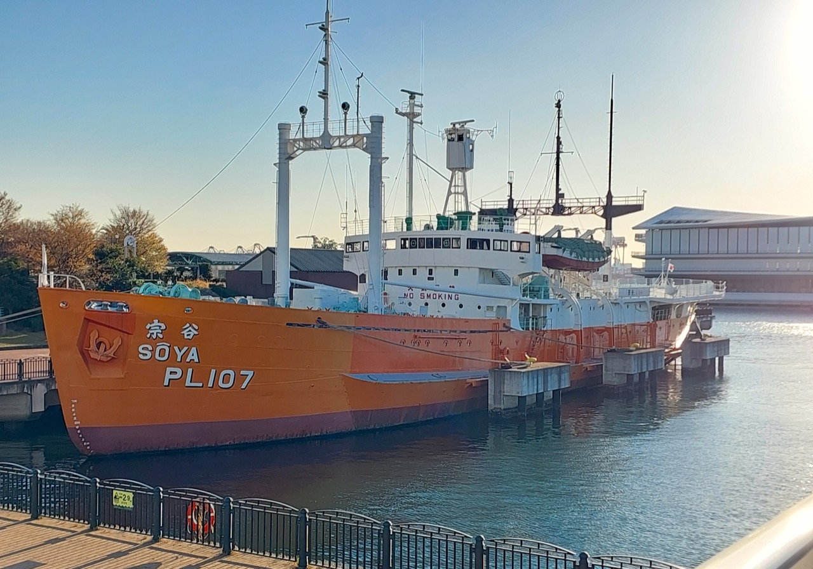
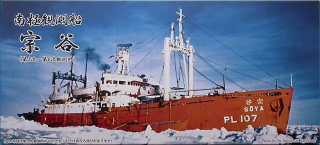
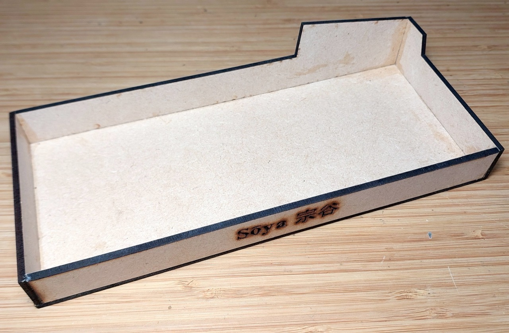
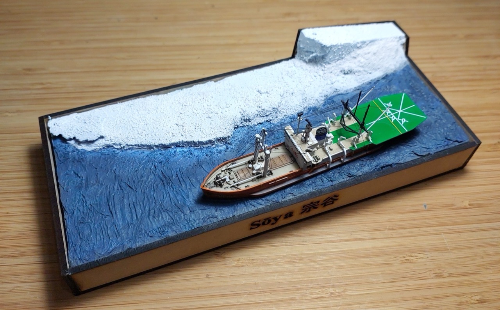

# #144 Antarctic Research Ship Sōya

Building the 1:700 Foresight model of the Antarctic Research Ship Sōya 宗谷 (PL107)

## Notes

[Sōya 宗谷 (PL107)](https://en.wikipedia.org/wiki/S%C5%8Dya_(PL107))
is a Japanese icebreaker that serves as a museum ship in Tokyo after a long and storied service spanning some of the 20th century's historic events. It is named for Sōya sub-prefecture in Hokkaido.

* In November 1939, the Imperial Japanese Navy requisitioned Chiryo Maru for national service. In February 1940, she was renamed Sōya.
* She was assigned duties as an auxiliary ammunition supply and survey vessel
* She survived the Second World War, albeit with multiple close calls
* After the war, she was assigned duties with the nation's repatriation fleet
* In 1949, Sōya was transferred to the Maritime Safety Agency, the precursor to the Japan Coast Guard. Her duties included supplying remote lighthouses.
* In 1950, the ship received a comprehensive refit in preparation for service as Japan's first dedicated Antarctic research ship.
* Between 1956 and 1962, Sōya undertook missions to the Antarctic (1st to the 6th).
* Sōya was fully decommissioned in 1978.
* In 1979, Sōya was moored alongside at the Museum of Maritime Science, Tokyo, and remains open to the public as a museum ship

See [IJN SOYA: Tabular Record of Movement](http://www.combinedfleet.com/Soya_t.htm) for more details, especially of wartime service.

The Sōya was the first in a line of icebreakers for Antarctic expeditions:

* [Japanese icebreaker Fuji (AGB-5001)](https://en.wikipedia.org/wiki/Japanese_icebreaker_Fuji_(AGB-5001)). Served 1965 - 1984. Now a museum ship in Nagoya.
* [Japanese icebreaker Shirase (AGB-5002)](https://en.wikipedia.org/wiki/Japanese_icebreaker_Shirase_(AGB-5002)). Served 1982 - 2008. Under remodeling into observation and exhibition facility.
* [Japanese icebreaker Shirase (AGB-5003)](https://en.wikipedia.org/wiki/Japanese_icebreaker_Shirase_(AGB-5003)). Commissioned 2009, Japan's fourth icebreaker for Antarctic expeditions. She inherited her name from her predecessor.

I got to visit Sōya in 2024 - highly recommended if you are ever visiting Tokyo.

A detailed series on Sōya by Ship Science Museum 船の科学館:

### The Kit

[Antarctic Research Ship Soya 3rd-6th Corps Foresight No. SMP-006 1:700](https://www.scalemates.com/kits/foresight-smp-006-antarctic-research-ship-soya-3rd-6th-corps--160687) was tooled in 2003 and depicts the ship as used between the 3rd and 6th expeditions.

I added the kit to my stash in 2022, purchased for ¥2570 from Yodobashi Shinjuku.

Plamo Samurai
has done a fantastic video building the 1:350 SOYA 宗谷 kit from Hasegawa:

### Paint Scheme

| Feature               | Color                                | Recommended | Paint Used |
|-----------------------|--------------------------------------|-------------|------------|
| superstructure        | Flat White                           | C62         | H11        |
| hull, aircraft        | Gloss Orange                         | C59         | H14        |
| deck                  | Gloss Tan                            | C44         | H27        |
| flight deck           | Gloss Bright Green                   | C66         | H26        |
| deck fittings         | Semi Gloss Medium Seagray BS381C 637 | C335        | H335       |
|                       | Semi Gloss Duck Egg Green            | C26         | H74        |
| funnel                | Gloss Bright Blue                    | C65         | H15        |
| tail rotor, wings     | Gloss Red                            | C3          | H3         |
|                       | Flat Light Grey                      | C324        | H324       |
|                       | Semi Gloss Wood Brown                | C43         | H37        |
|                       | Semi Gloss Hull Red                  | C29         | H17        |
|                       | Flat Black                           | C33         | H12        |
|                       | Metallic Silver                      | C8          | H8         |
| helicopter            | Semi Gloss Navy Blue                 | C14         | (H15) H54  |
|                       | Gloss Yellow                         | C4          | H4         |
|                       |                                      |             |            |

### Build Log

Rigging...

### Making the Base

### Project Box

I used [MakerCase](https://en.makercase.com/) to generate a simple parametric design:

* material thickness: 3mm
* inside dimensions:
    * width: 85mm
    * height: 20mm
    * depth:  203mm
* open box
* edge joints: flat
* panel layout: separate
* panel labels: disabled
* kerf: 0.2mm
* exported as [soya-box-template.svg](./assets/soya-box-template.svg)
* refined in Affinity Designer: [soya-box.afdesign](./assets/soya-box.afdesign)
* prepared for laser cutting in Inkscape: [soya-box.svg](./assets/soya-box.svg)

Cut and glued:

Testing the placement:

### Completing the Model

## Credits and References

* [this project on scalemates](https://www.scalemates.com/profiles/mate.php?id=74137&p=projects&project=186999)
* Antarctic Research Ship Soya 3rd-6th Corps Foresight No. SMP-006 1:700
    * [on scalemates](https://www.scalemates.com/kits/foresight-smp-006-antarctic-research-ship-soya-3rd-6th-corps--160687)
    * [instructions](./assets/SMP-006-instructions.pdf)

### Research References

* [Sōya (PL107)](https://en.wikipedia.org/wiki/S%C5%8Dya_(PL107))
* [Story of Antarctic research vessel Soya (宗谷)](https://www.kudan-japanese-school.com/blog/story-of-antarctic-research-vessel-soya.php)
* [IJN SOYA: Tabular Record of Movement](http://www.combinedfleet.com/Soya_t.htm)
