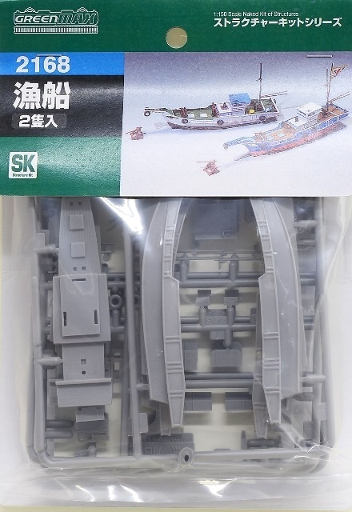

# #xxx Out Fishing - Target Fixation

Spare Green Max 1:150 Fishing Boat? Time for a whimsical little diorama.

## Notes

The Green Max 1:150 "Fishing boat" kit comes with parts for two boats.
I planned to use one of the boats in a diorama with 1:144 scale floatplanes (still to come). That leaves one hull free to do something whimsical!

### The Kit

Fishing boat Green Max No. 2168 1:150.

I got the kit at Yodobashi Akihabara for ¥919 in May 2025.
See the [instructions](./assets/2168-instructions.pdf).

### Paint Scheme

| Feature               | Color                | Recommended | Paint Used |
|-----------------------|----------------------|-------------|------------|
| primer                | White                |             | Aqueous White Surfacer 1000 |
| lower hull            | Red                  |             | H13        |
| upper hull            | Blue                 |             | H5        |
| mast, fittings        |                      |             | H37        |
| Deck, wooden features | Deck Tan             |             | 70.986     |
| Deck, wooden features | Cork Brown           |             | 70.843     |
| Deck, wooden features | Orange Brown         |             | 70.981     |
| Deck, wooden features | Burnt Umber          |             | 70.941     |
| Trim                  | White                |             | 70.951     |

### Paint Scheme (Hull 2)

| Feature               | Color                | Recommended | Paint Used |
|-----------------------|----------------------|-------------|------------|
| primer                | White                |             | Aqueous White Surfacer 1000 |
| lower hull            | Red                  |             | H13        |
| upper hull            | White                |             | H11        |
| mast, fittings        |                      |             | H37        |
| Deck, wooden features | Deck Tan             |             | 70.986     |
| Deck, wooden features | Cork Brown           |             | 70.843     |
| Deck, wooden features | Orange Brown         |             | 70.981     |
| Deck, wooden features | Burnt Umber          |             | 70.941     |
| Trim                  | White                |             | 70.951     |
| Cabin Roof            | Light Blue (White + Medium Blue) |             | 70.951 + 70.963 |

### Build Log

Basic construction

Primed in white

Two hulls basically ready for detailing and placing in their respective dioramas:

### Target Fixation

Preparing some fishermen. These are  adapted from
[Tomytec CN-NI118 Diorama Collection Sunbathers 1:150](https://www.scalemates.com/kits/tomytec-per-118-sunbathers--1365502).

Final gallery:

## Credits and References

* [this project on scalemates](https://www.scalemates.com/profiles/mate.php?id=74137&p=projects&project=211751)
* Fishing boat Green Max No. 2168 1:150
    * [on scalemates](https://www.scalemates.com/kits/green-max-2168-fishing-boat--1371995)
* Tomytec CN-NI118 Diorama Collection Sunbathers 1:150
    * [on scalemates](https://www.scalemates.com/kits/tomytec-per-118-sunbathers--1365502)
