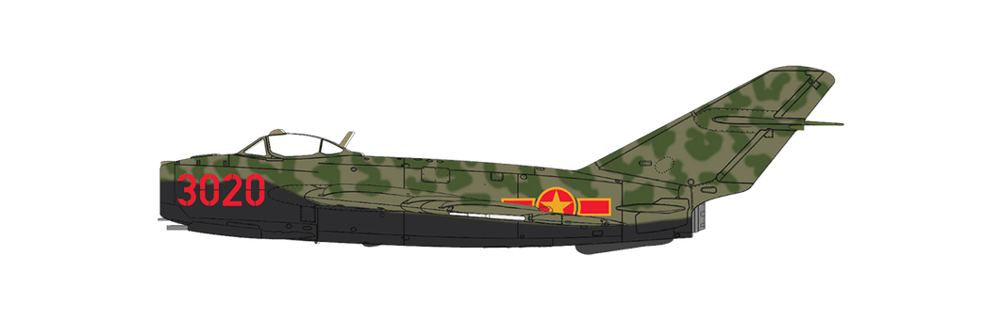

# #166 Shenyang J-5

Building the Shenyang J-5 (MiG-17F) as flown by Vietnam People's Air Force, 1969. This is the Airfix 1:72 kit.

## Notes

The Vietnamese Air Force used J-5s alongside the Soviet-supplied MiG-17s for interception missions until the 1990s when they were retired, along with the remaining MiG-19s, being replaced with newer MiG-21s and Su-27s.

### The Kit

[Mikoyan-Gurevich MiG-17F 'Fresco' (Shenyang J-5) Airfix No. A03091 1:72](https://www.scalemates.com/kits/airfix-a03091-mikoyan-gurevich-mig-17f-fresco-shenyang-j-5--1189943)
is the new 2019 tooling. I purchased it from Hobby Bounties for SGD$42.25 in Apr-2021.

See [instructions](./assets/A03091-instructions.pdf)

### Paint Scheme

I've chose to represent scheme A:
Mikoyan-Gurevich Mig-17F 'Fresco' (Shenyang J-5) Aircraft flown by Le Hai, 932rd Fighter Regiment, Vietnam People's Air Force, Tho Xuan, August 1969.

On June 14, 1968 Luu Huy Chao and Le Hai departed Tho Xuan to intercept 6 F-4s. When the Americans were spotted Le Hai attacked while Luu Huy Chao covered him. By the end of the encounter Le Hai had claimed 2 victories which the USAF records don't show. MiG-17F 3020 was also piloted by Nguyen Van Bay the Younger who was shot down May 6, 1972.

| Feature                | Color                 | Recommended | Paint Used |
|------------------------|-----------------------|-------------|------------|
| cockpit interior       | Dark Sea Grey - Satin | 164         | H331       |
| safety belts           | Hemp - Satin          | 168         | H336       |
| yoke, controls         | Aluminium - Metallic  | 56          | RCM011     |
| seat, grips            | Coal Black - Satin    | 85          | RCM033     |
| engine interior        | Aluminium - Metallic  | 56          | H76        |
| guns, exhaust          | Gunmetal - Metallic   | 53          | H18        |
| lower camo, drop tanks | Silver - Metallic     | 11          | H8         |
| lower camo undercoat   | Black - Matt          |             | H12        |
| pitot tubes            | Silver - Metallic     | 11          | H8         |
| tires                  | Black - Matt          | 33          | n/a        |
| base camo              | Marine Green - Matt   | 105         | H340       |
| camo                   | US Dark Green - Matt  | 116         | H330       |

Pilot

| Feature                | Color                | Recommended | Paint Used |
|------------------------|----------------------|-------------|------------|
| flight suit            | Khaki - Matt         | 26          | 70.889     |
| boots, gloves, tubes   | Black - Matt         | 33          | 70.950     |
| helmet                 | White - Matt         | 34          | 70.842     |
| face                   | Flesh - Matt         | 61          | F-550      |

### Build Log

#### Completion Gallery

#### Mounted for Display

An now mounted to my "Wall of Flight"

## Credits and References

* [this project on scalemates](https://www.scalemates.com/profiles/mate.php?id=74137&p=projects&project=135771)
* Mikoyan-Gurevich MiG-17F 'Fresco' (Shenyang J-5) Airfix No. A03091 1:72
    * [on scalemates](https://www.scalemates.com/kits/airfix-a03091-mikoyan-gurevich-mig-17f-fresco-shenyang-j-5--1189943)
    * [instructions](./assets/A03091-instructions.pdf)
    * [on airfix](https://uk.airfix.com/products/mig-17f-a03091)

### Research References

* <https://en.wikipedia.org/wiki/Shenyang_J-5>
* <https://pimaair.org/museum-aircraft/mig-17f/>
* [‘Fresco’ – A more combat capable MiG](https://uk.airfix.com/community/blog-and-news/workbench/fresco-more-combat-capable-mig)
* <https://en.wikipedia.org/wiki/Vietnam_Air_Defence_-_Air_Force>

### Build References

* <https://www.britmodeller.com/forums/index.php?/topic/235068122-mikoyan-gurevich-mig-17f-fresco-shenyang-j5-a03091-172/>

#### Airfix 1/72 MIG-17F Fresco review

YouTube by florymodels

#### Airfix MIG 17f fresco full build and paint of this classic RUSSIAN 1/72 scale model aircraft kit

YouTube by yorkshireman models

