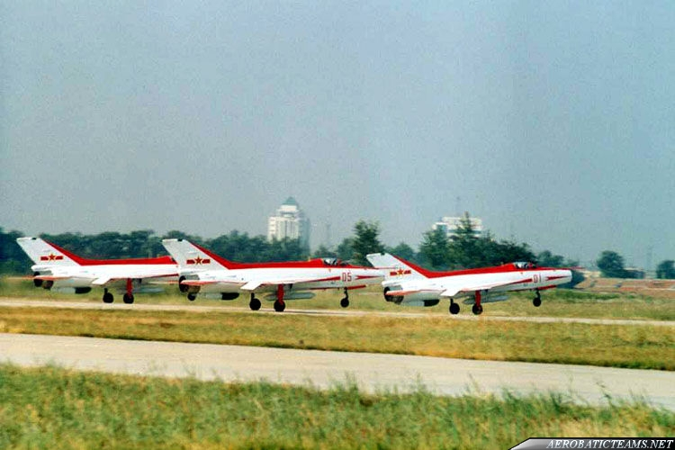

# #172 Chengdu J-7EB

Building the Chengdu J-7EB as flown by the PLAAF Ba Yi Aerobatic Team. This is the Trumpeter 1:144 kit.

## Notes

The Chengdu J-7EB is a specialized, unarmed aerobatic variant of the Chinese J-7 fighter jet (a derivative of the Soviet MiG-21). Built by the Chengdu Aircraft Corporation, it was exclusively used by the People's Liberation Army Air Force's (PLAAF)
[Ba Yi (August 1st) Aerobatics Team 八一飞行表演队](https://en.wikipedia.org/wiki/August_1st_(aerobatic_team))
in the late 90s, from 1995/1996 to 2000.

Compared with standard operational J-7Es, the J-7EB is distinguished by:

* Removal of combat equipment (radar, cannon, missile systems) to reduce weight.
* Installation of smoke generation equipment.
* Optimized weight distribution for formation aerobatics.
* Distinctive red-and-white aerobatic paint scheme.
* Some aircraft reportedly had additional instrumentation for display flying.

The aircraft retained the double-delta ("cranked") wing introduced on the J-7E, giving substantially better low-speed handling and turn performance than earlier MiG-21-derived J-7 variants.

The J-7EB was superseded by the J-7GB, an improved aerobatic version with revised avionics and systems.
The J-7GB was used by the Ba Yi (August 1st) Aerobatics Team between 2001 and 2009.

### The Kit

[The PLAAF Aerobatics Team F-7EB (Air Ballet) Trumpeter No. 01326 1:144](https://www.scalemates.com/kits/trumpeter-01326-f-7eb--102672) is a 1999 tool and boxing
of the [J-7EB](https://en.wikipedia.org/wiki/List_of_Chengdu_J-7_variants#J-7E_series)
as used by the [PLAAF August 1st Aerobatic Team](https://en.wikipedia.org/wiki/August_1st_(aerobatic_team)). The "B" suffix from Biǎoyǎn (表演) meaning performance or show.

Trumpeter mark the kit as "F-7EB" in English, but I think this is a mistake. There was never an export version of the J-7EB (F-7EB), and in fact the Chinese on the box is correct: "歼-7EB" / Jiān-7EB / J-7EB".

Unless you consider the kit itself to be the export.. in which case F-7EB would be right!

### Paint Scheme

| Feature                     | Color                | Recommended | Paint Used |
|-----------------------------|----------------------|-------------|------------|
| fuselage                    | White                |             | H11        |
| exhaust                     | Black                | X-1         | RCM011     |
| livery                      | Red                  | X-7         | H23        |
| instrument panel            | Flat Black           | XF-1        | RCM033     |
| air intake, front lower fin | Olive Green          | XF-58       | H64        |
| interior                    |                      |             | H62        |
|                             |                      |             |            |

Pilot

| Feature                     | Color                | Recommended | Paint Used |
|-----------------------------|----------------------|-------------|------------|
| uniform                     | Intermediate Blue    |             | H56        |
| flesh                       | Pale Brown           |             | H44        |
| helmet                      | Gloss White          |             | H1         |
| visor                       | Gloss Black          |             | H2         |

### Build Log

Fashioned a pilot with one of the figures from
[Diorama Human Soldier Yamada Kagaku No.3279 1:150](https://www.scalemates.com/kits/yamada-kagaku-3279-diorama-human-soldier--1690457)

In-flight conversion requires closing the under carriage bays and filling hard mounting points:

* front wheel bay can be filled with kit part A4 (lugs trimmed)
* rear wheel bays largely filled by kit part A9 (cut in half, one for each side)
* mounting lugs from A15, A16 used to fill receptor holes

A bit of fit and fettling required to get the cockpit looking OK:

Primed and white all over:

Masking the flashy red livery:

A quick watercolour background:

Mounted in a frame from Daiso:

### Final Gallery

## Credits and References

* [this project on scalemates](https://www.scalemates.com/profiles/mate.php?id=74137&p=projects&project=244072)
* The PLAAF Aerobatics Team F-7EB (Air Ballet) Trumpeter No. 01326 1:144
    * [on scalemates](https://www.scalemates.com/kits/trumpeter-01326-f-7eb--102672)
    * [instructions](./assets/01326-instructions.pdf)
    * Purchased from Miniature Hobby for SG$4.70 (Jul-2026).
* Diorama Human Soldier Yamada Kagaku No.3279 1:150
    * [on scalemates](https://www.scalemates.com/kits/yamada-kagaku-3279-diorama-human-soldier--1690457)
    * <https://www.yamadakagaku.co.jp/pages/103>

### Research References

* [Chengdu J-7 variants](https://en.wikipedia.org/wiki/List_of_Chengdu_J-7_variants#J-7E_series)
* [PLAAF August 1st Aerobatic Team](https://en.wikipedia.org/wiki/August_1st_(aerobatic_team))
* [August 1st Chengdu F-7EB Gallery](https://aerobaticteams.net/en/resources/i23/August-1st-Chengdu-F-7EB-Gallery.html)
* [Ba Yi (August 1st) Aerobatics Team 八一飞行表演队](https://en.wikipedia.org/wiki/August_1st_(aerobatic_team))

#### Chinese PLAAF Chengdu J-7

YouTube by Aviation videos archives part4 1975-2015

### Build References

#### F-7EB 1:144 Trumpeter inbox 4k

YouTube by Rafał Książek Rafhart

