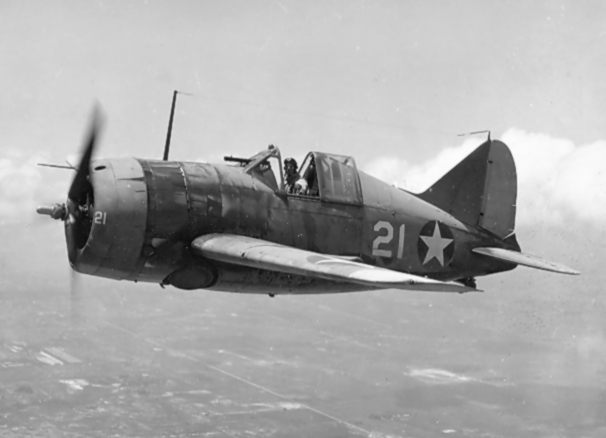
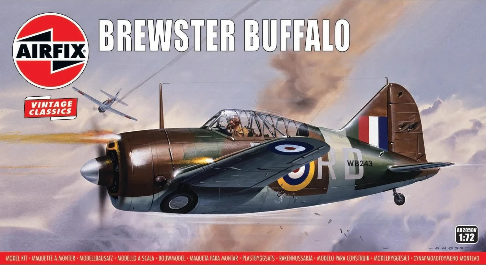
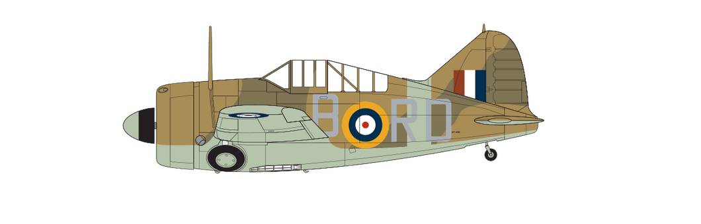
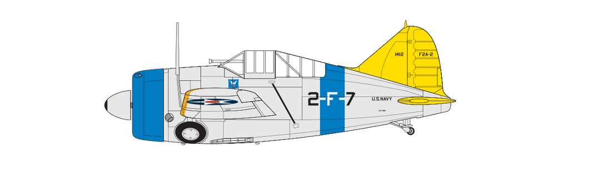

# #xxx Brewster Buffalo

Building the Brewster Buffalo on a jungle raid over Burma, early 1942. This is the Airfix 1:72 vintage classic kit A02050V.

## Notes

Despite its ungainly appearance, the
[Brewster Buffalo](https://en.wikipedia.org/wiki/Brewster_F2A_Buffalo)
was one of the most significant aircraft in US aviation history and one which would see heavy combat use during the early months of WWII.

The winner of a fly-off competition with the Grumman Wildcat to provide the US Navy with a new, modern carrier-based monoplane fighter, the Buffalo incorporated a host of advanced design features, including many to support its operation from the deck of US aircraft carriers.

The fighter would also attract strong international sales support, with Britain, Finland and the Netherlands all operating the Buffalo during WWII, particularly with the Commonwealth Air Forces facing the Japanese in South East Asia.

### The Kit

[Brewster Buffalo Airfix No. A02050V 1:72](https://www.scalemates.com/kits/airfix-a02050v-brewster-buffalo--1460251)

### Scheme A

Brewster B-339E Buffalo Mk.I, No. 67 Squadron, Royal Air Force, Mingaladon, Rangun, Burma, early 1942

| Feature               | Color                        | Recommended | Paint Used |
|-----------------------|------------------------------|-------------|------------|
|                       | Trainer Yellow - Matt        | No 24       |            |
| upper camo 1          | Dark Earth - Matt            | No 29       | H72        |
| upper camo 2          | Dark Green - Matt            | No 30       | H330       |
|                       | Black - Matt                 | No 33       |            |
|                       | Gunmetal - Metallic          | No 53       | RCM011     |
|                       | Aluminium - Metallic         | No 56       |            |
| lower camo            | Beige Green (aka Sky) - Matt | No 90       | H74 + H27  |
|                       | Brown Yellow - Matt          | No 94       |            |
|                       | Interior Green - Matt        | No 226      | RCM029     |

### Scheme B

Brewster F2A-2 Buffalo, Third Section Leader, US Navy Fighter Squadron VF-2, USS Lexington, 1941

| Feature               | Color                  | Recommended | Paint Used |
|-----------------------|------------------------|-------------|------------|
|                       | Silver - Metallic      | No 11       |            |
|                       | Trainer Yellow - Matt  | No 24       |            |
|                       | Black - Matt           | No 33       |            |
|                       | White - Matt           | No 34       |            |
|                       | Gunmetal - Metallic    | No 53       |            |
|                       | Aluminium - Metallic   | No 56       |            |
|                       | Scarlet - Matt         | No 60       |            |
|                       | Middle Blue Matt       | No 89       |            |
|                       | Lemon - Matt           | No 99       |            |
|                       | Brown Yellow - Matt    | No 94       |            |
|                       | Interior Green - Matt  | No 226      |            |

### Build Log

#### The Main Kit Build

It's a vintage kit from 1972 - simple to build and goes together surprisingly well.

I've used the wheels-up option, added in-flight attachment (1mm copper wire) and ditched the standard prop for
[Propblur](https://www.scalemates.com/kits/propblurcom-ohpb723b2u-propblur-on-hub-3-bladed-propeller--132867).

Ready for decals..

#### Mounting Box

I got a picture frame and box from Daiso to make my "diorama" mounting.

The box took a little adjustment to fit the picture frame

And now I have a nice semi-shadow-box for the display

#### Creating the Background Scene

#### Final Gallery

## Credits and References

* [this project on scalemates](https://www.scalemates.com/profiles/mate.php?id=74137&p=projects&project=167704)
* Brewster Buffalo Airfix No. A02050V 1:72
    * [on scalemates](https://www.scalemates.com/kits/airfix-a02050v-brewster-buffalo--1460251)
    * [on airfix.com](https://uk.airfix.com/products/brewster-buffalo-a02050v)
* <https://en.wikipedia.org/wiki/Brewster_F2A_Buffalo>
* [PHOTO-ETCHED Propblur On Hub 3-bladed propeller PropBlur.com No. OHPB723b2u 1:72](https://www.scalemates.com/kits/propblurcom-ohpb723b2u-propblur-on-hub-3-bladed-propeller--132867)
