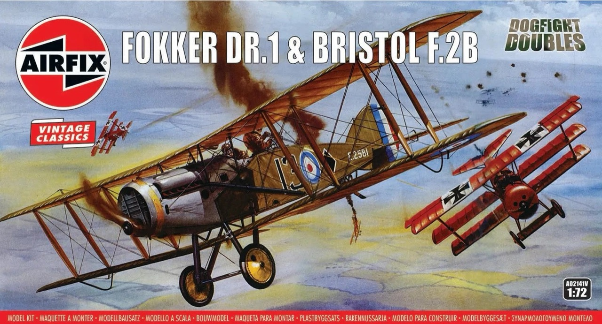
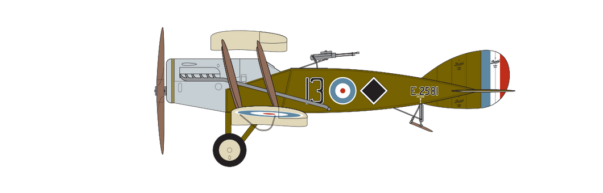

# #133 Bristol F.2b

Building the Bristol F.2b in 1:72 scale. This is the venerable Airfix Vintage Classic from 1957!

## Notes

The [Bristol F.2 Fighter](https://en.wikipedia.org/wiki/Bristol_F.2_Fighter) was a British two-seat biplane that served during World War I. Developed by the Bristol Aeroplane Company and introduced in 1917, it was initially intended as a reconnaissance aircraft, but quickly proved its worth as a highly capable fighter. Despite early setbacks, the Bristol Fighter excelled as a versatile and agile combat aircraft, capable of engaging both enemy fighters and ground targets. Its combination of a forward-firing machine gun and a rear gunner made it effective against a variety of threats, and it remained in service well after the war, solidifying its reputation as one of the most successful two-seat fighters of the conflict.

### The Kit

The pace of aviation development during the First World War was nothing short of astonishing, with aeroplanes transforming from flimsy, unarmed observation platforms to deadly dominators of the sky in less than a twelve month period of fighting.

The year 1917 would prove to be a significant one for the air war over the trenches of the Western Front, as the British introduced their capable Bristol F.2B Fighter, a true multi-role aircraft and the Germans their Fokker DR.1, an aircraft which would be made famous by the feared Manfred von Richthofen.

The scene was set for a period of unrelenting aerial combat, as both sides struggled for supremacy of the skies.

The [Fokker DR.1 & Bristol F.2B Dogfight Doubles](https://www.scalemates.com/kits/airfix-a02141v-fokker-dr1-and-bristol-f2b--1460227)
kit from Airfix (No. A02141V in 1:72) is a Vintage Classics boxing of toolings that date from as early as 1957.

### Paint Scheme

#### A02141V - Bristol F.2B Fighter, No.39 (Home Defence) Squadron, North Weald, Essex, England, September 1918. (A)

| Feature                | Color                  | Recommended | Paint Used |
|------------------------|------------------------|-------------|------------|
|                        | Black - Matt           |  No 33      | 70.950     |
|                        | Gunmetal - Metallic    |  No 53      | H18        |
| manifold bracing?      | Brass Metallic         |  No 54      | 70.878     |
|                        | Light Grey - Matt      |  No 64      | H61        |
|                        | Cream - Matt           |  No 103     | H34 + H21 + H104 |
| Interior, prop, struts | Natural Wood - Matt    |  No 110     | H37           |
|                        | Matt Olive Drab - Matt |  No 155     | H52        |
|                        | Signal Red - Satin     |  No 174     |            |

### Build Log

For inflight display, I've just done a quick watercolor, somewhat inspired by the box art:

## Final Gallery Picks

The venerable Bristol F.2b from Airfix.. still not bad for a 1957 tooling!

Now joining my wall of flight..

## Credits and References

* [this project on scalemates](https://www.scalemates.com/profiles/mate.php?id=74137&p=projects&project=190011)
* Fokker DR.1 & Bristol F.2B Dogfight Doubles Vintage Classics Airfix No. A02141V 1:72
    * on [scalemates](https://www.scalemates.com/kits/airfix-a02141v-fokker-dr1-and-bristol-f2b--1460227)
    * on [airfix.com](https://uk.airfix.com/products/fokker-dr1-triplane-bristol-fighter-dogfight-double-a02141v?_br_psugg_q=a02141v)
* [Bristol F.2 Fighter](https://en.wikipedia.org/wiki/Bristol_F.2_Fighter)
