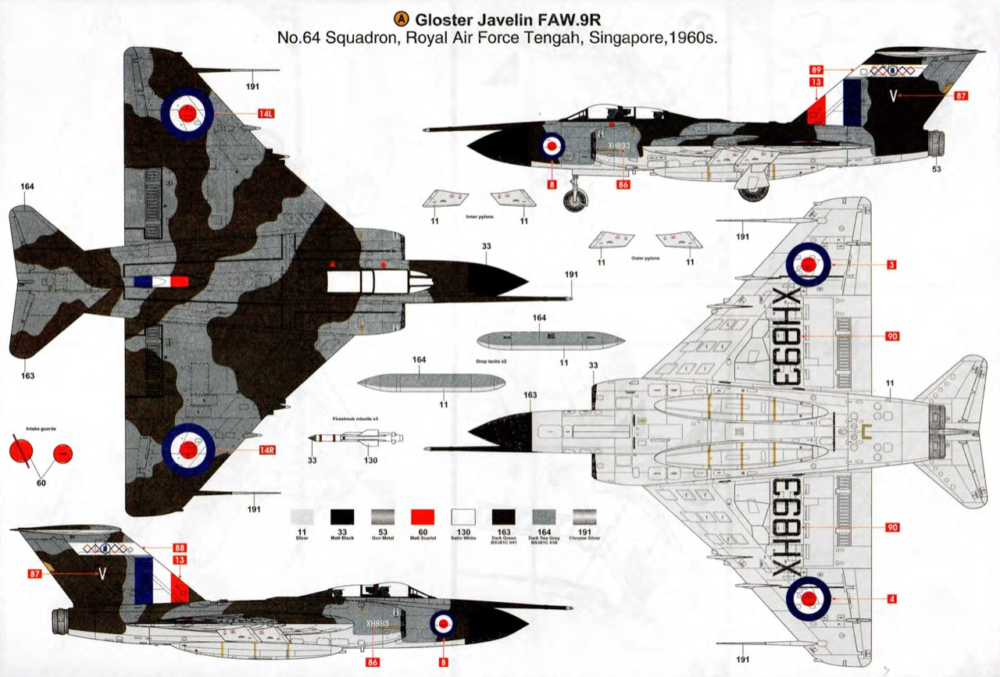
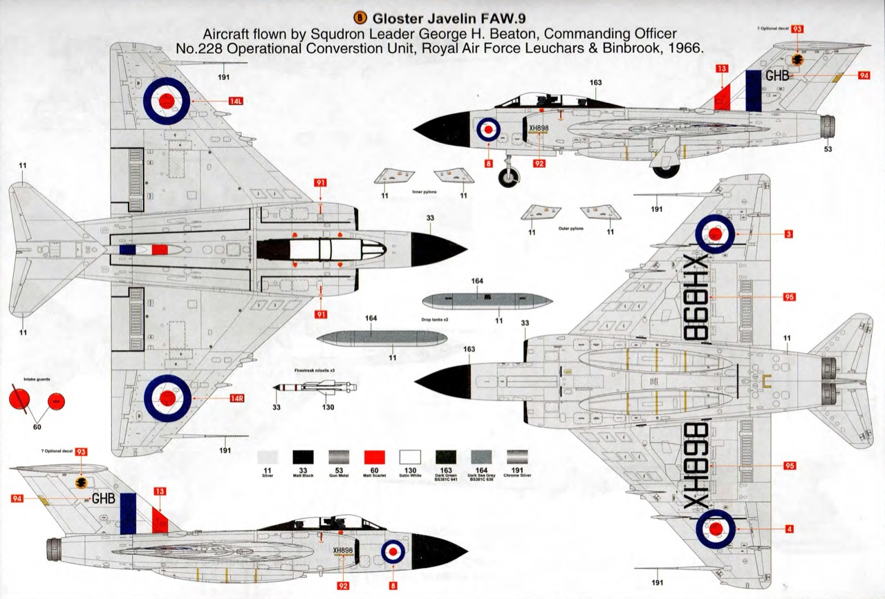
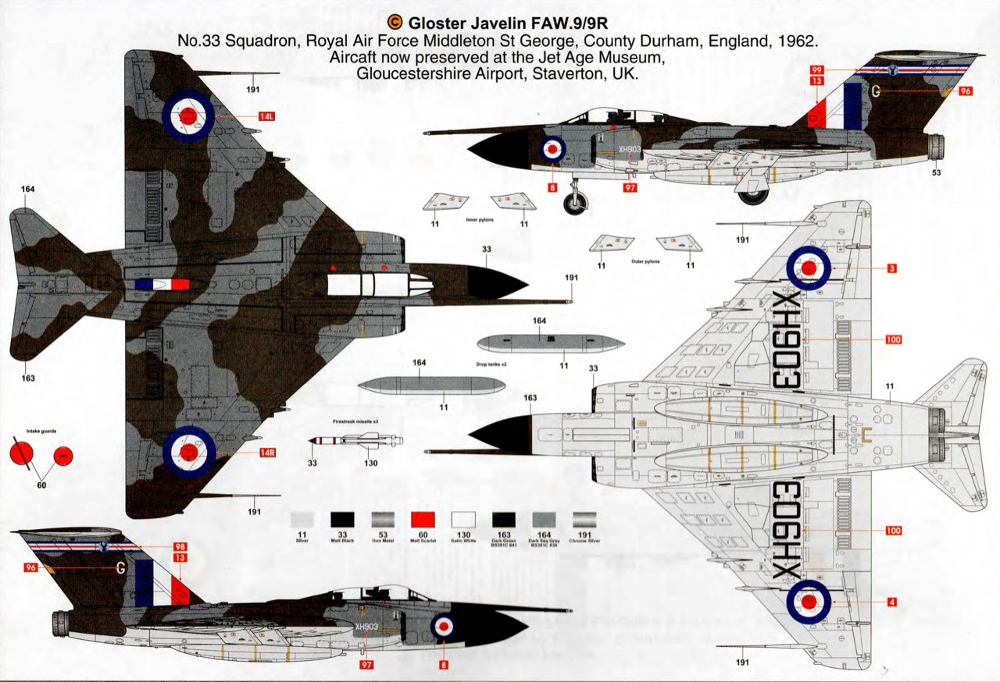
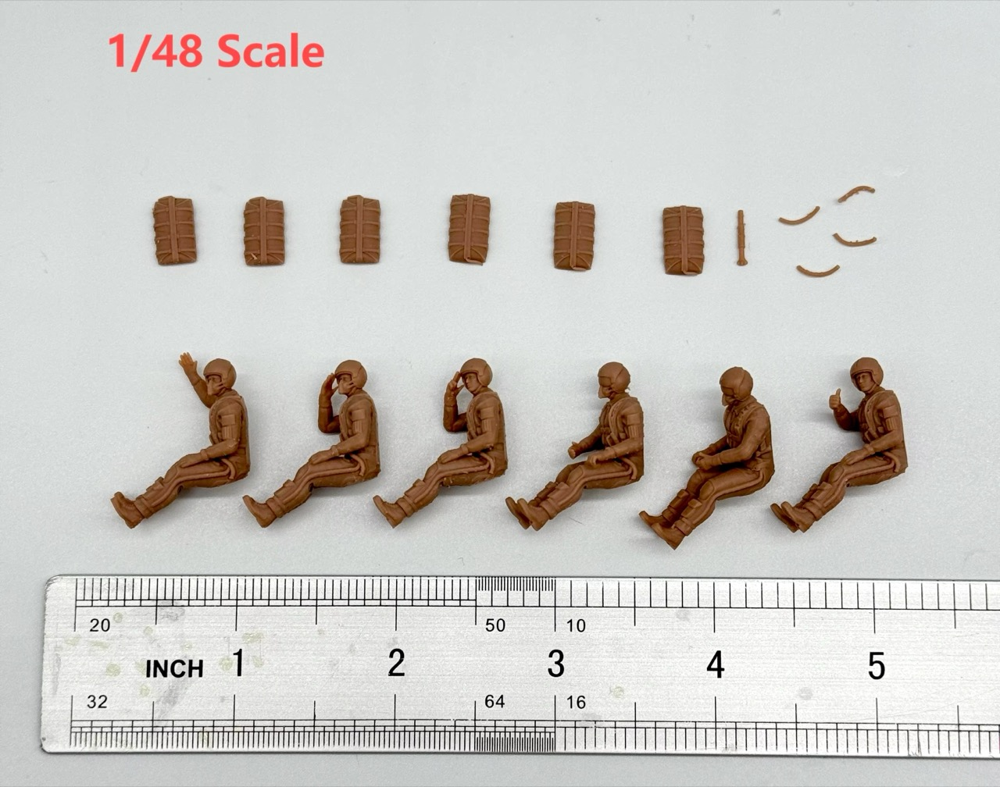
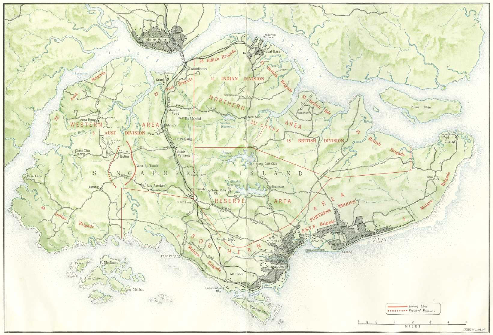
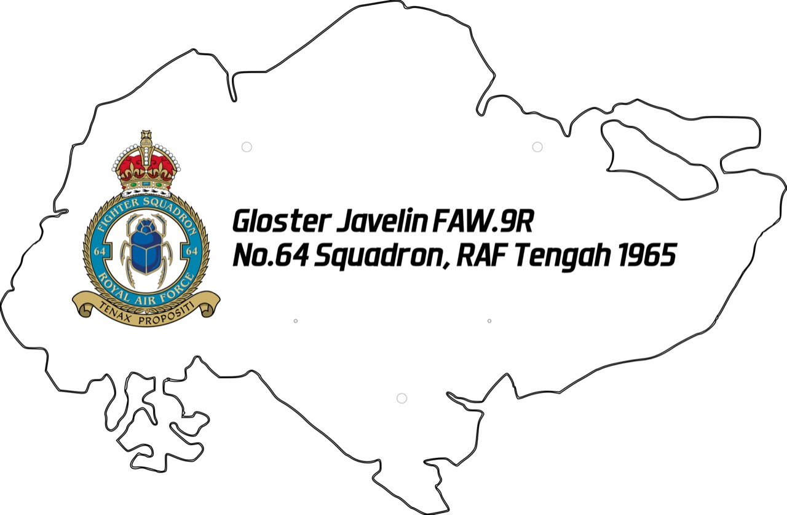

# #160 Gloster Javelin FAW.9R

Building the Airfix 1:48 Gloster Javelin FAW.9R (XH893) transferred to 64 Squadron in 1965 and based at RAF Tengah.

## Notes

The Gloster Javelin is a twin-engined all-weather interceptor aircraft that served with Britain's Royal Air Force from the mid-1950s until the late 1960s. It was a T-tailed delta-wing aircraft designed for night and all-weather operations and was the last aircraft design to bear the Gloster name. Introduced in 1956 after a lengthy development period, the aircraft received several upgrades during production to its engines, radar and weapons, including support for the De Havilland Firestreak air-to-air missile.

The Javelin was succeeded in the interceptor role by the English Electric Lightning, a supersonic aircraft capable of flying at more than double the Javelin's top speed, which was introduced into the RAF only a few years later. The Javelin served for much of its life alongside the Lightning; the last Javelins were withdrawn from operational service in 1968 following the introduction of successively more capable versions of the Lightning.

### The Kit

The [Gloster Javelin FAW.9/9R Airfix No. A12007 1:48](https://www.scalemates.com/kits/airfix-a12007-gloster-javelin-faw9-9r--173954)
was tooled and released in 2013. It was re-released in a new box in 2020.

See [instructions](./assets/A12007-instructions.pdf).

#### Scheme A Gloster Javelin FAW.9R (XH893)

This is the scheme I decided to model.

[No.64 Squadron](https://en.wikipedia.org/wiki/No._64_Squadron_RAF), Royal Air Force Tengah, Singapore, 1960s.

In September 1958, 64 squadron then converted to the Gloster Javelin FAW.7/FAW.9. In 1964 the squadron moved to RAF Tengah, partnering No. 60 Squadron RAF. The squadron was disbanded on 16 June 1967.

[XH893 (FAW.9R)](https://www.rafseletarandtengah.org.uk/raf-tengah/aircraft-based-at-raf-tengah/gloster-javelin/) built by Armstrong-Whitworth:

> Flown to Lee-on-Solent, having been prepared at 27 MU, Shawbury, and shipped to Singapore, its arrival date at Seletar being unknown. Issued to 60 Sqn. on 1 March 1965 and it shared the code ‘V’ with XH961 until the latter was transferred to 64 Sqn. in late May 1965. (XH910 was also ‘V’ during this period, q.v.) Transferred to 64 Sqn. on 16 November 1965, retaining the code ‘V’. It returned to 60 Sqn,. when 64 Sqn. was disbanded on 16 June 1967, and kept the code ‘V’. Flown to 389 MU on 1 May 1968 and was Struck Off Charge (SOC) on 1 December 1968, having being donated to the Singaporean Armed Forces and was allocated the new serial SAFTECH-6.

#### Scheme B Gloster Javelin FAW.9 XH898

Aircraft flown by Squadron Leader George H. Beaton, Commanding Officer
No.228 Operational Conversion Unit, Royal Air Force Leuchars & Binbrook, 1966.

#### Scheme C Gloster Javelin FAW.9/9R XH903

No.33 Squadron, Royal Air Force Middleton St George, County Durham, England, 1962.
Aircraft now preserved at the Jet Age Museum, Gloucestershire Airport, Staverton, UK.

### Paint Details

I'm building Scheme A Gloster Javelin FAW.9R - No.64 Squadron, Royal Air Force Tengah, Singapore, 1960s.

| Feature                | Color                    | Recommended | Paint Used |
|------------------------|--------------------------|-------------|------------|
| wheel wells            | Silver                   | 11          | n/a        |
| lower fuselage         | Silver                   | 11          | SM208      |
| ejection seat pulls    | Matt Trainer Yellow      | 24          | H34        |
| cockpit interior       | Matt Black               | 33          | Aqueous Surfacer 1000 Black |
| nose cone, intake trim | Matt Black               | 33          | H12                            |
| exhaust                | Gun Metal                | 53          | H18                         |
|                        | Matt Scarlet             | 60          |            |
| seat                   | Matt Brown Yellow        | 94          | 70.843 + 70.917             |
| missiles               | Satin White              | 130         | H11                         |
| upper fuselage camo 1  | Dark Green BS381C 641    | 163         | H80, H73, highlights w/H27  |
| upper fuselage camo 2  | Dark Sea Grey BS381C 638 | 164         | H331, H416 pre-shade        |
| pitot tubes            | Chrome Silver            | 191         | SM206                       |
|                        |                          |             |            |

### Pilot Figures

Unusually for an Airfix kit, this one doesn't come with any crew.

After searching around for a bit, I settled on a set of
[FPJ Model BY1S48 1/48 Scale Resin Model 6 Jet Pilots](https://www.aliexpress.com/item/1005007523380220.html). The set cost me SG$25.94 in Aug-2024.

I can't guarantee they are totally accurate for the aircraft, but they look pretty convincing, and there's not much to see when they are settled down in the cockpit!

### Build Log

## Mounting

I'm planning to mounting the plane in flight over a map of Singapore.

Back in the 1960's when the Javelin was based at RAF Tengah, the island of Singapore was quite a different shape than it is today.
A map from 1942:

And a more illustrative version from the 1960's:

To prepare the base for laser cutting:

* I cleaned up the map images in GIMP as [old-singapore-map.xcf](./map-base/old-singapore-map.xcf)
    * Aero Medium Italic font
* Used Inkscape to vectorize the island outline (currently not possible in Affinity Designer) as [singapore-island-outline.svg](./map-base/singapore-island-outline.svg)
* imported to xTool Studio and finalised the design as [singapore-base.xcs](./map-base/singapore-base.xcs)
    * added/fine-tuned text and squadron badge
    * add and locate mounting holes
    * cutting settings
* exported as [singapore-base.svg](./map-base/singapore-base.svg)

After cutting and engraving on an [xTool S1 Laser Cutter (at the NLB)](https://leap.tardate.com/equipment/nlb/xtools1/):

Mounted on 12"x18" Gesso Board (from Art Friends for SG$9.90):

## Initial Gallery after mounting

I realised I don't really have the space or lights to capture the build in my workroom. Maybe more pictures later from a better setting..

## Credits and References

* [this project on scalemates](https://www.scalemates.com/profiles/mate.php?id=74137&p=projects&project=161228)
* Gloster Javelin FAW.9/9R Airfix No. A12007 1:48
    * [on scalemates](https://www.scalemates.com/kits/airfix-a12007-gloster-javelin-faw9-9r--173954)
    * [instructions](./assets/A12007-instructions.pdf)
* Gloster Javelin FAW.9/9R for Airfix Eduard No. EX411 1:48
    * [on scalemates](https://www.scalemates.com/kits/eduard-ex411-gloster-javelin-faw9-9r--266023)
    * [instructions](./assets/EX411-instructions.pdf)
* FPJ Model BY1S48 1/48 Scale Resin Model 6 Jet Pilots
    * [on aliexpress](https://www.aliexpress.com/item/1005007523380220.html)

### Research References

* [Gloster Javelin](https://en.wikipedia.org/wiki/Gloster_Javelin) - wikipedia
* [RAF Tengah from July 1961 to April 1968 – by Ian Old](https://www.rafseletarandtengah.org.uk/raf-tengah/aircraft-based-at-raf-tengah/gloster-javelin/)
* [Tengah Air Base](https://en.wikipedia.org/wiki/Tengah_Air_Base)
* <https://en.wikipedia.org/wiki/No._64_Squadron_RAF>

### Build References

* [Build Review - Airfix 1/48 Gloster Javelin FAW 9/9R](https://bowemodels.blogspot.com/2013/10/build-review-airfix-148-gloster-javelin.html)
* [1/72 Airfix Gloster Javelin T3](https://uamf.org.uk/viewtopic.php?t=13619&start=15)

#### Airfix 1/48 Gloster Javelin inbox Review

YouTube by Mymodellingworld

#### Airfix Javelin Review

YouTube by florymodels

#### Build Playlist

YouTube by Dansmodelworx

#### Build Playlist

YouTube by Mojo Rising Modelling

