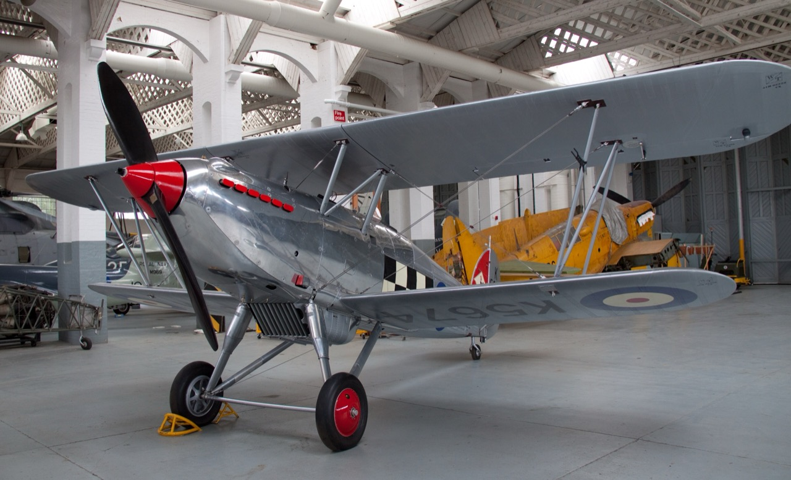
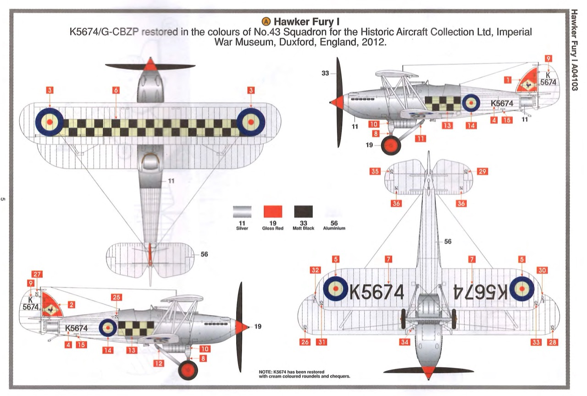
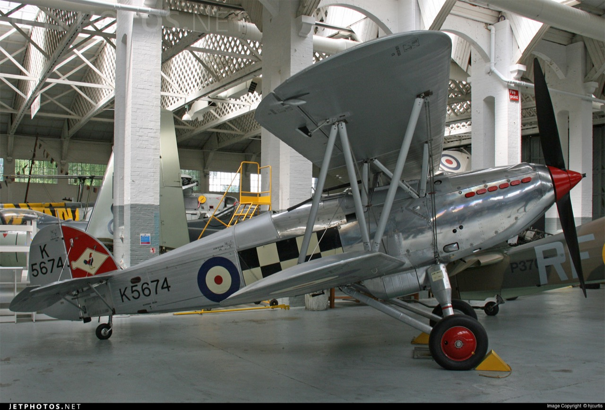
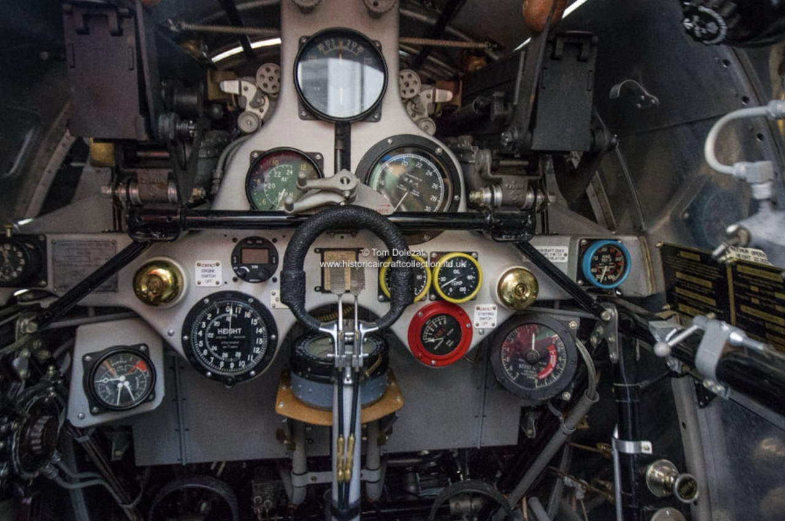

# #xxx Hawker Fury I

description here

## Notes

The [Hawker Fury](https://en.wikipedia.org/wiki/Hawker_Fury) was a fast, agile, biplane fighter aircraft used by the RAF in the 1930s. It was the fighter counterpart to the Hawker Hart light bomber.

The Fury I entered squadron service with the RAF in May 1931, re-equipping 43 Squadron. Owing to finance cuts in the Great Depression, only relatively small numbers of Fury Is were ordered, the type equipping 1 and 25 squadrons; the slower Bristol Bulldog equipped ten fighter squadrons. The Fury II entered service in 1936–1937, increasing total number of squadrons to six.

### The Kit

[Hawker Fury I Airfix No. A04103 1:48](https://www.scalemates.com/kits/airfix-a04103-hawker-fury-i--174731)
is the 2013 boxing of a pretty old 1980 tooling.
Purchased from Hobby Bounties for SG$88 (May-2026).

### Paint Scheme

Selected scheme A: K5674/G-CBZP restored in the colours of No.43 Squadron for the Historic Aircraft Collection Ltd, Imperial War Museum, Duxford, England, 2012.

| Feature               | Color                | Recommended | Paint Used                  |
|-----------------------|----------------------|-------------|-----------------------------|
| main cowling          | Silver               | 11          | SM206 Super Chrome Silver 2 |
| foot pedals           | Silver               | 11          | XF16                        |
| spinner, wheel hubs   | Gloss Red            | 19          | H3                          |
| propeller             | Matt Black           | 33          | H12                         |
| exhaust pipes         | Matt Black           | 33          | H12                         |
| yoke                  | Matt Black           | 33          | H12                         |
| fuselage              | Aluminium            | 56          | XF16                        |
| interior              | Aluminium            | 56          | XF16                        |
| engine block          | Silver               | 11          | H18                         |
| seat                  | Matt Dark Green      | 30          | H309                        |
| seat cushion          |                      |             | H47                         |
|                       |                      |             |                             |

Pilot figure:

| Feature               | Color                | Recommended | Paint Used |
|-----------------------|----------------------|-------------|------------|
| jacket                | Matt Dark Earth      | 29          |            |
| seat                  | Matt Dark Green      | 30          |            |
| skin                  | Matt Flesh           | 61          |            |
|                       |                      |             |            |

### Build Log

### Final Gallery

## Credits and References

* [this project on scalemates](https://www.scalemates.com/profiles/mate.php?id=74137&p=projects&project=241462)
* Hawker Fury I Airfix No. A04103 1:48
    * [on scalemates](https://www.scalemates.com/kits/airfix-a04103-hawker-fury-i--174731)
    * [instructions](./assets/A04103-instructions.pdf)
    * Purchased from Hobby Bounties for SG$88 (May-2026).

### Research References

* <https://en.wikipedia.org/wiki/Hawker_Fury>
* <https://www.jetphotos.com/registration/G-CBZP>

#### Hawker Fury K5674 (G-CBZP)

Hawker Fury K5674 (G-CBZP) is part of the [Historic Aircraft Collection Ltd, Imperial War Museum, Duxford, England](https://historicaircraftcollection.com/fury.htm).

From the [datasheet](https://historicaircraftcollection.com/downloads/fury_data_sheet.pdf):

> We were fortunate that a period photograph of the aircraft that we were lent by David Rosier (ACM Sir F Rosier's son) helped us restore the paint scheme exactly as it was in 1937.

#### Hawker Hart | The Bomber That No Fighter Could Catch (in 1930)

YouTube by Rex's Hangar

#### History of the Hawker Fury

YouTube by SirKittalot

### Build References

#### Airfix 1/48 Hawker Fury 1..Full Aircraft Build & Review

YouTube by PFS Modelling Projects

