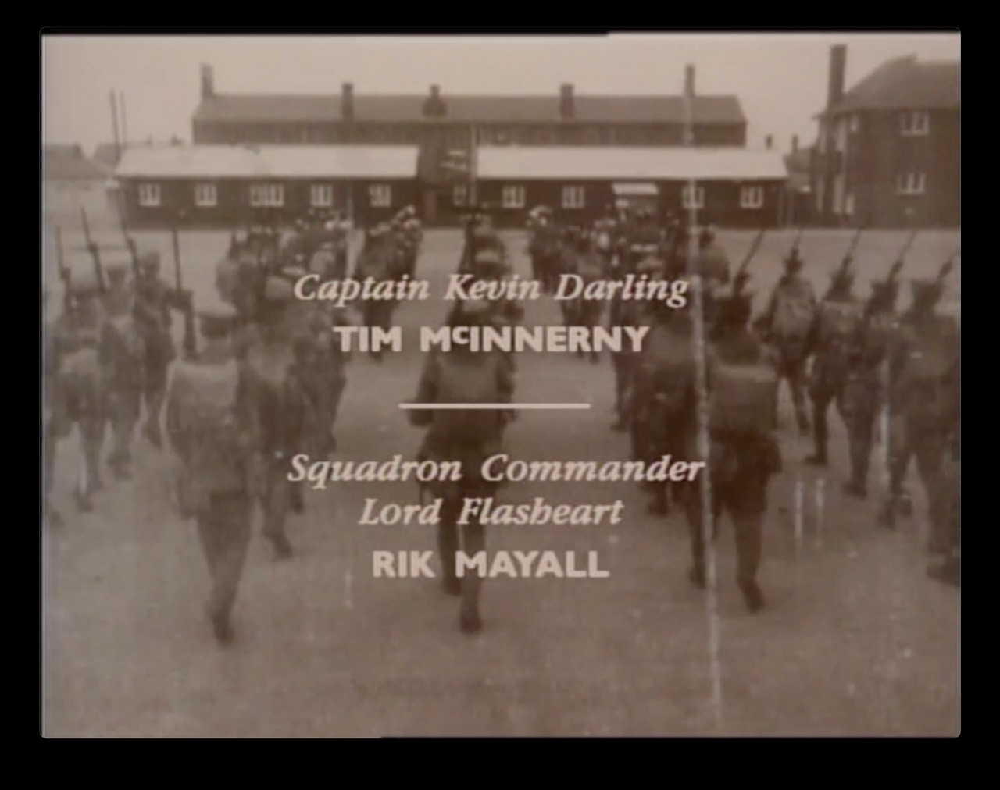
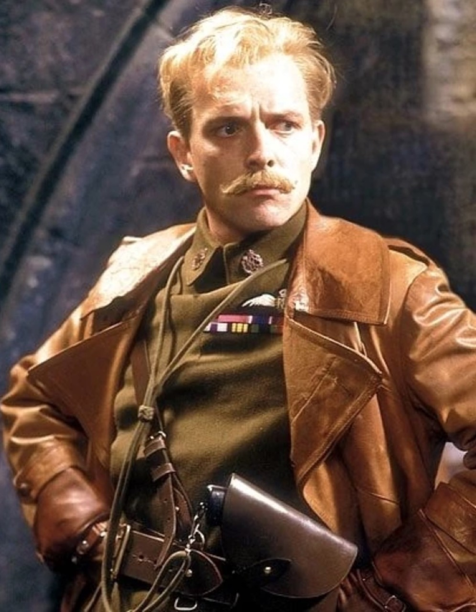

# #134 Squadron Commander Lord Flasheart

Woof! The legend of Squadron Leader The Lord Flasheart. An Elan13 Miniatures bust with a Fokker Dr.1 from Airfix.

## Notes

Squadron Commander Lord Flasheart is the annoyingly competent upper-class git,
played by [Rik Mayall](https://en.wikipedia.org/wiki/Rik_Mayall) in
[Blackadder Goes Forth, E4 "Private Plane"](https://www.imdb.com/title/tt0096548/).
Note: there's some disagreement in sources as to the correct spelling and rank, but I will go by the credits:

### The Kit

I found [Lord Flash 'Woof! Woof!'](https://www.scalemates.com/kits/elan13-miniatures-el93-lord-flash--1450322)
from Elan13 Miniatures. A wonderful casting, my second from Elan13.

I've posed it in the final display with the Airfix Vintage Classics Fokker DR.1,
from the [Dogfight Doubles No. A02141V 1:72](https://www.scalemates.com/kits/airfix-a02141v-fokker-dr1-and-bristol-f2b--1460227)
boxing. A 1957 tooling though!

### Build Log

### Final Gallery

And of course it now joins my wall of flight..

## Credits and References

* [this project on scalemates](https://www.scalemates.com/profiles/mate.php?id=74137&p=projects&project=145713)
* Lord Flash 'Woof! Woof!' Elan13 Miniatures No. EL93 1:10
    * on [scalemates](https://www.scalemates.com/kits/elan13-miniatures-el93-lord-flash--1450322)
    * as [elan13.co.uk](https://elan13.co.uk/epages/8ddd0c5f-33bc-47f3-92b7-7e1177bf5cd9.sf/en_GB/?ObjectPath=/Shops/8ddd0c5f-33bc-47f3-92b7-7e1177bf5cd9/Products/EL93)
* [About Lord Flashheart](https://blackadder.fandom.com/wiki/Wing_Commander_The_Lord_Flashheart)
* [Blackadder Goes Forth](https://www.imdb.com/title/tt0096548/)
