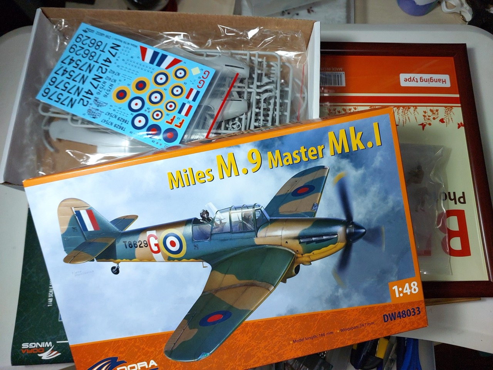

# #141 Miles Master

Building the Dora Wings Miles M.9 Master Mk. I in 1:48 for the Models for Heroes/Model Officers Mess 48x48 Group Build 2025.

## Notes

The Miles M.9 Master was a British two-seat monoplane advanced trainer designed and built by aviation company Miles Aircraft Ltd. It was inducted in large numbers into both the Royal Air Force (RAF) and Fleet Air Arm (FAA) during the Second World War.

### The Kit

### Paint Scheme

Miles M.9A Master I, N7412, first prototype, september 1938

| Feature                  | Color                | Recommended | Paint Used |
|--------------------------|----------------------|-------------|------------|
| A prop                   | Black                | H12         | H12        |
| B                        | Silver               | H8          |            |
| C spinner, undercarriage | Aluminium            | MC218       | SM204      |
| D                        | Gun Metal            | H28         |            |
| E                        | Rubber Black         | H77         |            |
| F cockpit interior       | Interior Green       | H58         | H58        |
| G                        | Yellow Chromat       | C352        |            |
| H                        | Clear Green          | H94         | 70.969     |
| I                        | Burnt Iron           | H76         |            |
| J                        | Signal Red           | H11         | 70.909     |
| K                        | Brown                | M37         |            |
| L upper camo 1           | Dark Green           | H73         | H330       |
| M upper camo 2           | Dark Earth           | H72         | H72        |
| N                        | Clear Red            | H90         |            |
| O                        | White                | H11         |            |
| P                        | Light Gray           | H338        |            |
| R lower camo             | Yellow               | H329        | H413       |

### Build Log

where I got to after a few hours on day 1 - basically just cleaned up most of the parts, did an in-flight conversion and a little priming

found a resin figure to pilot the aircraft. Only got one, so it's going to be a solo training flight! Quick slap dash paint job..

quick cockpit assembly, didn't sweat the details as its going to be pretty invisible in the final build

ok, fuselage halves coming together, getting closer to paint now

Interior - wheels-up conversion

Main body parts ready to assemble

Last chance to look inside the cockpit!

### Background Painting

working on a simple background for the B5 mounting frame

"a grand day for training" .. a quick and dirty framing

### Painting the Miles Master

Where I got to on Saturday evening. Primed for yellow .. or I could just stick with this scheme😁

Liking this hue of yellow. Let it dry a bit before masking for the final upper camo.

Masked and applying the dark earth camo

Decals .. if I had more time I think I'd spray on the roundels so I could get the yellow properly matched

### Final Gallery

"A grand day for training". All done!
Some final shots of the Dora Wings Miles M.9 Master Mk. I. Nice kit, took a few short cuts to finish within the 48 hours.

## Credits and References

* [this project on scalemates](https://www.scalemates.com/profiles/mate.php?id=74137&p=projects&project=157052)
* Miles M.9 Master Mk. I Dora Wings No. DW48033 1:48
    * [on scalemates](https://www.scalemates.com/kits/dora-wings-dw48033-miles-m9-master-mk-i--1290508)
    * [on dorawings.com](https://dorawings.com/index.php?route=product/product&product_id=91)
    * [instructions](./assets/DW48033-instructions.pdf)

### Research References

* [Miles Master](https://en.wikipedia.org/wiki/Miles_Master) - wikipedia

#### The Miles Master, The plane that raised the RAF

YouTube by Longtreader

#### DoraWings I 1/48 Miles M.9 Master Mk.I Kit Review and Build

YouTubes by Tim’s Scale Modelling

Kit Review:

Build Part One I:

