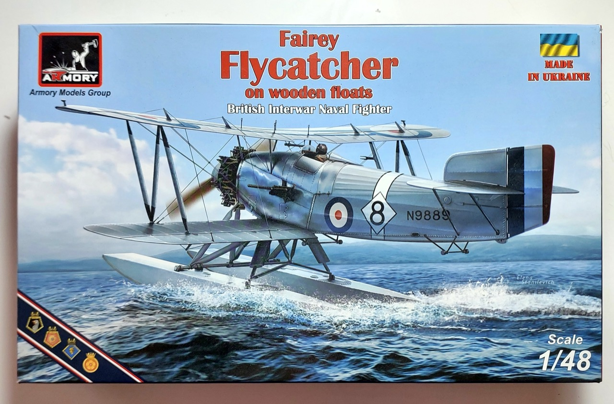
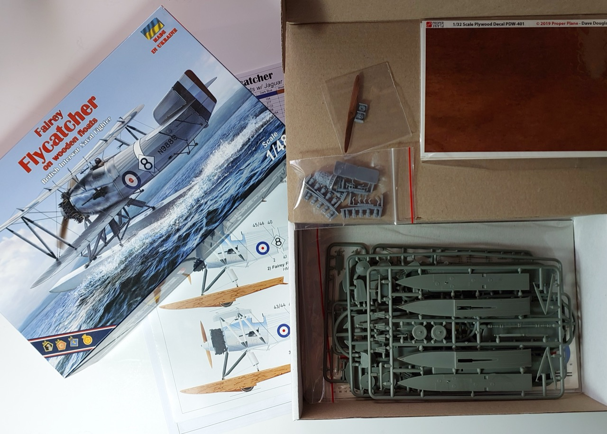

# #155 Fairey Flycatcher

Building the Fairey Flycatcher stationed at HMS Hermes, China Station, 1930. This is the Armory Models Group kit in 1:48, with a hand carved prop and wood decals from Proper Plane of Ukraine. All upstaged by a couple of cheeky seagulls.

## Notes

The Fairey Flycatcher was a British single-seat biplane carrier-borne fighter aircraft made by Fairey Aviation Company which served from 1923 to 1934. It was produced with a conventional undercarriage for carrier use, although this could be exchanged for floats for catapult use aboard capital ships.

The Fairey Flycatcher in Royal Navy service during the 1920s and early 1930s was finished in what was known as "silver dope" — a light, metallic-looking finish applied to the fabric surfaces — with metal panels usually painted in a very similar light grey-silver shade so the whole aircraft appeared a uniform pale silver.

The navigation lights on RNAS (Royal Naval Air Service) and later FAA (Fleet Air Arm) aircraft — including biplane floatplanes like the Fairey Flycatcher — followed the same international standard used for ships and aircraft since the early 20th century.

For the Fairey Flycatcher (introduced in the 1920s), the wingtip navigation lights would have been:

* Port (left) wingtip – Red light
* Starboard (right) wingtip – Green light

### The Kit

[Fairey Flycatcher (on Wooden Floats) + Extras 1/48](https://properplane.com/proper_sets?product_id=280) is the [Armory Models AR48003](https://armorymodels.com/product/1-48-fairey-flycatcher-british-faa-inter-war-floatplane-fighter-on-wooden-floats/) kit,
packaged with some extras by Proper Plane:

* Proper Plywood Decals
* Proper Wooden propeller

### Paint Scheme

Scheme 4: Fairey Flycatcher, s/n N9961/9, 403th Flight, HMS Hermes, China Station, 1930

| Feature                       | Color                | Recommended | Paint Used |
|-------------------------------|----------------------|-------------|------------|
| cockpit frame and detail      | Silver               | C8/H8       | MC213 Stainless         |
| cowling, cockpit interior     | Silver               | C8/H8       | SM204 Super Stainless 2 |
|                               | Polished Aluminum    | LP70        |             |
|                               | Yellow               | C329/H329   |             |
| fuselage                      | White                | C62/H11     | H11         |
|                               | Black                | C33/H12     |             |
|                               | Red                  | H013        |             |
|                               | Navy Blue            | C14/H54     |             |
|                               | Wood brown           | C310/H310   |             |
|                               | Rust                 | H344,H453   |             |
| cockpit fittings, instruments | Old Gold             |             | 70.878      |
| engine features               | Steel                |             | H18         |
| push rods                     |                      |             | RCM011      |
| window frame, prop nuts       | Copper               |             | H10         |
| fuselage tint 1               |                      |             | H11+H51     |
| fuselage tint 2               |                      |             | H11+H51+H34 |
| insignia 1                    | Bright Blue          |             | H15         |
| insignia 2                    | Shine Red            |             | H23         |
| Port wingtip light            | Red                  |             | 70.909      |
| Starboard  wingtip light      | Green                |             | 70.891      |

I made the mistake of thinking the main fabric fuselage was white, and that's how I've finished the model.
It wasn't particularly clear in the Armory instructions, but as I got towards the end of the build I started to doubt the choice.
A little research confirmed that I as wrong, and that the main fuselage should be "silver dope".
It was too late in the build to fix that without significant effort—I'd already laid down decals for instance—so
I'll just notch this up as a "lesson learned", and appreciate the build for what it is: a somewhat "what if" representation.

### Build Log

Working on the floats first..

Using the wood decals from ProperPlane

A little fiddly to apply, but got the job done..

Most of the construction effort is in the cockpit!

Starting work on on the motor.

Painting the fuselage

I airbrushing the tail insignia

Airbrushing the main insignia

Not too bad - a little touch-up required for some bleed of the blue

With the main decals applied..

## Final Rigging

## Engine and final details complete

## Display Base

Concept...

Making the dock section

Plane in place

## Adding Some "Character"

Sculpting a few seagulls..

Adding them to the base..

## Final Gallery

## Credits and References

* [this project on scalemates](https://www.scalemates.com/profiles/mate.php?id=74137&p=projects&project=213142)
* Fairey Flycatcher floatplane on wooden floats Armory No. AR48003 1:48
    * [on scalemates](https://www.scalemates.com/kits/armory-ar48003-fairey-flycatcher-floatplane-on-wooden-floats--1169342)
    * [on armory models](https://armorymodels.com/product/1-48-fairey-flycatcher-british-faa-inter-war-floatplane-fighter-on-wooden-floats/)
    * [on proper plane](https://properplane.com/proper_sets?product_id=280) with extras (this is the version I bought)
    * [instructions](./assets/AR48003-instructions.pdf)

### Research References

* <https://en.wikipedia.org/wiki/Fairey_Flycatcher>
* <https://www.lookandlearn.com/history-images/M559297/The-Fairey-Flycatcher>

#### FAIREY FLYCATCHER: A Pioneering Interwar Carrier Fighter

YouTube by Not A Pound For Air To Ground

#### Fairey Flycatcher with and without floats on aircraft carriers. Archive film 62530

YouTube by HuntleyFilmArchives

### Build References

* <https://imodeler.com/2024/11/fairey-flycatcher/> - beautifully finished, same variant as I am building

#### Armory Models 1/48 Fairey Flycatcher (48002) Review

YouTube by DetailScaleView

#### First impressions, Armoury models, 1/48, Fairey Flycatcher

YouTube by Modelkit Stuff

