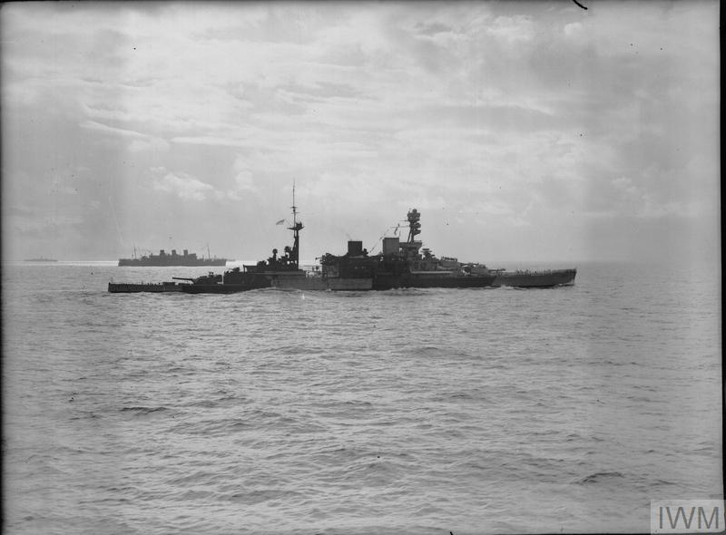
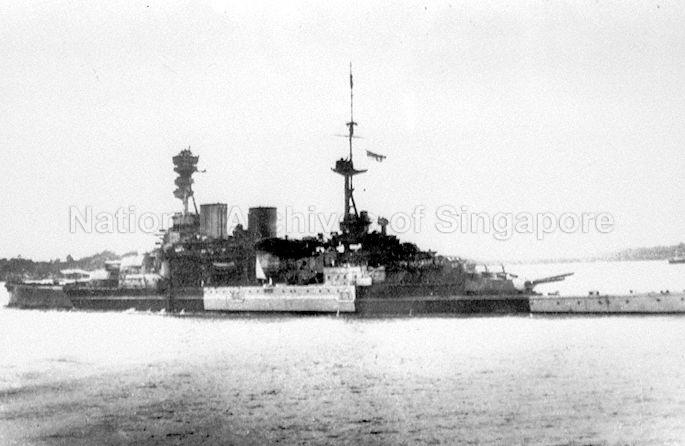
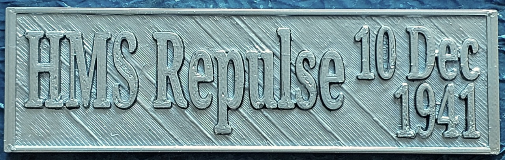

# #138 HMS Repulse

Remembering Force Z with a build of the HMS Repulse from the Tamiya 1:700 waterline series.

## Notes

[Force Z](https://en.wikipedia.org/wiki/Force_Z), comprising battleship HMS Prince of Wales, battlecruiser HMS Repulse,
and destroyer escorts sailed from Singapore at 1710 on 8 December 1941 after receiving word of a Japanese convoy bound for Malaya.
On 10 December 1941 the force was intercepted by land-based bombers and torpedo bombers of the Imperial Japanese Navy,
and both the Prince of Wales and Repulse were sunk. Coming so soon after the attack on Pearl Harbor, it underscored the strategic shift from big gunned battleships to air power in naval warfare.

I've previously build the rest of Force Z that was engaged on the 10th Dec: HMS Prince of Wales, HMS Electra, HMS Express, HMAS Vampire.

In this build I am depicting HMS Repulse under attack by the first wave by elements of the IJN 22nd Koku Sentai, specifically
1st Squadron Mihoro Kokutai of 8 Mitsubishi Navy Type 96 G3M2 Nell bombers, each carrying two 250kg high explosive bombs.

* Elements, 22nd Koku Sentai (Air Flotilla) - Rear-Admiral Matsunaga, based in Saigon
    * <https://en.wikipedia.org/wiki/Japanese_order_of_battle_during_the_Malayan_campaign>
    * 1st Squadron, Mihoro Kokutai (Lt Shirai): 8 Mitsubishi Navy Type 96 G3M2 'Nell' bombers, each carrying two 250kg high explosive (HE) bombs
* First Wave
    * 1113hrs. 1st Squadron, Mihoro Kokutai conducts high-level (3,000m) bombing attack on Repulse. Eight 250kg bombs dropped, but only one hit. Bomb penetrates hangar and causes minor damage
* Mihoro Kokutai (美幌海軍航空隊 Mihoro kaigun kōkūtai)
    * <https://ja.wikipedia.org/wiki/%E7%BE%8E%E5%B9%8C%E6%B5%B7%E8%BB%8D%E8%88%AA%E7%A9%BA%E9%9A%8A>
    * 九六式陸上攻撃機

### Force Z

[Force Z](https://en.wikipedia.org/wiki/Force_Z) sailed from Singapore at 1710 on 8 December 1941 after receiving word of a Japanese convoy bound for Malaya.
It consisted of
the battleship [HMS Prince of Wales](https://en.wikipedia.org/wiki/HMS_Prince_of_Wales_(53)),
battlecruiser [HMS Repulse](https://en.wikipedia.org/wiki/HMS_Repulse_(1916)),
with destroyer escorts
[HMS Electra](https://en.wikipedia.org/wiki/HMS_Electra_(H27)),
[HMS Express](https://en.wikipedia.org/wiki/HMS_Express_(H61)),
[HMAS Vampire](https://en.wikipedia.org/wiki/HMAS_Vampire_(D68)) and
[HMS Tenedos](https://en.wikipedia.org/wiki/HMS_Tenedos_(H04)).

On 9 December 1941, Japanese submarine and reconnaissance aircraft reported on Force Z without their knowledge.
HMS Tenedos was also detached to return to Singapore as she was running low on fuel.
Overnight, flares dropped by Japanese aircraft alerted Force Z to their discovery.
Having lost the element of surprise, the force was ordered to return to Singapore.

On the return voyage, the force was intercepted by land-based bombers and torpedo bombers of the Imperial Japanese Navy.
Prince of Wales and Repulse were sunk by Japanese aircraft on 10 December 1941.
Destroyers Electra and Vampire moved in to rescue survivors of Repulse, while Express rescued those from the Prince of Wales.

Occurring just a few days after the Pearl Harbor attacks, this was Britain's turn to learn how vulnerable capital ships were to air power.
There was no attempt to alert or scramble RAF air cover for Force Z, though it is likely to have made little difference
as the number and vintage of the planes on hand were totally outclassed by the Japanese forces in play.

### Japanese Forces

Elements, 22nd Koku Sentai (Air Flotilla) - Rear-Admiral Matsunaga, based in Saigon

First Wave:

* 1st Squadron, Genzan Kokutai (Lt Ishihara): 9 Mitsubishi Navy Type 96 G3M2 'Nell' bombers, each carrying one Type 91 torpedo
* 2nd Squadron, Genzan Kokutai (Lt Takai): 7 Mitsubishi Navy Type 96 G3M2 'Nell' bombers, each carrying one Type 91 torpedo
* 1st Squadron, Mihoro Kokutai (Lt Shirai): 8 Mitsubishi Navy Type 96 G3M2 'Nell' bombers, each carrying two 250kg high explosive (HE) bombs
* 4th Squadron, Mihoro Kokutai (Lt Takahashi): 8 Mitsubishi Navy Type 96 G3M2 'Nell' bombers, each carrying one Type 91 torpedo

Second Wave:

* 2nd Squadron, Mihoro Kokutai (Lt Takeda): 8 Mitsubishi Navy Type 96 G3M2 'Nell' bombers, each carrying one 500kg HE bomb
* 3rd Squadron, Mihoro Kokutai (Lt Ohira): 9 Mitsubishi Navy Type 96 G3M2 'Nell' bombers, each carrying one 500kg HE bomb
* 1st Squadron, Kanoya Kokutai (Lt Nabeta): 9 Mitsubishi Navy Type 1 G4M1 'Betty' bombers, each carrying one Type 91 torpedo
* 2nd Squadron, Kanoya Kokutai (Lt Higashimori): 8 Mitsubishi Navy Type 1 G4M1 'Betty' bombers, each carrying one Type 91 torpedo
* 3rd Squadron, Kanoya Kokutai (Lt Iki): 9 Mitsubishi Navy Type 1 G4M1 'Betty' bombers, each carrying one Type 91 torpedo

#### First Wave

* 1113hrs. 1st Squadron, Mihoro Kokutai conducts high-level (3,000m) bombing attack on Repulse. Eight 250kg bombs dropped, but only one hit. Bomb penetrates hangar and causes minor damage
* 1149hrs. 2nd Squadron, Genzan Kokutai carries out a torpedo attack on Repulse. However, the battlecruiser evades all the torpedoes
* 1151hrs (approx). 4th Squadron, Mihoro Kokutai carries out a long-range torpedo attack on Repulse. As they were undetected by the British, they probably attacked from long range, immediately after the Genzan squadron completed its attack. None of these eight torpedoes hit their target
* 1157hrs. 1st Squadron, Mihoro Kokutai returns to carry out another high-level bombing attack on Repulse. All six 250kg HE bombs miss

#### Second Wave

* 1224hrs. The remainder of 1st and 2nd squadrons, Kanoya Kokutai break away from the attack on the Prince of Wales, and begin a run towards the Repulse, which is off their port side. They circle around the battlecruiser, to attack her from several directions at once
* 1224hrs. Repulse avoids most of these torpedoes. However, one hits Repulse on her port quarter, damaging her outer port propeller shaft and causing flooding
* 1225hrs. Simultaneously, the 3rd Squadron, Kanoya Kokutai have been approaching the battlecruiser from both port and starboard. Repulse struck by four more torpedoes, three on her port side and one to starboard. These cause extensive flooding damage, jam her rudder, and the battlecruiser begins to heel over and sink. The order is given to abandon ship
* 1230hrs. Attack by the Kanoya Kokutai ends as the aircraft head for their home bases
* 1232hrs. Repulse sinks

### The Kit

The
[Tamiya kit No. 31617](https://www.scalemates.com/kits/tamiya-31617-hms-repulse--105624)
is a in 1:700 waterline rendition of the HMS Repulse.
This is an old tooling from 1975 but it still stands up to scrutiny. Later boxings I think included the extra detail sprues.

#### Photo-etch Customization

While the Tamiya kit is a reasonably well detailed, I think it needs some PE to bring it to life, even if just for the railings.

I'm using a pretty good photo-etch set from
[White Ensign Models No. PE 780 1:700](https://www.scalemates.com/kits/white-ensign-models-pe-780-hms-repulse--105719).

Here are my notes on how the PE was applied:

| PE | Name                                                  | Used |
|----|-------------------------------------------------------|------|
| 1  | Railings (Bow Sections)                               | √ |
| 2  | Railings (Fo'c's'le Sections)                         | √ |
| 3  | Railings (Mainmast Starfish)                          | add to B30 |
| 4  | Railings (Catapult Forward)                           | √ |
| 5  | Railings (Catapult Aft)                               | √ |
| 6  | Railings (Lower Forward Superstructure)               | √ |
| 7  | Railings (Part B43)                                   | √ add to B43 |
| 8  | Foretop Yardarm Foot Ropes                            | √ add to B3 |
| 9  | Railings (Quarterdeck Aft Sections)                   | √ |
| 10 | Railings (Upper Boat Deck Canvassed)                  | not used - use open instead |
| 11 | Railings (Upper Boat Deck Open)                       | √ add to rear of C27 |
| 12 | Railings (Flag Signal Deck Canvassed)                 | not used - use open instead |
| 13 | Railings (Flag Signal Deck Open)                      | √ |
| 14 | Railings (Lower Boat Deck)                            | √ |
| 15 | Railings (Part B31)                                   | √ add to B31 |
| 16 | Railings (Lower Aft Superstructure)                   | √ add to  B29|
| 17 | Railings (Forward Superstructure 02 Deck)             | √ |
| 18 | Railings (Part B2)                                    | √ |
| 19 | Railings (Upper Áft Superstructure)                   | √ add to B45|
| 20 | Anchor Chain                                          | not used - use kit part |
| 21 | 27' Whaler Cradles                                    | add to C21 - mounting on C22 |
| 22 | Anchors                                               | not used - use kit parts C4 |
| 23 | Mainmast DF Antenna                                   | √ add to B49 |
| 24 | Foretop Signal Platforms                              | √ add to B34, B35 |
| 25 | Crane Base Frame                                      | √ replace C9 |
| 26 | Foretop Upper Yardarm Supports                        | √ add to B1 |
| 27 | Railing (Part B19)                                    | √ add to B19 |
| 28 | Main Crane Jib                                        | √ replace C8, C10 |
| 29 | Crane Hooks                                           | √ replace C8, C10 |
| 30 | 8-Barrel Pom-Pom Assembly                             | replaces C5, C7 x 3 - partial replacement |
| 31 | 20mm Single Oerlikons                                 | replaces C25 x 8 - partial replacement |
| 32 | Quad 5* MG Mountings                                  | replaces C6 x 4 - not used |
| 33 | Main Director Arm Supports                            | √ add to B36 |
| 34 | Port Vent Box Boat Cradles                            | √ replace cradles on 38  |
| 35 | Jack Staff (bow)                                      | √ add |
| 36 | Ensign Staff (stern)                                  | √ replace B48 |
| 37 | Starboard Vent Box Boat Cradles                       | √ replace cradles on 39 |
| 38 | Port Vent Box                                         | √ replace part on A7 |
| 39 | Starboard Vent Box                                    | √ replace part on A7 |
| 40 | Foretop Light & Antenna                               | √ add to B1  |
| 41 | Aft HACS Director Supports                            | √ add to B15 |
| 42 | Mainmast Starfish Assembly                            | not used - replaces B30 |
| 43 | Mainmast Top Platform Assembly                        | √ partially used - replace upper platform on B49 |
| 44 | Upper Boat Deck Outer Cradles                         | √ replace cradles on A7 |
| 45 | Forward Funnel Cap Grille                             | √ add to A13 |
| 46 | Aft Funnel Cap Grille                                 | √ add to A12 |
| 47 | Lower 284 Radar Antenna                               | √ add to B27 |
| 48 | Upper Boat Deck Centre Cradles                        | √ replace cradles on A7 |
| 49 | Aft Accommodation Ladder Handrails                    | not required - only used at anchor |
| 50 | Aft Accommodation Ladder                              | not required - only used at anchor |
| 51 | Accommodation Ladder Davits                           | not required - only used at anchor |
| 52 | Forward Accommodation Ladder                          | not required - only used at anchor |
| 53 | Forward Accommodation Ladder Handrails                | not required - only used at anchor |
| 54 | Accommodation Ladder Davits                           | not required - only used at anchor |
| 55 | Quarterdeck Officers' Stairs                          | √ add to B29 |
| 56 | Main Crane Rigging                                    | √ add to C8, C9, C10 |
| 57 | 27' Whaler Thwarts, Rudders and Oars                  | √ add to C21 |
| 58 | 30' Gig Thwarts, Rudders and Oars                     | √ add to C22 |
| 59 | 32' Cutter Thwarts, Rudders and Oars                  | √ add to C23 |
| 60 | Sea Boat Embarkation Nets                             | √ add to C1 |
| 61 | Crane Jib Stowage Cradle Supports                     | √ add to underside aft A7 |
| 62 | Walrus Amphibian Fittings                             | √ add to C16 |
| 63 | Walrus Amphibian Launch Cradles                       | √ add to C16 |
| 64 | 42' Launch Thwarts and Rudder                         | √ add to B26 |
| 65 | Bridge Windows                                        | √ add to B42 |
| 66 | Vertical Ladder Stock                                 | √ used on turrets |
| 67 | Boat Davit Rigging                                    | √ add to C1 |
| 68 | Inclined Ladders (Midships)                           | |
| 69 | Inclined Ladder (Flag Signal Deck/Bridge)             | |
| 70 | Inclined Ladder (Part B37)                            | √ add to B37 |
| 71 | Inclined Ladders (Standard Length)                    | √ add to B29 |
| 72 | 30' Gig Cradles                                       | add to C22 - not used |
| 73 | Searchlight Lens Crosses                              | √ add to C36 x 6 |

### HMS Repulse's camouflage scheme during her final sortie with Force Z

On her final sortie with Force Z in December 1941, HMS Repulse wore a camouflage scheme designed to reduce visibility during operations in Southeast Asia. The details of her camouflage and deck color were as follows:

#### Camouflage Scheme

HMS Repulse carried an Admiralty disruptive camouflage pattern on her vertical surfaces. This pattern was typical for Royal Navy warships at the time and was meant to confuse enemy observers by breaking up the ship's outline.

The pattern was asymmetrical, featuring large, irregular patches of contrasting tones.
The colors likely included 507A (Dark Grey) and 507C (Light Grey) or similar shades used for disruptive designs. These were standard Royal Navy colors at the time.
The exact layout of the scheme on HMS Repulse varied across her hull and superstructure.

#### Deck Colors

The wooden decks of HMS Repulse were typically treated with Semtex, a non-slip material, or left in natural teak. However, for camouflage purposes:

The decks were often painted or stained a dark grey or similar muted color to reduce visibility from the air.
On her final sortie, her decks may have been painted in dark grey, consistent with contemporary Royal Navy practice.

#### Key Observations

Photographs and historical records suggest that the camouflage was primarily optimized for blending in with open ocean conditions rather than tropical or coastal environments. This was in keeping with the operational doctrine of Force Z, which was focused on engaging Japanese forces at sea rather than operating close to land.

Photograph from the Imperial War Museum

* Description: This image shows HMS Repulse painted in a dazzle camouflage scheme while escorting the last troop convoy to reach Singapore in early December 1941.
* Source: Imperial War Museum (IWM)
* Link: [IWM Collection](https://www.iwm.org.uk/collections/item/object/205119433)

Photograph from the National Archives of Singapore:

Description: Royal Navy battlecruiser HMS Repulse leaving Singapore from Sembawang Naval Base on 8 December 1941.
Source: National Archives of Singapore
Link: [NAS Photo](https://www.nas.gov.sg/archivesonline/photographs/record-details/21bfce27-1162-11e3-83d5-0050568939ad)

### Paint Scheme

| Feature                                        | Color            | Recommended      | Paint Used |
|------------------------------------------------|------------------|------------------|------------|
| wooden main deck                               | Wooden Deck Tan  | TS-68            | H27 overspray with H53 |
|                                                | Gun Metal        | X-10             |            |
|                                                | Chrome Silver    | X-11             |            |
| funnel tops                                    | Flat Black       | XF-1             |            |
| gun shrouds                                    | Flat White       | XF-2             |            |
| boat hulls                                     | Dark Grey        | XF-24            | H305       |
| fwd deck, floatplane tracks                    | Neutral Grey     | XF-53            | H305       |
|                                                | Dark Sea Grey    | XF-54            |            |
| superstructure decks                           | Light Sea Grey   | XF-54:2 + XF-2:1 | H53        |
|                                                | Deck Tan         | XF-55            |            |
| anchor chains                                  | Metallic Grey    | XF-56            |            |
| hull camo 1, superstructure, fwd turrets+hull  | Royal Light grey | TS-81 / XF-80    | H335       |
| hull camo 2, dark bands, aft turret            | dark grey        | XF-1:2 + XF-2:1  | H333       |
| hull camo 3, central band                      |                  |                  | H338       |
| hull camo 4, aft hull                          |                  |                  | H334       |

Walrus

| Feature                                        | Color            | Recommended      | Paint Used |
|------------------------------------------------|------------------|------------------|------------|
| lower camo                                     | Sky              | XF-21            |            |
| upper camo 1                                   | Dark Grey        | XF-24            | H305       |
| upper camo 2                                   | Olive Green      | XF-58            |            |

### G3M2 Nell

1st Squadron, Mihoro Kokutai (Lt Shirai): 8 Mitsubishi Navy Type 96 G3M2 'Nell' bombers, each carrying two 250kg high explosive (HE) bombs

[IJN Aircraft Set 7 Pit-Road No. S66 1:700](https://www.scalemates.com/kits/pit-road-s66-ijn-aircraft-set-7--1439738)

| Feature                              | Color                 | Recommended      | Paint Used |
|--------------------------------------|-----------------------|------------------|------------|
| lower fuselage                       | IJN Gray              | H61,C35          | H61        |
| upper fuselage 1                     | IJN Green             | H59,C15          | H59        |
| upper fuselage 2                     | Wood Brown            | H37,C43          | H37        |
| engine cowling                       | Flat Black            | H12,C33          | 70.950     |
| wing leading edge                    | Orange Yellow         | H24,C58          |            |

### Nameplate

Modelled with TinkerCad, STL for printing available here:
[HMS_Repulse_Nameplate_2.stl](./assets/HMS_Repulse_Nameplate_2.stl)

I printed this on a PLA printer at the NLB Woodlands MakeIt centre (what a great resource!)

Primed with lashes of My Hobby Surfacer to fill some of those print lines. Painted with SM206 Super Chrome Silver 2 and SM205 Super Titanium 2

### Build Log

The G3M2 Nells come from the Pit-Road S66 kit.

Most of the sub-assemblies ready for paint now

Starting the seascape

Putting together the diorama

Almost done now..

### Final Gallery Images

HMS Repulse 10 Dec 1941
1113hrs under attack with 250kg bombs
Eight G3M2 Nell bombers (九六式陸上攻撃機)
1st Squadron Mihoro Kokutai (美幌海軍航空隊)

## Credits and References

* [this project on scalemates](https://www.scalemates.com/profiles/mate.php?id=74137&p=projects&project=135758)
* [HMS Repulse Tamiya No. 31617 1:700](https://www.scalemates.com/kits/tamiya-31617-hms-repulse--105624)
* [HMS Repulse White Ensign Models No. PE 780 1:700](https://www.scalemates.com/kits/white-ensign-models-pe-780-hms-repulse--105719)
* [Sinking Force Z 1941: The day the Imperial Japanese Navy killed the battleship by Angus Konstam](https://www.goodreads.com/book/show/51096859-sinking-force-z-1941)
* [IJN Aircraft Set 7 Pit-Road No. S66 1:700](https://www.scalemates.com/kits/pit-road-s66-ijn-aircraft-set-7--1439738)
* <https://www.destinationsjourney.com/historical-military-photographs/hms-repulse-british-battlecruiser/>
