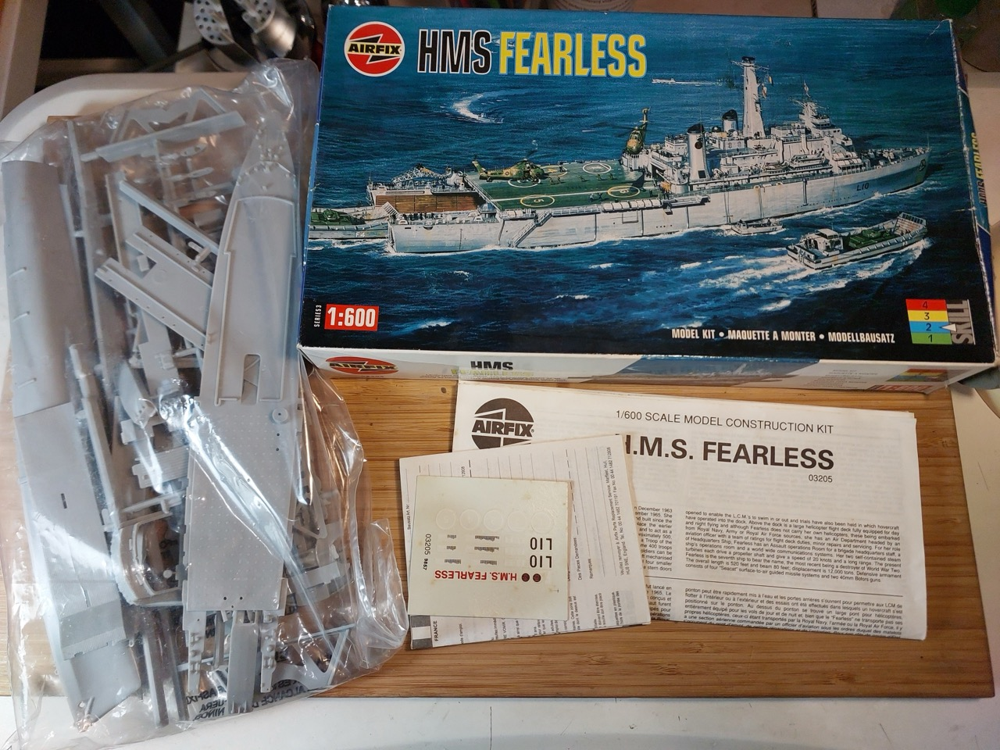

# #175 HMS Fearless

Building the vintage classic HMS Fearless from Airfix in 1:600 scale.

## Notes

This is one of the few kits I remember building as a kid. IIRC, my Dad brought it home as a present after a work trip.
It got the stringy glue treatment, I don't think even painted. But many an hour was spent recreating beach landings over the living room carpet.

So this is very much a nostalgia build. I built it straight out of the box during a local 48 hour group build,
but put it on a seascape in the following weeks.

### The Kit

[HMS Fearless Airfix No. 03205 1:600](https://www.scalemates.com/kits/airfix-03205-hms-fearless--182494)
is the 1994 boxing of the 1968 tool.

### Paint Scheme

| Feature                | Color                | Recommended | Paint Used    |
|------------------------|----------------------|-------------|---------------|
| hull, superstructure   | Light Aircraft Grey  | Humbrol 64  | H61           |
| funnel tops, waterline | Matt Black           | Humbrol 33  | H12           |
| flight deck, deck      | Dull Green           | Humbrol 117 | H320          |
| anchors                | Bronze               | Humbrol 55  | H61           |
| propellers             | Bronze               | Humbrol 55  | 70.999        |
| life rafts             | Matt White           | Humbrol 34  | 70.951        |
| hull below waterline   | Dark Red             | Humbrol 73  | H17           |
|                        |                      |             |               |

Helicopters

| Feature                | Color                | Recommended | Paint Used    |
|------------------------|----------------------|-------------|---------------|
| camo                   | Medium Green         | Humbrol 30  | H309          |
| camo                   | Light Brown          | Humbrol 26  | H81           |
| props                  |                      |             | H65           |
| windows                |                      |             | 70.989        |

### Build Log

I chose the Fearless as my subject for our local 48 hour group build in July 2026.
Getting started...

### Ship Build Complete

This is where I go to at the end of our 48 hour group build:
basic out of the box build, no weathering or extra details.

### Seascape - Base

I used my standard technique for the sea base:

* cut & carved the base structure from high density foam
* created the basic surface texture with tissue paper and Mod Podge Gloss as a glue
* built up successive layers of airbrushed Vallejo Model colour (various shades of grey, blues, sea greens) over layers of Mod Podge Gloss.

### Seascape - Waves and Weathering

After adding the ship to the base:

* waves and foam built up with:
    * cotton wool applied with Mod Podge Gloss
    * Deluxe Scenic Snowflakes applied with Mod Podge Gloss
* oil paint weathering of the ship itself

Oops, I spot some decals that need some more aggressive attention with Mr Mark Softer.
Overall the decals were surprisingly good given how old my boxing was.
They were quite yellowed and I didn't expect them to work as well as they did (or at all).

### Final Gallery

### Case TBD

Next up...making a case. I'll design a case for open/closed display, and cut it from MDF on the laser cutters at our library.

Inner base dimensions: 298mm x 100mm

## Credits and References

* [this project on scalemates](https://www.scalemates.com/profiles/mate.php?id=74137&p=projects&project=140049)
* HMS Fearless Airfix No. 03205 1:600
    * [on scalemates](https://www.scalemates.com/kits/airfix-03205-hms-fearless--182494)
    * [instructions](./assets/03205-instructions.pdf)
    * Purchased from Hobby Bounties for SG$48.00 (Jun-2022)

### Research References

* <https://en.wikipedia.org/wiki/HMS_Fearless_(L10)>

#### Fearless To The Fleet (1978)

YouTube by DAVID BOBER (ROYAL NAVY FILMS)

### Build References

#### Fearless

YouTube by RF590KG84

