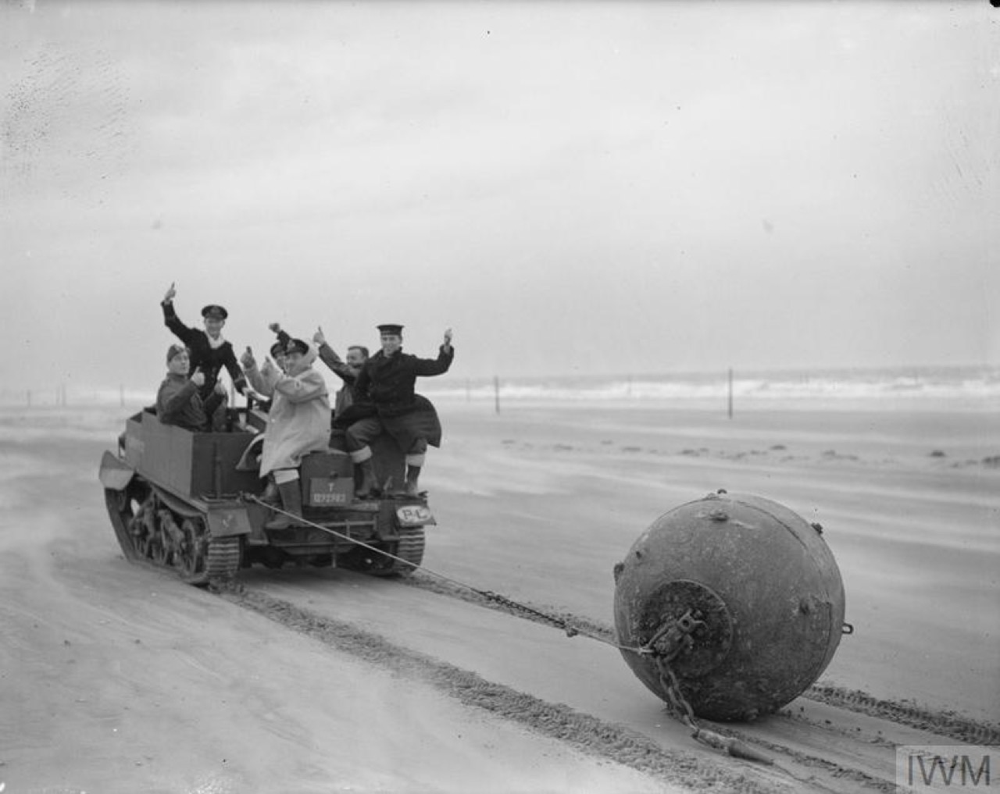
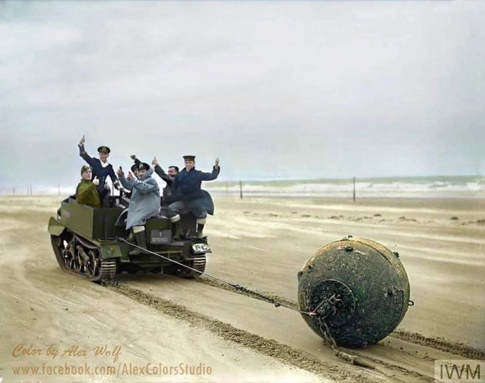
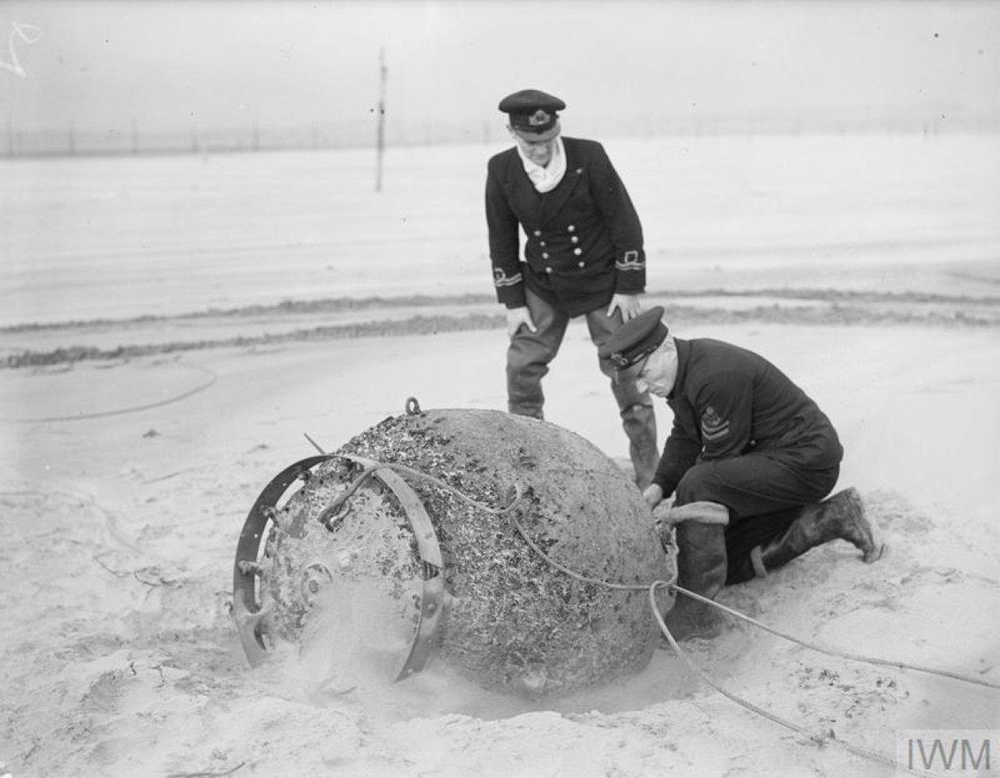
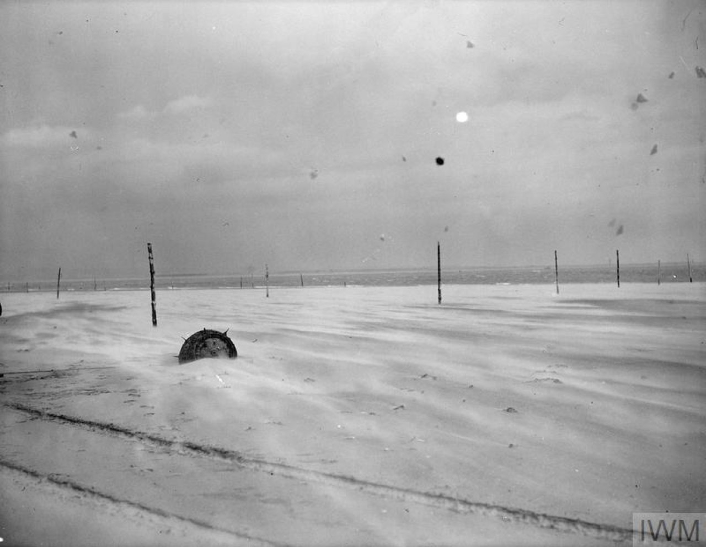
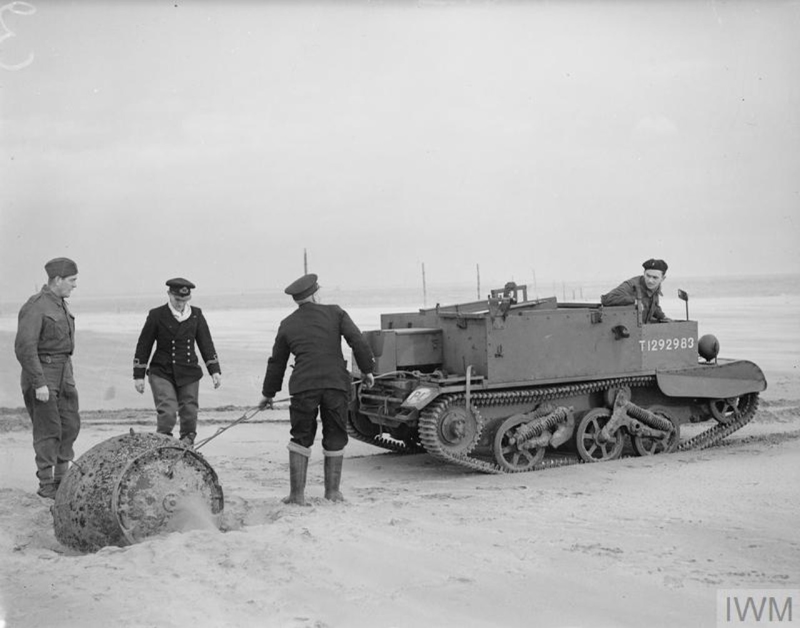
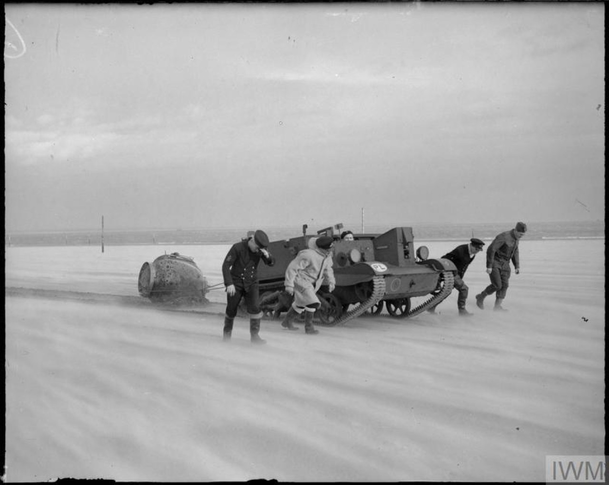
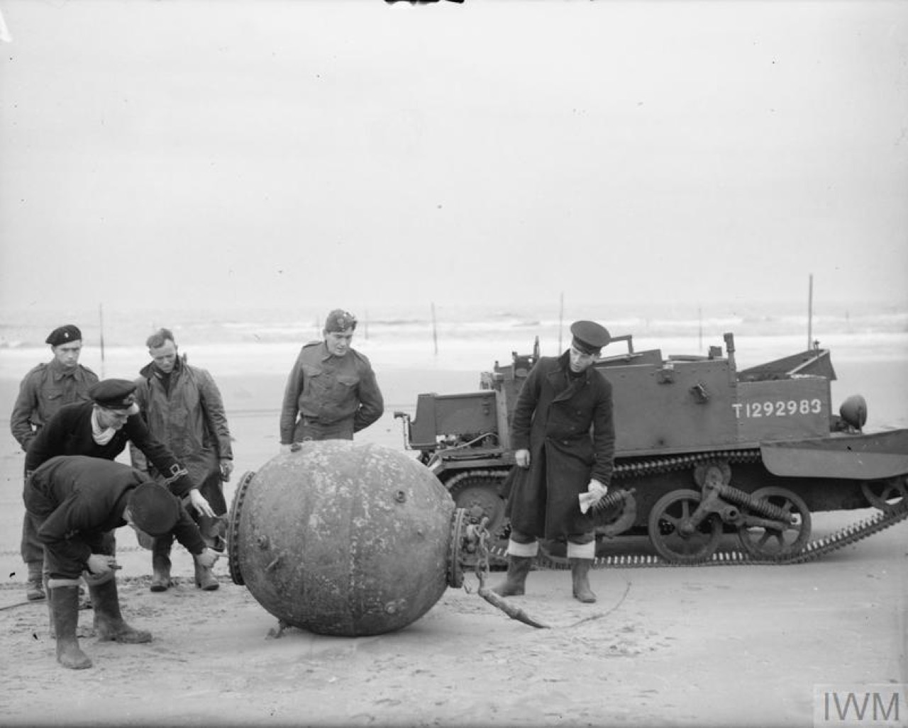

# #130 Naval Mine Removal

Members of the Mine Recovery and Disposal Squad towing away a naval mine from the beach at Tayport with the aid of a Bren gun carrier being operated by troops of the 1st Polish Corps. Features the Airfix Bren Gun Carrier and figures from Germania Figuren.

## Notes

First employed in North Africa in 1942, the 6-pounder anti-tank gun was able to destroy all German tanks then in service. lt was usually towed by a Universal or 'Bren' Carrier.

### Research and References

#### THE NAVAL MINE RECOVERY AND DISPOSAL SQUADS IN SCOTLAND, 1939-1945

Members of the Mine Recovery and Disposal Squad towing away a naval mine from the beach at Tayport with the aid of a Bren gun carrier being operated by troops of the [1st Polish Corps](https://en.wikipedia.org/wiki/1st_Polish_Corps_(Polish_Armed_Forces_in_the_West)), 25 November 1941.

### The Kit

The Bren Gun Carrier is from the Airfix Vintage Classics kit
[Bren Gun Carrier & 6pdr Anti-Tank Gun No. A01309V 1:76](https://www.scalemates.com/kits/airfix-a01309v-bren-gun-carrier-and-6pdr-anti-tank-gun--1141402)

Airfix says:

> If you're after something unique yet full of history then the anti-tank gun is the perfect choice! Now available in 1:76 scale and containing 45 pieces, this kit is a great collectable for both young and long-time model makers. In addition to the tank gun itself, this kit includes four crew figures. Mould Tools made in 1964, pack illustration by G.Schule, 1966.

#### Paint Scheme

| Feature                       | Color                | Recommended | Paint Used |
|-------------------------------|----------------------|-------------|------------|
| uniform                       | Dark Earth - Matt    | 29          | |
| fittings                      | Gunmetal - Metallic  | 53          | |
| faces                         | Flesh - Matt         | 61          | |
| steering wheel, boots, wheels | Black - Satin        | 85          | |
|                               | Olive Green - Matt   | 86          | |
| body                          | Khaki Drab           | 159         | H80 |

### Figures

I replaced the figures from the Airfix kit with a set from Germania Figuren:
[British homeguard in a Bren Carrier harbors sea mine Crew for Bren Carrier Germania Figuren No. GF72-WW2-251 1:72](https://www.scalemates.com/kits/germania-figuren-gf72-ww2-251-british-homeguard-in-a-bren-carrier-harbors-sea-mine-crew-bren-carrier--1525099)

### Build Log

Initial idea was to do a village parade..

.. until I discovered the naval mine recovery references. Planning the layout..

A scratch built mine. Hmm, this would be a great example for learning some 3D design..

Re-arranging the figures ..

Making some barbed wire for the beach..

Putting it all together..

## Credits and References

* [this project on scalemates](https://www.scalemates.com/profiles/mate.php?id=74137&p=projects&project=167700)
* Bren Gun Carrier & 6pdr Anti-Tank Gun Vintage Classics Airfix No. A01309V 1:76
    * on [scalemates](https://www.scalemates.com/kits/airfix-a01309v-bren-gun-carrier-and-6pdr-anti-tank-gun--1141402)
    * on [uk.airfix.com](https://uk.airfix.com/products/bren-gun-carrier-6pdr-anti-tank-gun-a01309v)
* [Universal Carrier](https://en.wikipedia.org/wiki/Universal_Carrier)
* British homeguard in a Bren Carrier harbors sea mine Crew for Bren Carrier Germania Figuren No. GF72-WW2-251 1:72
    * on [scalemates](https://www.scalemates.com/kits/germania-figuren-gf72-ww2-251-british-homeguard-in-a-bren-carrier-harbors-sea-mine-crew-bren-carrier--1525099)
