# #147 Armored Trooper VOTOMS Scope Dog

Building the Armored Trooper VOTOMS Scope Dog in a diorama featuring Fyana (フィアナ) contemplating life, the universe, and everything.

## Notes

I'm not generally a science-fiction, gundam or mecha maker, but I am curious.

So when I saw [Robot Hobby Life 003](https://www.kadokawa.co.jp/product/322309000915/) in
[MARUZEN Marunouchi 丸善 丸の内本店](https://maps.app.goo.gl/RoNkZModKGAr6Cqf6), including an
[Armored Trooper Votoms Scope Dog](https://www.scalemates.com/kits/max-factory-rhl-003-armored-trooper-votoms-scope-dog--1557274)
kit, I didn't think twice. Hopefully an easy way in, with some guidance in the magazine!

[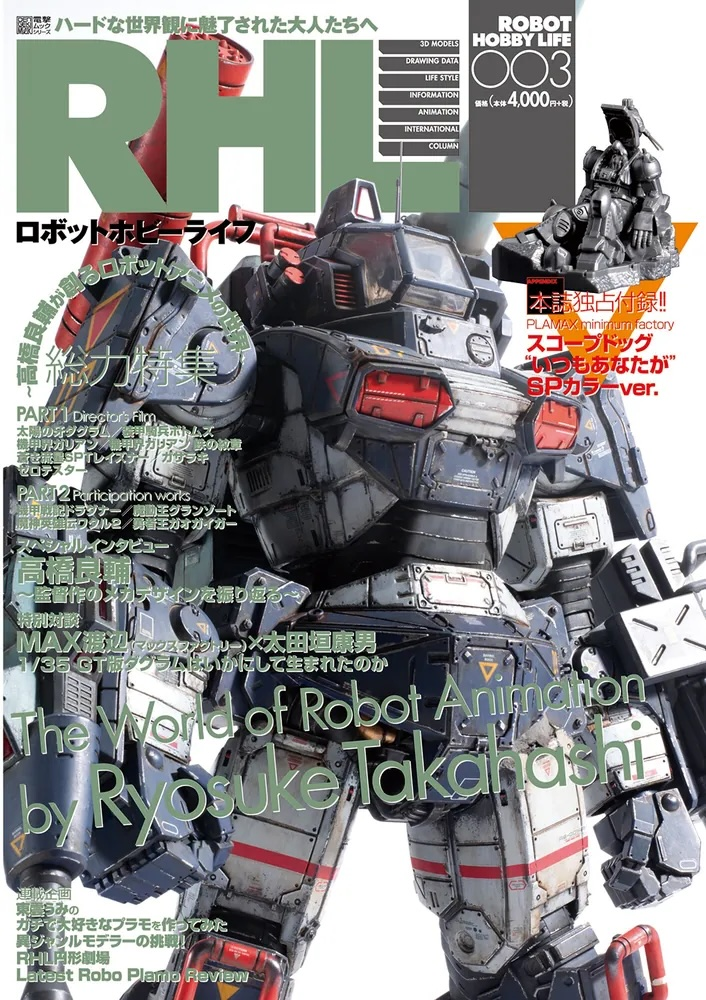](https://www.kadokawa.co.jp/product/322309000915/)

### Research and References

The scope dog is completely new to me, and I never saw the anime that it comes from, so this took me down a bit of a research rabbit hole. I've put some more video references at the end of this page.

Armored Trooper VOTOMS (装甲騎兵ボトムズ) is a Japanese military science fiction mecha anime series produced by Nippon Sunrise, created and directed by Ryosuke Takahashi and featuring mechanical designs by Kunio Okawara. Following directly in the footsteps of Takahashi's previous series, Fang of the Sun Dougram, VOTOMS continued the trend towards hard science in the mecha anime subgenre.

The character depicted in the kit is
[Fyana (フィアナ)](https://myanimelist.net/character/21821/Fyana). She piloted the [ATM-09-SA Scopedog II](https://www.mahq.net/atm-09-sa/).

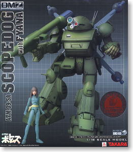

The kit seems to have Fyana wearing a cape. I don't know where that appears in the series, and this is the only visual reference I could find:

### The Kit

The
[kit](https://www.scalemates.com/kits/max-factory-rhl-003-armored-trooper-votoms-scope-dog--1557274)
is only a handful of pieces, so it goes together very quickly.

It's a pity that parts of the scope dog are molded into the base, which complicates the painting process a little.

A quick press-fit assembly (unpainted):

### Paint Scheme

The magazine includes some great examples in a range of schemes, and the kit does not dictate or even recommend any specific scheme.

I think I may keep a generally green scheme, but try to render in a more realistic style.

#### Scope Dog Painting

| Feature                        | Color                | Paint Used |
|--------------------------------|----------------------|------------|
| Primer                         | Black                | Black Surfacer 1000 |
| undercoat highlights           | Dark Seagrey         | H75        |
| undercoat highlights 2         | Copper               | H10        |
| undercoat highlights 3         | Silver               | H8         |
| main scheme                    | Metallic Green       | H89        |
| suit highlights 3              | Lime Green           | H50        |
| cockpit interior               | Steel                | H18        |
|                                |                      |            |
| face                           | Warm skin tone       | AMMO F-550 |
| hair                           | Burnt Umber          | 70.941     |
| cape                           | Medium Blue          | 70.963     |

### Build Log

Dark Seagrey undercoat over primer, with a preview of my basing concept.

Pre-shading in grey

Copper highlights

Metallic green base

Picking out selected panels in lime green

Fyana..

## Base

### Circuit Construction

A very simple variation of the classic CD4017 counter with a 555 astable clock source,
set to a frequency of around
[6.5Hz](https://visual555.tardate.com/?mode=astable&r1=2&r2=10&c=10).

Outputs connected to 0,2,4,5,8

Testing the circuit on a breadboard:

Transferred to protoboard:

### Parts

The main electronic components:

| Item | Description                                    |
|------|------------------------------------------------|
| U1   | 555 Timer                                      |
| U2   | CD4017 decade counter                          |
| C1   | 10µF electrolytic capacitor                    |
| R1   | 2kΩ                                            |
| R2   | 10kΩ                                           |
| LEDx | 10x mixed red/yellow 0805 LEDs                 |
| RLx  | 1x 0805 220Ω resistor per LED                  |
|      | lots of 0805 220Ω resistors - one for each LED |

### Base Construction

The basic wire frame sculpture

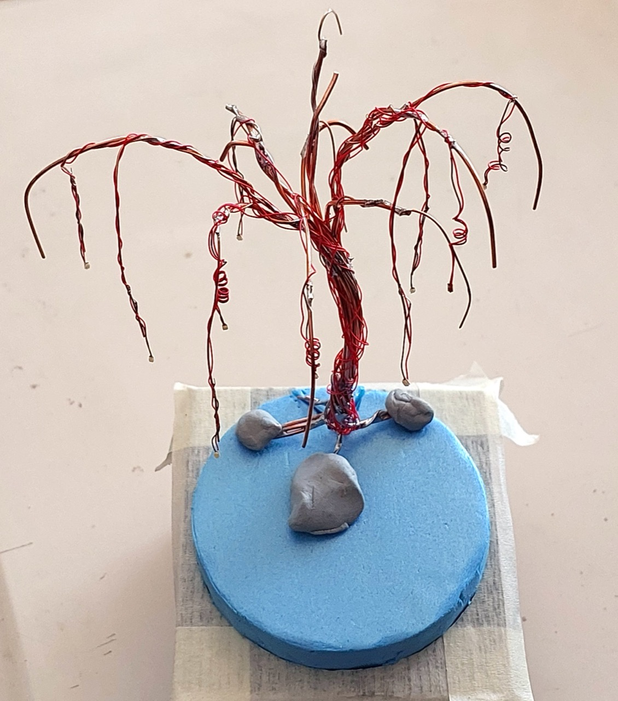

Bulking up the tree

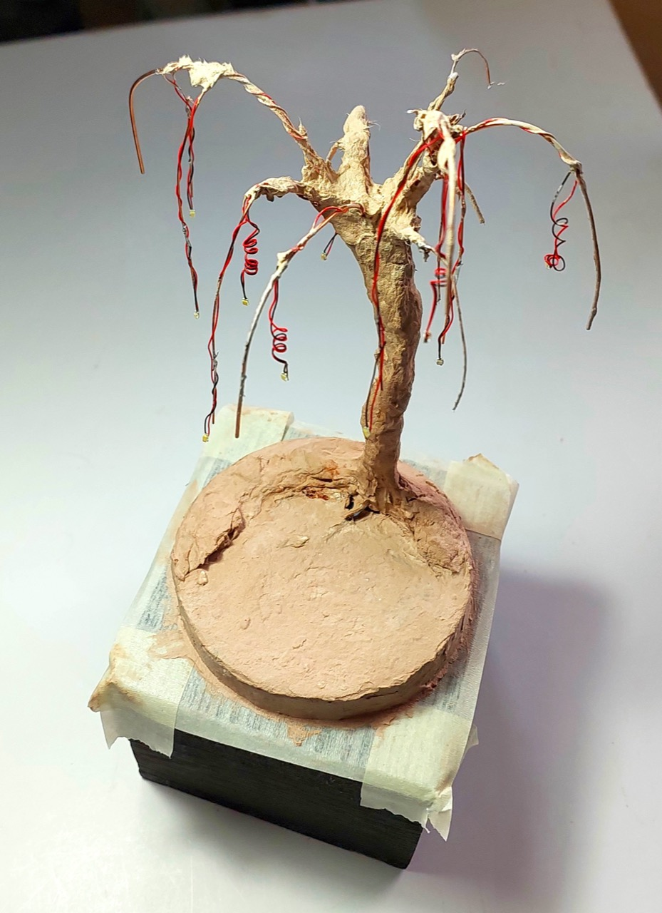

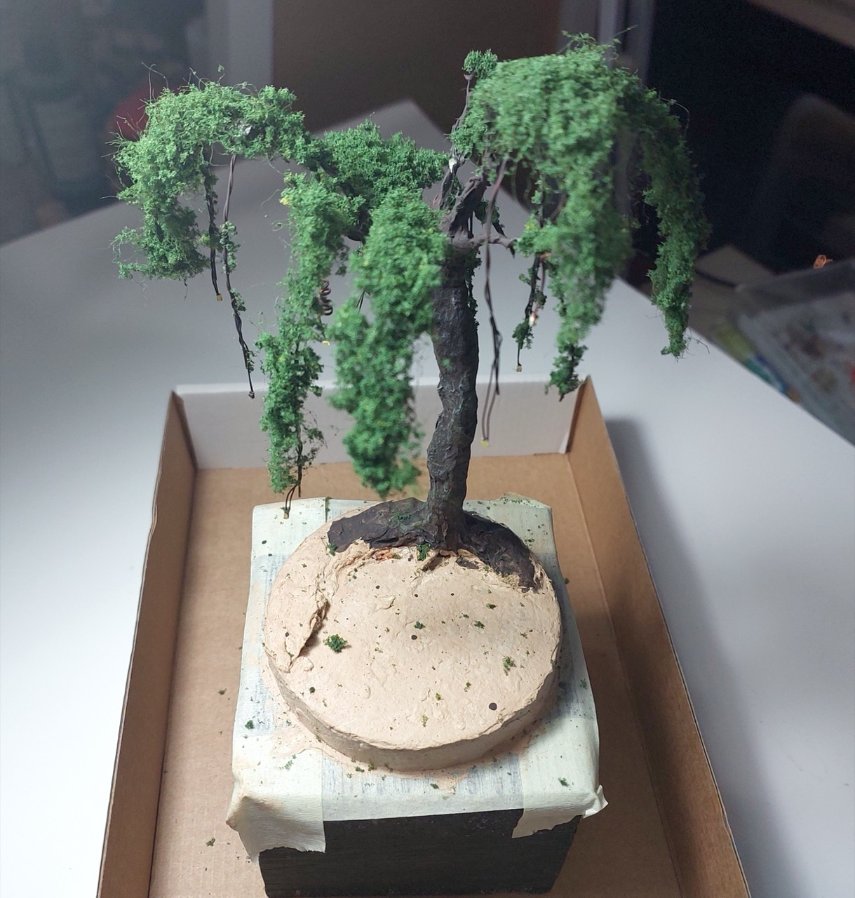

## Final Gallery

Fyana and Scope Dog contemplating life, the universe and everything

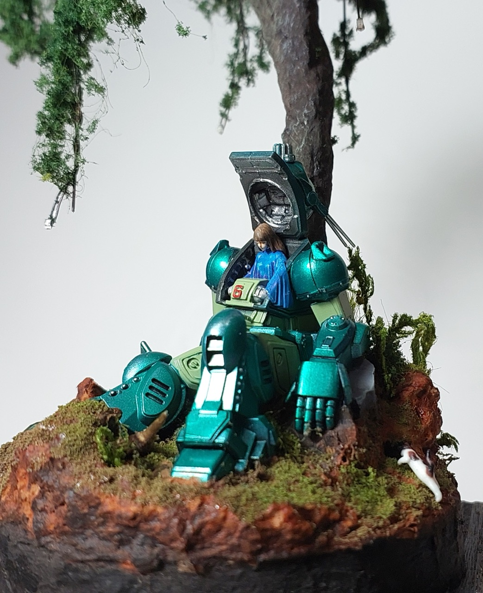

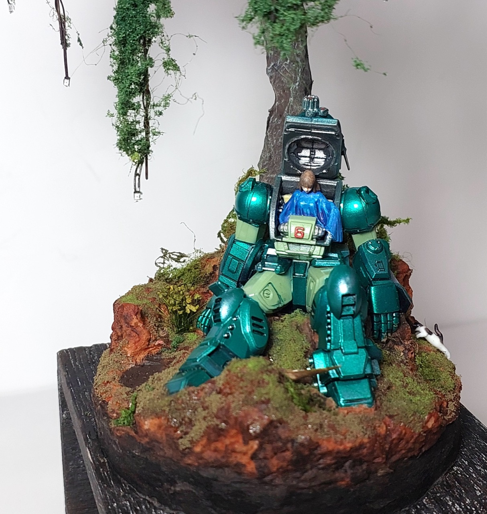

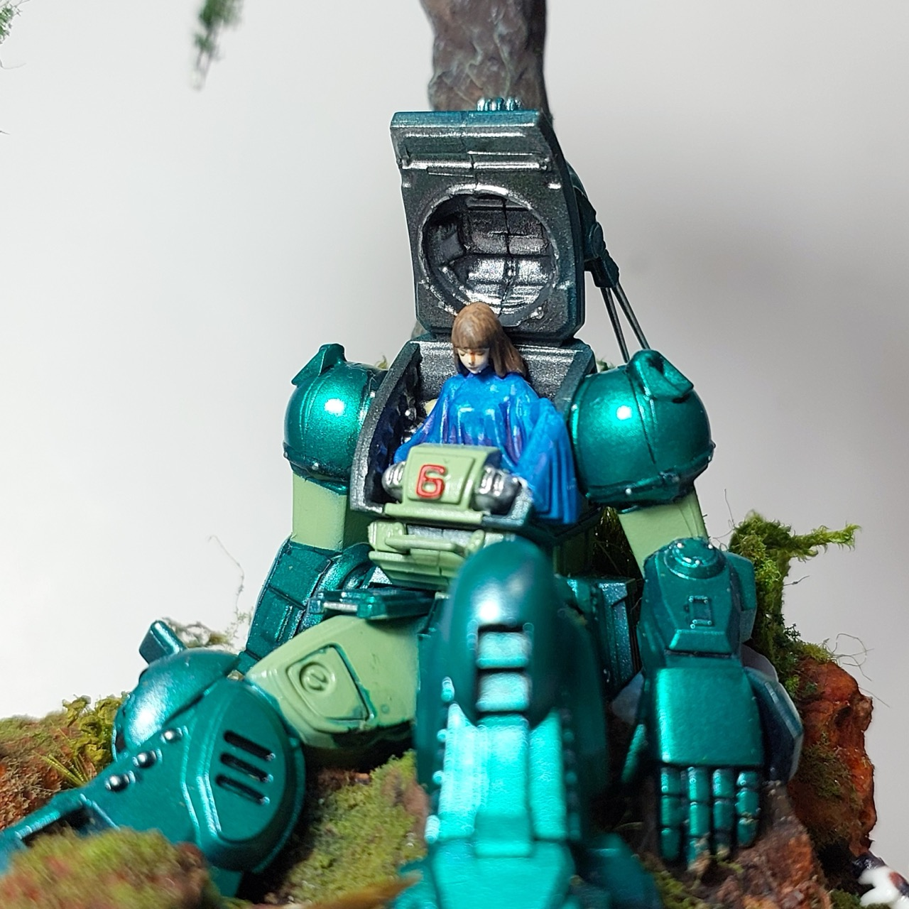

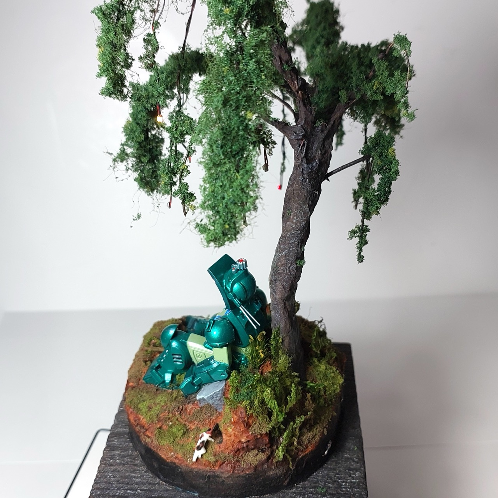

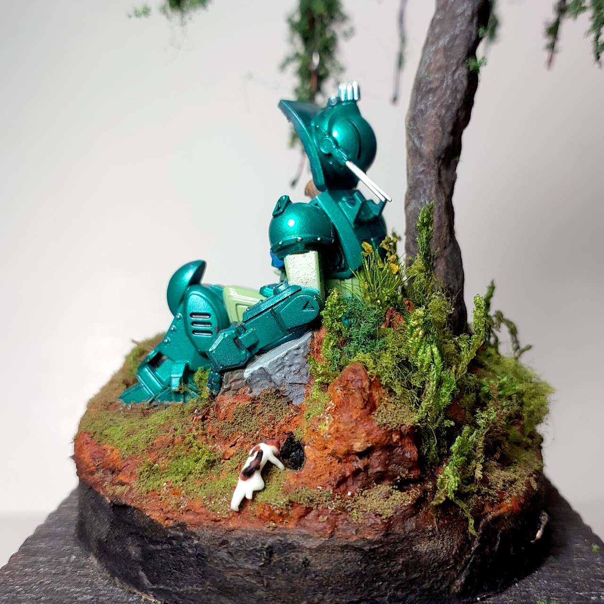

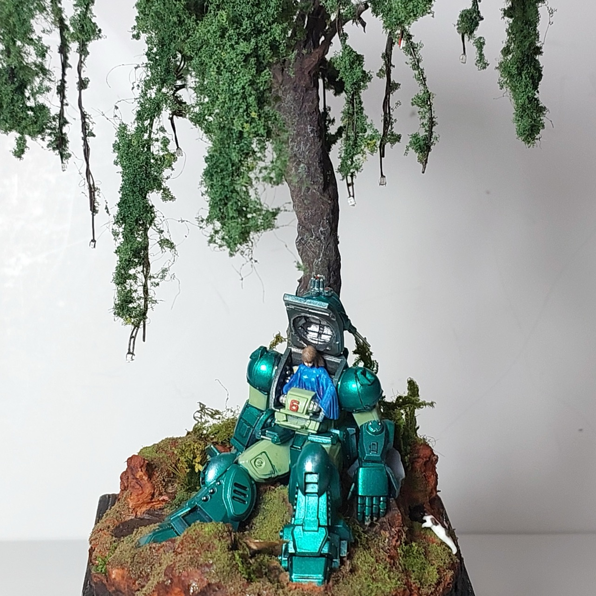

## Credits and References

* [this project on scalemates](https://www.scalemates.com/profiles/mate.php?id=74137&p=projects&project=211694)
* [Armored Trooper Votoms Scope Dog Robot Hobby Life 003 Special Appendix, Plamax minimum factory Max Factory No. RHL-003](https://www.scalemates.com/kits/max-factory-rhl-003-armored-trooper-votoms-scope-dog--1557274)
* About Armored Trooper Votoms
    * <https://en.wikipedia.org/wiki/Armored_Trooper_Votoms>
    * <https://votoms.fandom.com/wiki/VOTOMS_Wiki>
    * <https://www.mahq.net/votoms-tv/>
    * <https://timeldred.com/votomshub/>
    * <https://myanimelist.net/character/21821/Fyana>
    * <https://super-robot-wars-gu-universe.fandom.com/wiki/Fyana>
    * [Final episode - dailymotion](https://www.dailymotion.com/video/x2oylud)
* [LM555 Datasheet](https://www.futurlec.com/Linear/LM555CN.shtml)
* [CD4017 datasheet](https://www.futurlec.com/4000Series/CD4017.shtml)

## Video References

Absolute noobs like me need a little introduction to Armored Trooper VOTOMS!
I found the following very useful!

### 5 Mecha Anime Better Than Gundam by Pixxellie

### Armored Trooper VOTOMS | Retcon_404 (Anime Retrospective) by Retcon_404

