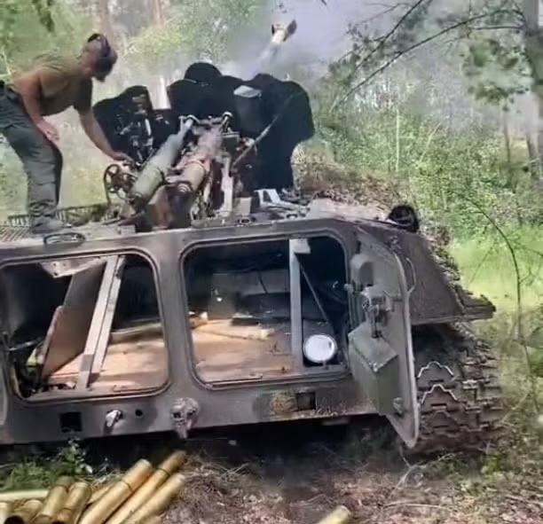
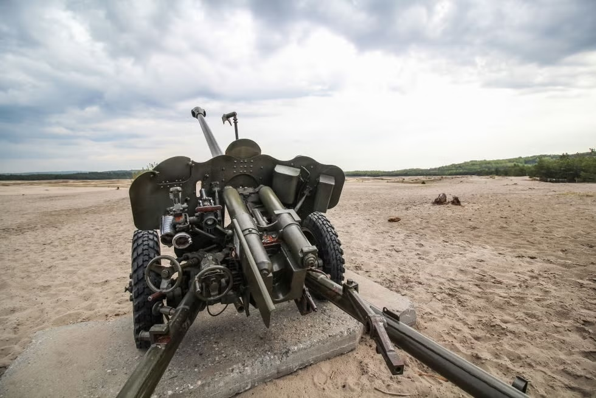

# #xxx Soviet 85mm D-44 Divisional Gun

The D-44 was introduced late in WWII and has been put into service by many countries in wars since then, up to and including both sides in the Russian invasion of Ukraine. This build is intended for a future diorama.

## Notes

The
[85 mm divisional gun D-44](https://en.wikipedia.org/wiki/85_mm_divisional_gun_D-44)
was a Soviet divisional 85-mm calibre field artillery gun used in the last action of World War II. It was designed as the replacement for the 76 mm divisional gun M1942 (ZiS-3). The gun was no longer in front-line service with the Russian Ground Forces, until being pressed back into service by both sides in the Russo-Ukrainian War in 2023. Wartime service included use by communist forces during the Vietnam War and by Arab forces during their conflicts with Israel.

Russia has deployed D-44s in Ukraine. With one being destroyed by a Ukrainian drone on 27 September 2023 according to footage posted online. Other footage has shown a D-44 mounted on a tractor as a tank destroyer used by Ukraine in fighting near Kreminna.

### The Kit

description

See [instructions](./assets/02339-instructions.pdf)

### Paint Scheme

| Feature               | Color                | Recommended | Paint Used |
|-----------------------|----------------------|-------------|------------|
| Tires                 | Tire Black           | H77/C137    |            |
| Body                  | Russian Green (2)    | C136        | H511       |
|                       |                      |             |            |

### Build Log

It's a bit of a fiddly build.
I never quite figured out how to get the elevation adjustment right.

## Final Gallery Pics

Just the gun build for now - I intend to use it in a diorama I am still planning.

## Credits and References

* [this project on scalemates](https://www.scalemates.com/profiles/mate.php?id=74137&p=projects&project=188429)
* Soviet 85mm D-44 Divisional Gun Trumpeter No. 02339 1:35
    * [on scalemates](https://www.scalemates.com/kits/trumpeter-02339-85mm-d-44-divisional-gun--158148)
    * [instructions](./assets/02339-instructions.pdf)

### Research References

* <https://en.wikipedia.org/wiki/85_mm_divisional_gun_D-44>
* [85 mm divisional gun D-44](https://en.wikipedia.org/wiki/85_mm_divisional_gun_D-44)
* Ammunition
    * <https://www.bulletpicker.com/projectile_-85mm-frag_-o-365k.html>
    * <https://www.bulletpicker.com/cartridge_-85mm-frag_-uo-365k.html>
    * <https://www.bulletpicker.com/cartridge_-85mm-he_-uo-365.html>
    * <https://www.bulletpicker.com/cartridge_-85mm-aphe-t_-ubr-32.html>

#### The 85-mm divisional gun D-44 was a Soviet divisional 85-mm calibre field artillery gun World War II - FootpassengerSDE

#### Hey, Ukraine: World War II Called. It Wants Its Guns Back

[Ukraine has bolted antique Soviet artillery onto APCs.](https://www.popularmechanics.com/military/weapons/a44723874/ukraine-antique-soviet-artillery-apcs/)

> A recent video posted by Ukraine’s military shows an MT-LB armored tractor of Ukraine’s 67th Mechanized Brigade with an old 85-millimeter D44 gun on top. Gunners hop up onto the vehicle’s roof to load and fire the World War II-era weapon. With each shot, a spent shell casing is ejected through the cut-out roof of the MT-LB and rolls back out its open rear access hatch.

#### Lucze, Poland in May 2020

> An 85-millimeter D-44 divisional gun on display in Lucze, Poland in May 2020. Note the split-rail carriage, wavy-style gun shield and OP-2-7 5.5x magnification gun sight on left side

### Build References

#### Soviet 85mm D-44 Divisional Gun Final - Jan Haayer

#### Trumpeter 1/35 Soviet 85mm D-44 Divisional # 02339 - emodelsuk

