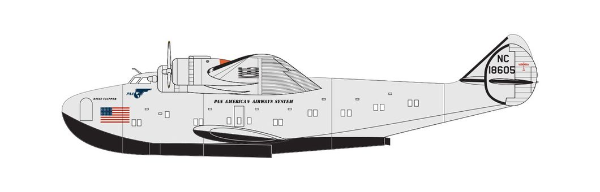
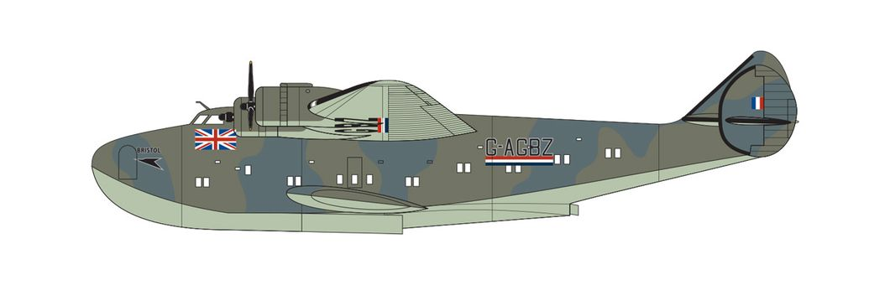

# #xxx BOAC Boeing 314A Clipper

Building the Airfix 1:144 Vintage Classic kit of the Boeing 314 Clipper, in the livery of BOAC 1941.

## Notes

The [Boeing 314 Clipper](https://en.wikipedia.org/wiki/Boeing_314_Clipper) was an American long-range flying boat produced by Boeing from 1938 to 1941. One of the largest aircraft of its time, it had the range to cross the Atlantic and Pacific oceans. For its wing, Boeing re-used the design from the earlier XB-15 bomber prototype. Twelve Clippers were built, nine of which served with Pan Am. It was the first aircraft to carry a sitting American president, when in 1943 Franklin D. Roosevelt flew from Miami to the Casablanca Conference in Morocco, via Trinidad, Brazil, and The Gambia.

Pan American had an option to purchase further 314s. Confident that the problems that had occurred with the first order had been resolved, and having found the 314 to be more reliable in service than the Martin M-130, they exercised this option, ordering six. The order was placed two days before its expiry date of 1 October 1939. Planned delivery was in 1941, with the goal of doubling the service on both Atlantic and Pacific routes by retiring its remaining two Martin 130s, and allocating six of the 314s to the Pacific and the other six to the Atlantic.

However, the fall of France in 1940 caused some doubt about whether the Atlantic service could continue; passenger numbers were already reduced by the war, and if Spain or Portugal were to join the Axis, then the flights to Lisbon would be forced to stop. Pan American began to consider reducing its order and, in August 1940, reached an agreement to sell two of the six under construction to the United Kingdom for $1,035,400 each with an option to purchase a third if Pan American stopped its Lisbon service. This option for a third aircraft was soon exercised. The purchase of the three aircraft included 12 spare GR2600A2A engines at a cost of $16,753 each and $21,750 for 19 Hamilton propellers. The aircraft were to be operated by the British Overseas Airways Corporation (BOAC) and were primarily intended for the UK–West Africa route, as existing flying boats could not travel this route without stopping in Lisbon. The sale made a small net profit for Pan American – priced at cost plus 5% – and provided a vital communications link for Britain, but was politically controversial. In order to arrange the sale, the junior minister Harold Balfour had to agree to the contract with no government approval, leading to stern disapproval from Winston Churchill and lengthy debate by the Cabinet over the propriety of the purchase.

Pan American provided training for BOAC staff and delivered the aircraft to La Guardia in New York, where 33 days were spent changing their registration and painting them in a new color scheme.

Churchill later flew on the Bristol and Berwick in January 1942 from Washington, D.C. to England, and he praised the plane intensely, adding to the Clippers' fame during the war.

### The Kit

The Boeing 314 Clipper [Airfix kit No. A04172V 1:144](https://www.scalemates.com/kits/airfix-a04172v-boeing-314-clipper--1594506)
was released in 2025 as part of the Vintage Classics line.
It is based on the 1967 tooling .. as old as me!

See [instructions](./assets/A04172V-instructions.pdf).

There are two schemes in this release:

#### Scheme A: Boeing 314 Clipper, "Dixie Clipper", Pan American World Airways, 1943

Aircraft used by President Franklin D. Roosevelt, Casablanca Conference, 14-24 January 1943

#### Scheme B: Boeing 314 Clipper, "Bristol", British Overseas Airways Corporation, 1941

### Paint Scheme

I'll be depicting scheme B in this build.

| Feature               | Color                     | Recommended | Paint Used |
|-----------------------|---------------------------|-------------|------------|
| prop tips             | Matt Yellow               | 24          | H4         |
| prop                  | Matt Black                | 33          | H95        |
| leading edges         | Matt Black                | 33          | H12        |
|                       | Matt Varnish              | 49          |            |
| engine                | Metallic Gun Metal        | 53          | H18        |
| lower camo            | Matt Beige Green          | 90          | H74        |
|                       | Satin Extra Dark Sea Grey | 123         |            |
| upper camo 1          | Matt Extra Dark Sea Grey  | 123 + 49    | H333       |
| upper camo 2          | Matt Dark Slate Grey      | 224         | H62        |
| interior              |                           |             | H73        |

### Build Log

It didn't take long for me to realise that this build was going to be a challenge.
The mould tolerances are a country mile!

I son gave up any pretence of trying to deal with my seam-lines and allowed my to build this "old school"..

Probably the main thing to recommend the Vintage Classic range is the decals.
Newly minted and printed by [Cartograf](https://www.cartograf.com/en/decals-en/) - no issues at all!

The main experiment with this build was to use plastic disks to simulate props-in-motion. Let's see how this pans out..

### Final Gallery

## Credits and References

* [this project on scalemates](https://www.scalemates.com/profiles/mate.php?id=74137&p=projects&project=219421)
* Boeing 314 Clipper Airfix No. A04172V 1:144
    * [on scalemates](https://www.scalemates.com/kits/airfix-a04172v-boeing-314-clipper--1594506)
    * [on Airfix site](https://uk.airfix.com/products/boeing-314-clipper-a04172v)
    * [instructions](./assets/A04172V-instructions.pdf)

### Research References

* <https://en.wikipedia.org/wiki/Boeing_314_Clipper>

#### Boeing 314 Clipper - Warbird Wednesday Episode #191

YouTube by Palm Springs Air Museum

#### The Boeing 314: Pan Am's Greatest Flying Boat (2016)

YouTube by Pan Am Museum Foundation

### Build References

#### AIRFIX 1/144 Boeing 314 Clipper | Unboxing & Review

YouTube by Hearns Hobbies

