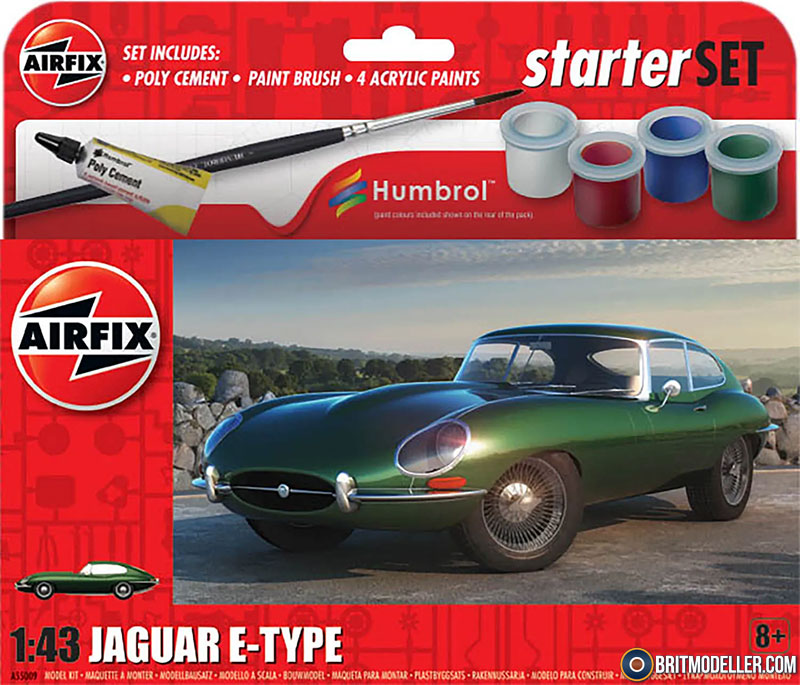

# #143 1967 Jaguar E-Type

Building the Airfix 1:43 kit of the Jaguar E-Type

## Notes

### The Kit

Starter Set Jaguar E-Type

A 1960’s icon, the outstanding Jaguar E-Type is the perfect combination of a powerful sports car and a competitively priced luxury vehicle. This Starter Set portrays the series one model produced between 1961 and 1967. The striking model claims a top speed of 150MPH thanks to taking its racing DNA from the Le Mans winning Jaguar D-type.

Product Info

Once described by Enzo Ferrari as the most beautiful car ever made, the E-Type is as breath-taking now as it was when first released in 1961. Based on Jaguar's Le Mans winning D-Type, the E-Type had racing DNA combined with extremely competitive pricing and a claimed 150mph top speed, this led to it quickly becoming a 1960's icon. The earliest cars or series one as they have become known, portrayed by this kit, were produced between 1961 and 1967 with two different engines, a 3.8L and 4.2L. Over 22,000 E-Types were sold. Jaguar produced the E-type in various guises including a 2+2 coupe, the limited edition 'Lightweight E-Type' and the low drag coupe along with many other variants.

### Paint Scheme

| Feature               | Color                | Recommended | Paint Used  |
|-----------------------|----------------------|-------------|-------------|
| body                  |                      | 239         | H60 over H6  |
| interior              |                      | 118         |              |
| exhaust               |                      | 11          | MC211        |
| trim                  |                      | 11          | SM206, MC211 |

### Build Log

It's a nice and simply kit - can be a very quick build.
Primary disappointment is that there is no wing or rear view mirror included in the kit

The kit is a left-hand drive version for some reason.
Converting back to right-hand drive would not be such a big job if this is important

### Project Box

I used [MakerCase](https://en.makercase.com/) to generate a simple parametric design:

* material thickness: 3mm
* inside dimensions:
    * width: 110mm
    * height: 50mm
    * depth:  202mm
* open box
* edge joints: finger, 24.39
* panel layout: separate
* panel labels: disabled
* kerf: 0.2mm

Finalising the box design:

* exported from MakerCase as [etype-box-template.svg](./assets/etype-box-template.svg)
* imported and refined with Affinity Designer as [etype-box.afdesign](./assets/etype-box.afdesign)
* exported from Affinity Designer as [etype-box.svg](./assets/etype-box.svg)
* import to Inkscape for cutting layout and g-code generation as [etype-box-inkscape.svg](./assets/etype-box-inkscape.svg)

### Building the Display Base

The assembled display case:

Building up the underlying groundwork:

## Final Gallery

## Credits and References

* [this project on scalemates](https://www.scalemates.com/profiles/mate.php?id=74137&p=projects&project=206120)
* Jaguar E-Type Airfix No. A55009 1:43
    * [scalemates](https://www.scalemates.com/kits/airfix-a55009-jaguar-e-type--1439995)
    * [airfix](https://uk.airfix.com/products/small-starter-set-jaguar-e-type-a55009)
