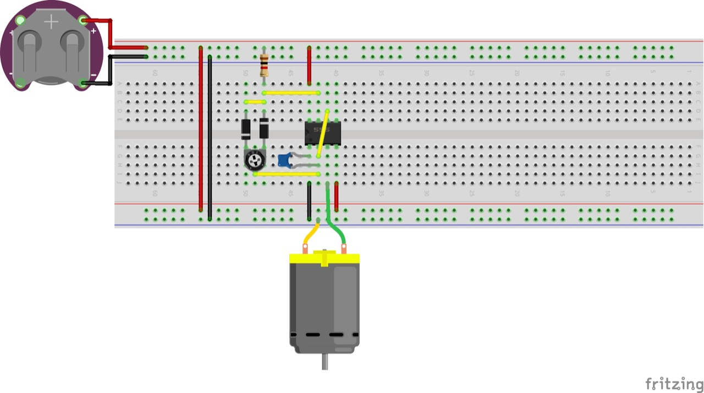

# #xxx FM-2 Wildcat

Building the FM-2 Wildcat from Sweet in 1:144, converted for in-flight with motorized propeller.

Here's a quick demo..

## Notes

Late in the war, the F4F Wildcat was obsolete as a front line fighter compared to the faster F6F Hellcat and F4U Corsair,
however they were adequate for small escort carriers against submarine and shore threats.

At first, GM produced the FM-1, identical to the F4F-4, but reduced the number of guns to four, and added wing racks for two 250 lb (110 kg) bombs or six rockets. Production later switched to the improved FM-2 optimized for small-carrier operations, with a more powerful engine (the 1,350 hp (1,010 kW) Wright R-1820-56), and a taller tail to cope with the torque.

### The Kit

Sweet kit No. 14103 includes two 1:144 U.S. Navy Fighter GM FM-2 Wildcats.
The sprues even include the little cat mascot.

See [instructions](./assets/14103-instructions.pdf)

### Paint Scheme

I've chosen to depict scheme A/C#2 VC-80, CVE-61, USS Manila Bay.
It has tail code 11 under an inverted V.

USS Manila Bay (CVE-61) was a Casablanca-class escort carrier of the United States Navy.
Operations: Gilbert and Marshall Islands campaign, Western New Guinea campaign, Battle off Samar, Battle of Mindoro, Invasion of Lingayen Gulf, Operation Magic Carpet

| Feature               | Color                      | Recommended | Paint Used |
|-----------------------|----------------------------|-------------|------------|
| camo 1                | FS 15042 Gloss Sea Blue    | H54         | AK11864    |
| camo 2                | FS 35164 Intermediate Blue | H56         | AK11865    |
| lower fuselage        | FS 37925 White             | H316        | AK11868    |
| n/a                   | FS 36231 Dk Gull Gray      |             |            |
| prop hub              | Silver                     |             | SM204 Super Stainless 2 |
| prop tips             | Orange Yellow              |             | RCM004     |
| prop and tires        | Black                      |             | H12        |
|                       |                            |             |            |

### Build Log

A fantastic little molding of the wildcat by Sweet..

### Inflight Conversion with Motor

Adapting the airframe for inflight with a motor..

### Motor Control

I'm using a simple variable PWM motor controller based on a 555 timer.
It works fine with a 3V coin cell to drive the particular motor I am using.

PWM gives a much more realistic, slower speed drive than just direct drive from a coin cell.

Circuit designed with Fritzing, see [FM2.fzz](./FM2.fzz).

Testing with an adjustable PWM motor driver based on the 555 timer.

Using mainly SMD components to mount the circuit on a small SO-16 DIP adapter:

### Completing Assembly

### Mounting the Plane on a Frame

Mounted (but without the battery inserted)

### Inflight Gallery

Checkout a quick demo..

## Credits and References

* [this project on scalemates](https://www.scalemates.com/profiles/mate.php?id=74137&p=projects&project=191835)
* U.S. Navy Fighter GM FM-2 Wildcat Sweet No. 14103 1:144
    * [on scalemates](https://www.scalemates.com/kits/sweet-14103-gm-fm-2-wildcat--161462)
    * [instructions](./assets/14103-instructions.pdf)

### Research References

* <https://en.wikipedia.org/wiki/USS_Manila_Bay>
* <https://asisbiz.com/il2/Wildcat/VC80.html>
* <https://en.wikipedia.org/wiki/Grumman_F4F_Wildcat>
