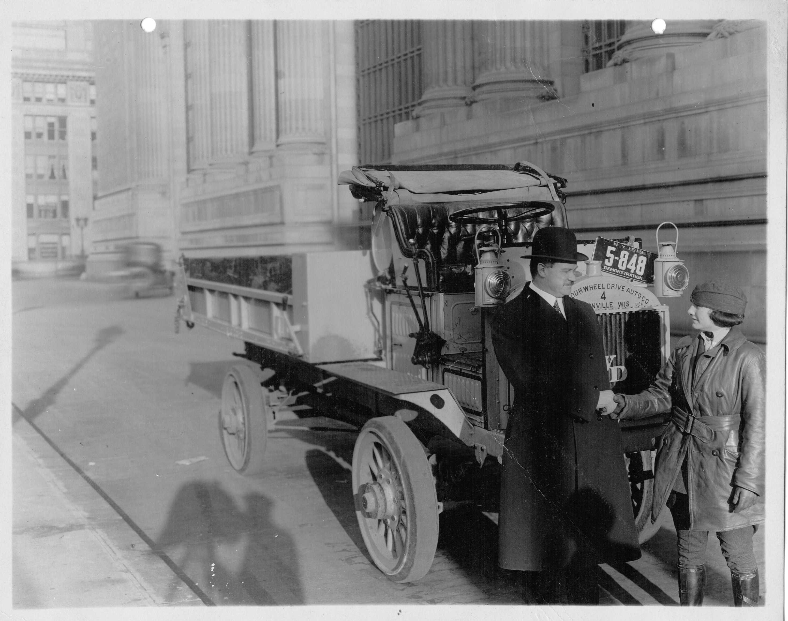
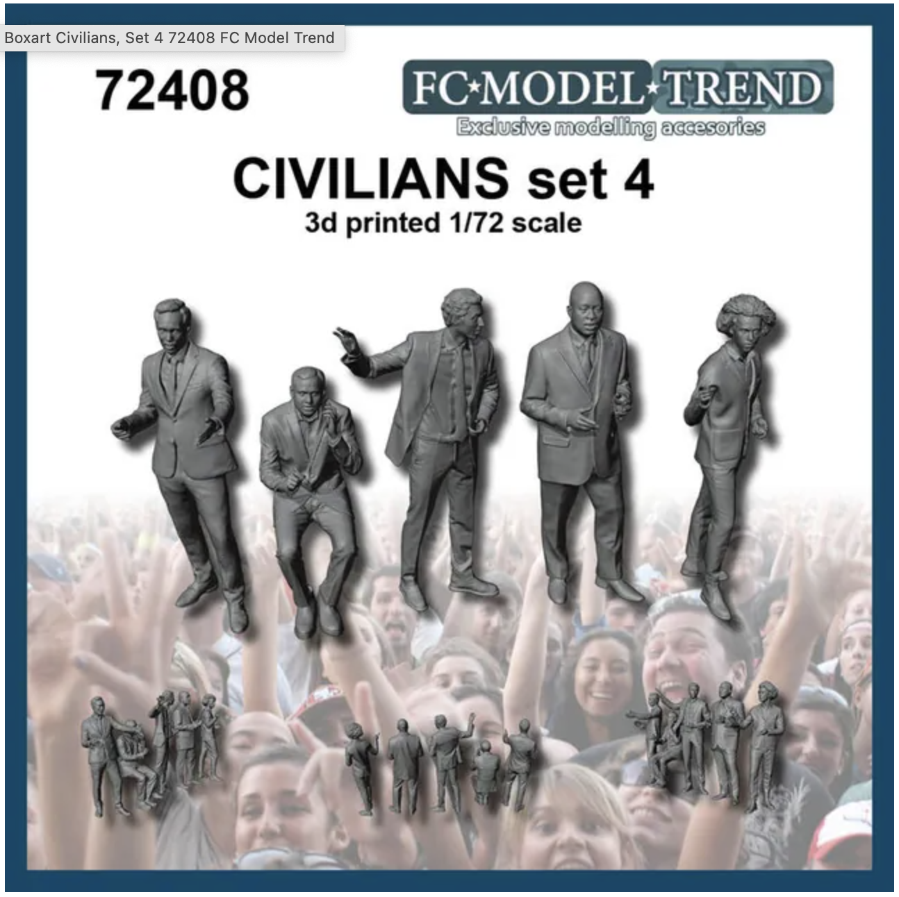
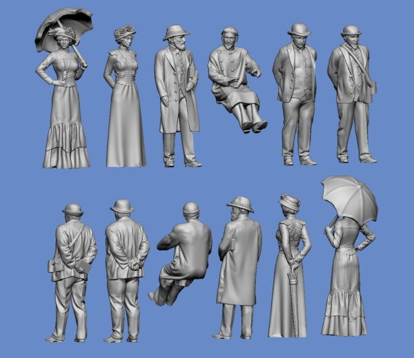
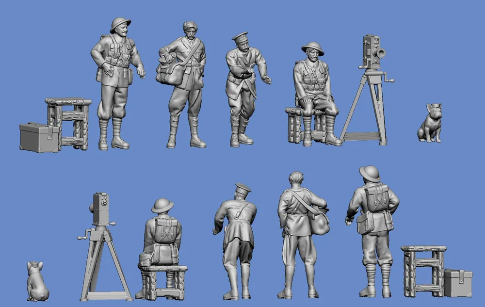

# #140 Luella Bates and the FWD Model B

Celebrating the life of Luella Bates, one of the first women to professionally drive and test heavy-duty trucks, paving the way for future generations in transportation and heavy industry. Features the Roden FWD Model B in 1:72.

## Notes

The FWD Model B was an American built four-wheel drive truck produced by the Four Wheel Drive Auto Company that saw widespread service with American and British forces during the First World War.

After the war the US government sold or distributed the majority of their Model Bs to local governments and municipalities.
British machines were returned to the UK from where some were shipped throughout British Empire.

Surplus Model Bs proved popular in the postwar Good Roads Movement as their all wheel drive made them ideal municipal and civilian construction vehicles, and FWD survived the postwar recession on the strength of Model B sales and parts.

### Luella Bates: A Trailblazing Female Truck Driver

* Born: October 17, 1897
* Died: November 25, 1985
* Occupation: Truck driver, test driver, demonstrator
* Notable for: First known female truck driver in the U.S.

[Luella Bates](https://en.wikipedia.org/wiki/Luella_Bates) was a pioneering female truck driver in the early 20th century, known for her work as a test driver for the Four Wheel Drive Auto Company (FWD). She made history as one of the first women to drive and test heavy-duty trucks professionally.

In 1922, Luella left the FWD Auto Company and moved to Milwaukee. She later married Howard Coates and had two sons. She died in 1985 at the age of 88.

While details about her later life remain scarce, Bates' legacy as a trailblazer in trucking and women's labor history remains significant. She is recognized today as an early example of women breaking into male-dominated fields, paving the way for future generations in transportation and heavy industry.

#### Her Role at FWD

* World War I Contribution (1918–1919):
    * During World War I, FWD, a company based in Clintonville, Wisconsin, manufactured military trucks for the war effort.
    * She became one of approximately 150 women hired  to fill jobs that had been left vacant by male employees reporting for military duty.
    * She was the first of six female employees of the Four Wheel Drive Auto Co. chosen as test and demonstration drivers and worked as an FWD truck driver from 1918 to 1922.
* Post-War Test Driving:
    * After the war, most women left their wartime jobs, but Bates continued working for FWD as a demonstrator and test driver.
    * “I like the business and expect to stay in it,” she said.
    * She traveled across the country showcasing FWD trucks' durability and handling, even in harsh conditions.
* Publicity and Advocacy:
    * Bates’ role wasn’t just technical; she became a public figure, proving that women could handle heavy machinery.
    * She participated in promotional tours, demonstrating FWD vehicles to potential buyers and appearing in media stories that challenged gender norms in the trucking industry.

[HERstory: Luella Bates and Lillian Drennan](https://www.realwomenintrucking.org/post/herstory-luella-bates-and-lillian-drennan)

#### Luella Bates at the New York Auto Show

In January 1920, Bates drove a Model B to New York City, where she attended the New York Auto Show. During her stay, she met with Secretary of State of New York Francis Hugo and became the first woman truck driver to receive a driver's license in New York.

### Model References

Roden, FWD 3Ton Lorry, 1:72 - Stop-motion Experiment

Roden 1:72 FWD 3 Ton Truck Finished

Roden 1:72 WW1 FWD Truck Diorama Completed

### Paint Scheme

| Feature               | Color                | Recommended | Paint Used |
|-----------------------|----------------------|-------------|------------|
| tray                  | Lime Green           |             | H50        |
| body                  | Gloss Green          |             | H6         |
| lights and horn       | Gold                 |             | H9         |
| wheels                | Rubber Black         |             | RCM001     |
|                       |                      |             |            |

### Figure Options

I've taken and modified some figures for the diorama from a few sets:

[Civilians, Set 4 FC Model Trend No. 72408 1:72](https://www.scalemates.com/kits/fc-model-trend-72408-civilians-set-4--1340588)

[Drivers And Dignitaries Around The Kaiserwagen II Germania Figuren No. GF72-GER-004 1:72](https://www.scalemates.com/kits/germania-figuren-gf72-ger-004-drivers-and-dignitaries-around-kaiserwagen-ii--1537684)

[British Infantry 1914/18 souvenir photo Germania Figuren No. GF72-WW1-312 1:72](https://www.scalemates.com/kits/germania-figuren-gf72-ww1-312-british-infantry-1914-18-souvenir-photo--1524973)

### Base Components

I've used some 3D (PLA) printed parts in the base

* columns:
    * [Luella-column-2.stl](./assets/Luella-column-2.stl)
    * Source: <https://www.thingiverse.com/thing:980444>
* window frames:
    * [Luella-wall-frame.stl](./assets/Luella-wall-frame.stl)

Front signage:

* [signs.afdesign](./assets/signs.afdesign)
* exported as: [luella-bates-goes-to-new-york.pdf](./assets/luella-bates-goes-to-new-york.pdf)

### Build Log

Checking the diorama layout before finalising..

### Final Gallery

"Luella Bates goes to New York" - pioneering heavy truck test driver from 1918, paved the way for women in transportation. Features the FWD Model B in 1:72 from Ukrainian model maker Roden.

## Credits and References

* [this project on scalemates](https://www.scalemates.com/profiles/mate.php?id=74137&p=projects&project=162930)
* Roden ROD 733 FWD Model B-ton Lorry 1/72
    * [on scalemates](https://www.scalemates.com/kits/roden-733-fwd-model-b-3-ton-lorry--961624)
    * [instructions](./assets/733-instructions.pdf)
* Civilians, Set 4 FC Model Trend No. 72408 1:72
    * [on scalemates](https://www.scalemates.com/kits/fc-model-trend-72408-civilians-set-4--1340588)
* Drivers And Dignitaries Around The Kaiserwagen II Germania Figuren No. GF72-GER-004 1:72
    * [on scalemates](https://www.scalemates.com/kits/germania-figuren-gf72-ger-004-drivers-and-dignitaries-around-kaiserwagen-ii--1537684)
* British Infantry 1914/18 souvenir photo Germania Figuren No. GF72-WW1-312 1:72
    * [on scalemates](https://www.scalemates.com/kits/germania-figuren-gf72-ww1-312-british-infantry-1914-18-souvenir-photo--1524973)
* Ninja-cat Kato No. 28-853 1:87
    * [on scalemates](https://www.scalemates.com/kits/kato-28-853-ninja-cat--1375033)

### Research References

* [FWD Model B](https://en.wikipedia.org/wiki/FWD_Model_B) - wikipedia
* [Luella Bates](https://en.wikipedia.org/wiki/Luella_Bates)
* [HERstory: Luella Bates and Lillian Drennan](https://www.realwomenintrucking.org/post/herstory-luella-bates-and-lillian-drennan)
* [Luella Bates: “Our Girl Driver”](https://www.shipenergy.com/luella-bates-our-girl-driver/)
* [Women in Transportation History: Luella Bates, Pioneering Truckdriver](https://transportationhistory.org/2017/03/03/women-in-transportation-history-luella-bates-pioneering-truckdriver/)
