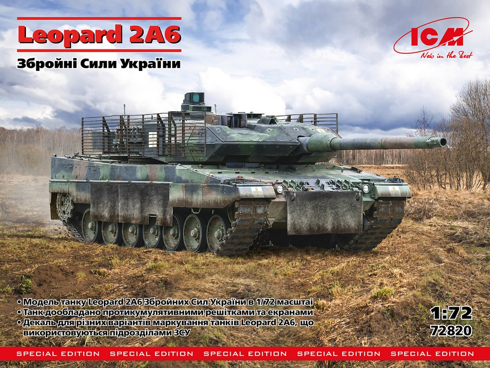
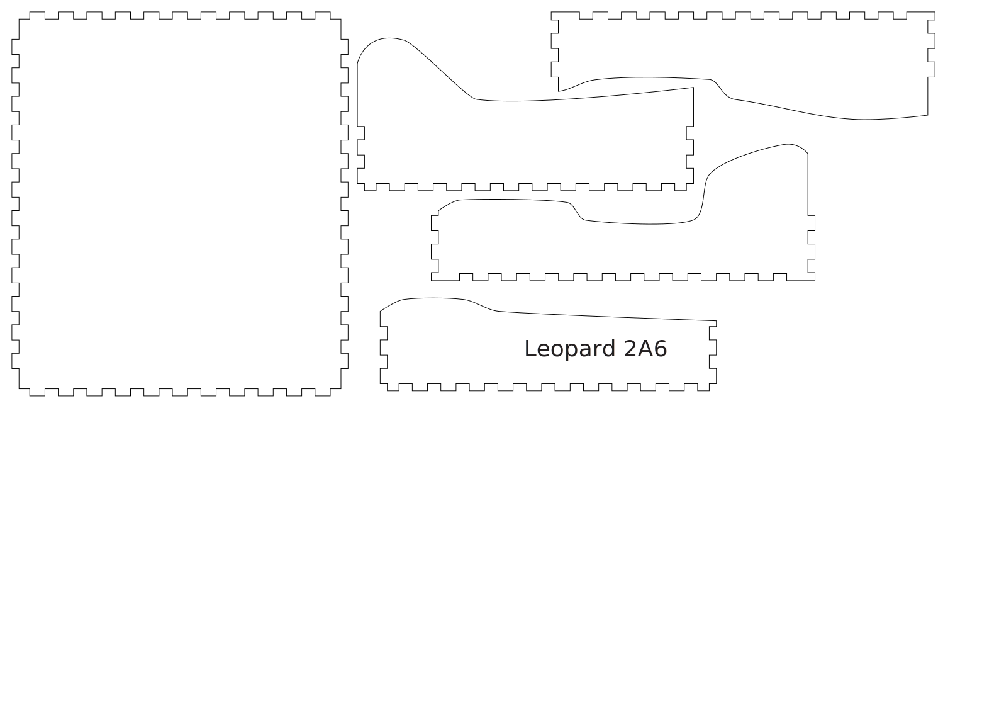

# #149 Leopard 2A6 Armed Forces of Ukraine

Building the ICM 1:72 model of the Leopard 2A6 deployed with the Armed Forces of Ukraine.

## Notes

Since the summer of 2023, Leopard 2A6 tanks have been in service with the Armed Forces of Ukraine. They actively participate in battles in the east and northeast of Ukraine. Some of them undergo specific modifications due to the nature of modern combat. Recent combat engagements have imposed new requirements, particularly improving protection against shaped charge munitions and attack drones. To address this, additional protective elements in the form of grids are added to the combat vehicles. Solid screens of various types are also used to protect the running gear. The Leopard 2A6 tanks of the Ukrainian army undergo such modifications, and several of these combat vehicles were seen in action in the fall of 2023.

### The Kit

The [Leopard 2A6 Armed Forces of Ukraine No. 72820 1:72 from ICM](https://icm.com.ua/technique/leopard-2a6/)
is a new 2024 boxing of the Revell 2011 tooling but with new parts to depict modern Ukrainian variants with drone defences etc.
It includes 4 decal schemes.
See the [instructions](./assets/72820-instructions.pdf).

### Paint Scheme

Leopard 2A6 of the Armed Forces of Ukraine marking option 2

| Feature                      | Color                                      | Recommended | Paint Used |
|------------------------------|--------------------------------------------|-------------|------------|
| A camo 1, lower hull, wheels | Сірий польовий німецький German Field Grey | ICM 1070    | H48        |
| B camo 2                     | Корабельний червоний  Hull Red             | ICM 1052    | H47        |
| C camo 3                     | Чорна грунтовка  Black Primer              | ICM 2005    |            |
| D tracks, wheel rims         | Гумовий чорний  Rubber Black               | ICM 1039    | H77        |
| E wheel hub                  | Червоний  Deep Red                         | ICM 1007    |            |
| F                            | Напівпрозорий коричневий  Clear Smoke      | ICM 1013    |            |
| G                            | Напівпрозорий помаранчевий  Clear Orange   | ICM 1016    |            |
| H track links                | Масляна сталь  Oily Steel                  | ICM 1026    | H18        |
| I                            | Світла земля  Light Earth                  | ICM 1056    |            |
| J                            | Срібло  Silver                             | ICM 1024    |            |
| K                            | Офвайт  Offwhite                           | ICM 1028    |            |
| L                            | Збройовий метал  Gun metal                 | ICM 1027    |            |
| M                            | Напівпрозорий червоний  Clear Red          | ICM 1011    |            |
| N                            | Чорний  Black                              | ICM 1002    |            |
| view ports                   | Cobalt Blue                                | -           | H35        |
|                              |                                            |             |            |

### Build Log

Adding a filter of H73 in matt clear

Adding a filter of H26 in matt clear

Weathering effects including:

* chipping: 70.989, 70.997
* filter: 70.989 + 70.921
* washes
* streaking
* mud
* mud splatter

### Planning the Presentation

Reconsidering the composition..

### Project Box

I used [MakerCase](https://en.makercase.com/) to generate a simple parametric design:

* material thickness: 3mm
* inside dimensions:
    * width: 135mm
    * height: 30mm
    * depth:  155mm
* open box
* edge joints: finger
* panel labels: enabled (to be excluded from cutting)
* cut line width: 1mm
* kerf: 0.2mm
* panel layout: separate, single file
* exported as [leo-box-template.svg](./assets/leo-box-template.svg)
* refined in Affinity Designer: [leo-box.afdesign](./assets/leo-box.afdesign)
* prepared for laser cutting in Inkscape: [leo-box.svg](./assets/leo-box.svg)

I cut the box on a [Lionsforge Craftlaser at the library](https://leap.tardate.com/equipment/nlb/lionsforgecraftlaser/).

## Building the Diorama Base

## Final Gallery

## Credits and References

* [this project on scalemates](https://www.scalemates.com/profiles/mate.php?id=74137&p=projects&project=189422)
* Leopard 2A6 Armed Forces of Ukraine ICM No. 72820 1:72
    * [on scalemates](https://www.scalemates.com/kits/icm-72820-leopard-2a6--1568423)
    * [on ICM](https://icm.com.ua/technique/leopard-2a6/)
    * [instructions](./assets/72820-instructions.pdf)
* Research:
    * <https://en.wikipedia.org/wiki/Leopard_2>

### Kit and Build References

#### Leopard 2A6 Armed Forces of Ukraine #72820 Scale 1/72 - ICM

#### ICM 1/72 Leopard 2A6 Ukraine armed forces (72820) - Peter Oxley

