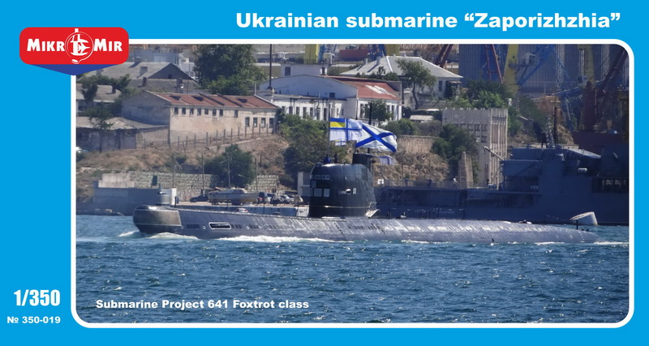

# #131 Foxtrot-class Zaporizhzhia

MikroMir have made a very good kit of the Foxtrot-class Zaporizhzhia. The build went well, but my attempt to encase it in resin was a catastrophic failure☹ One day I'll try this again, but in the spirit of sharing failures as well as successes: here's the gory story of what went wrong!

## Notes

### About the Zaporizhzhia

[Zaporizhzhia](https://en.wikipedia.org/wiki/Ukrainian_submarine_Zaporizhzhia) (U-01) (Ukrainian: Запоріжжя) is a project 641 (Foxtrot-class) diesel-electric powered submarine. It was originally built by the Soviet Union and commissioned in 1970, with her home port in Sevastopol.

After the Soviet Union dissolved, it was inherited by Ukraine as part of the Ukrainian Navy in 1997. It was the only submarine in Ukraine's fleet and served as a symbol of the country's maritime capability despite its age and limitations.

In 2014, during the annexation of Crimea by Russia, Zaporizhzhia was seized by Russian forces along with other Ukrainian naval assets. Captured by Russian forces on 22 March 2014, half of the Ukrainian personnel, among them the captain of the submarine, had left while the others chose to begin their service in the Russian Black Sea Fleet with the submarine.

The submarine has never returned to front line duty.

As of 29 December 2020, Google Maps imagery showed U-01 afloat and pier-side in Yuzhnaya Bay in Sevastopol surrounded by containment booms, next to Romeo-class submarine S-49 (44°36'22.31"N  33°31'58.42"E)

### The Kit

Ukrainian Submarine Project 641 Foxtrot Class - "Zaporizhzhia" MikroMir No. 350-019 1:350

### Paint Scheme

| Feature               | Color                | Recommended | Paint Used |
|-----------------------|----------------------|-------------|------------|
|                       | Neutral Gray         |             | H53        |
|                       | Navy Blue            |             | H54        |
|                       | Tire Black           |             | H77        |
| Lower hull            | Hull Red             |             | H17        |
|                       |                      |             |            |

### Build Log

It's a very quick build. The PE adds some nice detail.

I prepared a base .. the idea is to capture the submarine on the surface with a resin pour.

#### Resin Pour

Calculated volume:

* 38.5cm x 5.5cm x 4.5cm
* approx 950cm^3, just under 1l

Preparing to pour resin...

### The Disaster

I did a single pour and at first everything was looking good.

But...

... as the resin started to generate more heat, the hot glue I had used to fix the mold and hold the sub in place all started to fail.

Luckily I had everything inside a foil tray, so the disaster was contained,
but the build is obviously unrecoverable.

## Conclusion

Well, I've had to trash this very nice MicroMir kit, but learned some important resin lessons in return:

* don't trust hot-glue for fixing resin dams, unless the volume of resin (and heat it generates) is very limited
* I really pushed the recommended limits of a single pour:
    * I was wanting to avoid layer lines
    * total pour was around 38.5cm x 4.5cm x 4.5cm
    * after a few minutes, it was getting very hot (perhaps 30-50˚C)
* acrylic sheet does actually work well for resin dams (without mold release)
* aluminium foil containers are excellent for containing a resin pour, and stopping disasters from leaking all over the work-bench!

See also my [Notebook: Resin](/notebook/resin/).

## Credits and References

* Ukrainian Submarine Project 641 Foxtrot Class - "Zaporizhzhia" MikroMir No. 350-019 1:350
    * on [scalemates](https://www.scalemates.com/kits/mikromir-350-019-project-641-foxtrot-class-zaporizhzhia--949107)
    * on [mikro-mir.com](http://mikro-mir.com/en/ships-scales/1-350/170-project-641.html)
* [Ukrainian submarine Zaporizhzhia](https://en.wikipedia.org/wiki/Ukrainian_submarine_Zaporizhzhia)
* <https://laststandonzombieisland.com/2012/05/02/ukraines-only-sub-operational-now/>
* <https://turkishnavy.net/2014/03/24/russians-doubled-their-submarine-force-in-the-black-sea/>
