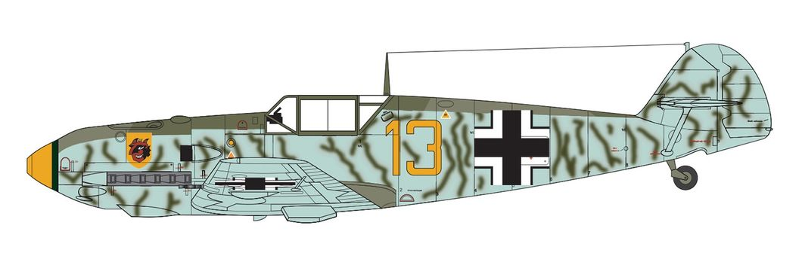
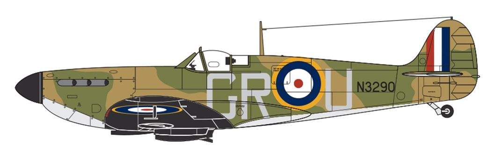

# #167 Blood Red Skies

Building the Messerschmitt Bf109E-4 and Supermarine Spitfire Mk.Ia in 1:72 scale from the Airfix boxing of the Blood Red Skies tabletop game.

## Notes

[Blood Red Skies](https://boardgamegeek.com/boardgame/236370/blood-red-skies-battle-of-britain) is a World War II mass air combat game from Warlord Games, written by renowned game developer Andy Chambers.

### The Kit

[Blood Red Skies: Battle of Britain Airfix No. A1500 1:72](https://www.scalemates.com/kits/airfix-a1500-blood-red-skies-battle-britain--1329856)
is the Airfix boxing of Warlord Games 'Blood Red Skies' ruleset with
four Airfix 1:72 models to be used in the game.
I purchased this direct from Airfix for £16.66 (Jan-2024).

See [instructions](./assets/A1500-instructions.pdf)

Contents:

* 1 x Blood Red Skies Rulebook
* 2 x Supermarine Spitfire MkII Fighter Model Kits (A01071B)
* 2 x Messerschmitt Bf109-E Fighter planes Model Kits (A01008A)
* 4 x BRS Advantage Flying Bases
* 2 x Reference Aircraft Cards
* 8 x Combat Dice
* 6 x Pilot Skill Level Discs
* 6 x Boom Chit Tokens
* 6 x Zoom Tokens
* 3 x Cloud /Air Defence Clusters
* 1 x Navigation Caliper
* 1 x Range Finder
* 2 x Movement Templates

### A01008A Messerschmitt Bf109E-4

The kit includes two [Messerschmitt Bf109 E-4 Airfix No. A01008A 1:72](https://www.scalemates.com/kits/airfix-a01008a-messerschmitt-bf109-e-4--1240967)

| Feature                | Color                      | Recommended | Paint Used |
|------------------------|----------------------------|-------------|------------|
|                        | Silver - Metallic          | No 11       |            |
|                        | Black - Gloss              | No 21       |            |
| wing tips              | Trainer Yellow - Matt      | No 24       | H413       |
| cockpit interior       | Slate Grey - Matt          | No 31       | H62        |
| cockpit details        | Black - Matt               | No 33       |            |
| exhaust pipes          | Gunmetal - Metallic        | No 53       | H18        |
|                        | Flesh - Matt               | No 61       |            |
|                        | Ocean Grey - Matt          | No 106      |            |
| lower camo             | Aircraft Blue - Matt       | No 65       | H67        |
| upper camo 1           | RLM 02 Grau - Matt         | No 240      | H70        |
| upper camo stripes     | RLM 70 Schwartzgrun - Matt | No 241      | H65        |
| propeller rear         | RLM 70 Schwartzgrun - Matt | No 241      | H65        |
| upper camo 2           | RLM 71 Dunkelgrun - Matt   | No 242      | H64        |
| propeller front        | RLM 71 Dunkelgrun - Matt   | No 242      | H64        |
|                        |                            |             |            |

Luftwaffe Pilots:

| Feature                | Color                      | Recommended | Paint Used |
|------------------------|----------------------------|-------------|------------|
| harness clips          | Silver - Metallic          | No 11       |            |
| life preserver         | Trainer Yellow - Matt      | No 24       |            |
| helmet, sleeves, boots | Black - Matt               | No 33       | 70.950     |
| face                   | Flesh - Matt               | No 61       | AMMO F-550 |
| uniform                | Ocean Grey - Matt          | No 106      | 70.868     |
| harness                | Pale Stone - Matt          | No 121      |            |

### A01071B Supermarine Spitfire Mk.Ia Build

The kit includes two
[Supermarine Spitfire Mk.Ia Airfix No. A01071B 1:72](https://www.scalemates.com/kits/airfix-a01071b-supermarine-spitfire-mkia--1510051)

| Feature                        | Color                      | Recommended | Paint Used          |
|--------------------------------|----------------------------|-------------|---------------------|
|                                | Tan - Gloss - Acrylic 14ml | No 9        |                     |
|                                | Silver - Metallic          | No 11       |                     |
|                                | Trainer Yellow - Matt      | No 24       |                     |
| upper camo 1, seat back        | Dark Earth - Matt          | No 29       | H66 + H72           |
| upper camo 2, cockpit interior | Dark Green - Matt          | No 30       | H330                |
| cockpit details                | Black - Matt               | No 33       |                     |
| propeller                      | Black - Matt               | No 33       |                     |
|                                | White - Matt               | No 34       |                     |
| exhaust pipes                  | Gunmetal - Metallic        | No 53       | H18                 |
| lower camo, wheel well         | Beige Green                | No 90       | H74, H31 highlights |
|                                |                            |             |                     |

RAF Pilots:

| Feature                | Color                      | Recommended | Paint Used |
|------------------------|----------------------------|-------------|------------|
| boots                  | Black - Matt               | No 33       | 70.950     |
| helmet                 | Dark Earth - Matt          | No 29       | 70.941     |
| uniform                | Dark Green - Matt          | No 30       | 70.921     |
| face                   | Flesh - Matt               | No 61       | AMMO F-550 |

### Build Log

Getting started..

#### Pilots

#### Spitfire Mk.Ia Build

#### Bf109E-4 Build

#### Final Gallery

### Playing the Game

Blood Red Skies gets a 7.3/10 rating on [Board Game Geek](https://boardgamegeek.com/boardgame/236370/blood-red-skies-battle-of-britain).

I haven't actually played it yet(!), but here's the essential gameplay:

Turn order:

* Advantaged Action Phase: advantaged planes are activated in order from highest pilot skill to lowest
* Neutral Action Phase: neutral planes are activated in order from highest pilot skill to lowest
* Disadvantaged Action Phase: disadvantaged planes are activated in order from highest pilot skill to lowest

Activating a Plane:

* Shoot
* Burn advantage
* Manoeuvre
* Dive
* Move
* Pilot Action
* Shoot
* Outmanoeuvre
* Climb
* End Activation

## Credits and References

* [this project on scalemates](https://www.scalemates.com/profiles/mate.php?id=74137&p=projects&project=167557)
* Blood Red Skies: Battle of Britain Airfix No. A1500 1:72
    * [on scalemates](https://www.scalemates.com/kits/airfix-a1500-blood-red-skies-battle-britain--1329856)
    * [on airfix.com](https://uk.airfix.com/products/airfix-blood-red-skies-battle-britain-a1500)
    * [instructions](./assets/A1500-instructions.pdf)
* Supermarine Spitfire Mk.Ia Airfix No. A01071B 1:72
    * [on scalemates](https://www.scalemates.com/kits/airfix-a01071b-supermarine-spitfire-mkia--1510051)
* Messerschmitt Bf109 E-4 Airfix No. A01008A 1:72
    * [on scalemates](https://www.scalemates.com/kits/airfix-a01008a-messerschmitt-bf109-e-4--1240967)

### Research References

* <https://www.blood-red-skies.com/>
* [Blood Red Skies: Battle of Britain (2017)](https://boardgamegeek.com/boardgame/236370/blood-red-skies-battle-of-britain)
* <https://en.wikipedia.org/wiki/Supermarine_Spitfire>
* <https://en.wikipedia.org/wiki/Messerschmitt_Bf_109>

#### Build SCALE MODELS Then Play Blood Red Skies - Airfix TABLE Game!! - WEBSITE DEAL

YouTube by MOS6510 Models

#### Blood red skies

YouTube by JK WARGAMES

